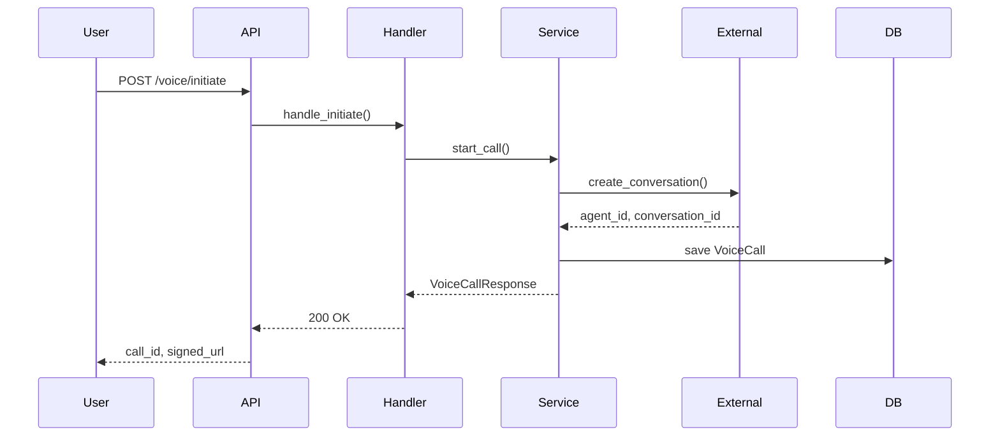

# Phase 0: System Understanding Workflow

## Purpose

Auto-triggers for complex features to build deep system understanding BEFORE specification. Creates visual knowledge graphs and classifies complexity to inform downstream phases.

**Output**: `specs/$FEATURE/SYSTEM-UNDERSTANDING.md`

---

## When This Phase Triggers (Auto-Detection)

| Indicator | Detection Method | Threshold |
|-----------|------------------|-----------|
| Component count | Count unique modules/files in scope | >3 components |
| File touch estimate | Analyze feature scope keywords | >5 files estimated |
| Architectural keywords | Parse user request | "refactor", "migrate", "integrate", "overhaul", "redesign" |
| First feature in project | Check if `specs/` directory is empty | No existing specs |
| User explicit request | Direct mention | "analyze system", "understand codebase", "map architecture" |
| Cross-cutting concern | Keywords in request | "auth", "database", "API", "middleware", "cache" |

**Complexity Classification**:
- **Simple**: ≤3 components, ≤5 files, single layer → SKIP Phase 0
- **Moderate**: 4-6 components, 6-10 files, 2 layers → Optional Phase 0
- **Complex**: >6 components, >10 files, 3+ layers → REQUIRED Phase 0

---

## Step 1: Intelligence Gathering

**Execute queries BEFORE reading files:**

```bash
# 1. Project overview (structure, entry points)
project-intel.mjs --overview --json

# 2. Search for feature-relevant files
project-intel.mjs --search "<feature-keywords>" --json

# 3. Map imports/dependencies
project-intel.mjs --map-imports --json

# 4. Get symbols for key files
project-intel.mjs --symbols <key-file> --json
```

**Token Budget**: ~500 tokens (vs 20K+ reading files)

---

## Step 2: Entity Identification

**Extract key entities from intelligence results:**

| Entity Type | Detection Pattern | Example |
|-------------|-------------------|---------|
| **Services** | Files in `services/`, `*Service.py/ts` | `VoiceService`, `ScoringService` |
| **Models** | Files in `models/`, dataclass/Pydantic | `User`, `Conversation`, `Chapter` |
| **Handlers** | Files in `handlers/`, `*Handler.py/ts` | `MessageHandler`, `WebhookHandler` |
| **Routes/API** | Files in `routes/`, `api/` | `/voice/initiate`, `/tasks/decay` |
| **Repositories** | Files in `repositories/`, `*Repo.py` | `UserRepository`, `ConversationRepo` |
| **Utils/Helpers** | Files in `utils/`, `helpers/` | `PromptBuilder`, `ConfigLoader` |

**Document in CoD^Σ notation:**
```
Entities := {
  VoiceService@voice/service.py:15 → manages voice calls,
  VoiceConfig@voice/config.py:8 → ElevenLabs configuration,
  VoiceCallModel@db/models/voice.py:22 → voice call records
}
```

---

## Step 3: Relationship Mapping

**Trace dependencies between entities:**

```bash
# For each key entity
project-intel.mjs --dependencies <entity-file> --direction upstream --json
project-intel.mjs --dependencies <entity-file> --direction downstream --json
```

**Relationship Types**:
- `→` imports/depends on
- `⇄` bidirectional dependency
- `∘` sequential flow (A → B → C)
- `⊕` parallel/concurrent
- `∥` aggregates/composes

**Document relationships:**
```
Relations := {
  VoiceService → VoiceConfig (configuration),
  VoiceService → VoiceCallModel (persistence),
  VoiceHandler → VoiceService (delegation),
  VoiceHandler ⇄ ElevenLabsClient (external API)
}
```

---

## Step 4: Layer Analysis

**Identify architectural layers:**

| Layer | Pattern | Responsibility |
|-------|---------|----------------|
| **API/Routes** | `routes/`, `api/` | HTTP endpoints, request handling |
| **Handlers** | `handlers/` | Business logic coordination |
| **Services** | `services/` | Core business operations |
| **Repositories** | `repositories/` | Data access |
| **Models** | `models/` | Data structures |
| **External** | `clients/`, `integrations/` | Third-party APIs |

**Layer Flow Diagram**:
```
API → Handler → Service → Repository → Database
         ↓
      External APIs
```

---

## Step 5: Generate Mermaid Diagrams

### Component Diagram

```mermaid
graph TD
    subgraph API Layer
        A[/voice/initiate]
        B[/voice/server-tool]
    end

    subgraph Handler Layer
        C[VoiceHandler]
    end

    subgraph Service Layer
        D[VoiceService]
        E[ScoringService]
    end

    subgraph Repository Layer
        F[VoiceCallRepository]
        G[UserRepository]
    end

    subgraph External
        H[ElevenLabs API]
    end

    A --> C
    B --> C
    C --> D
    C --> E
    D --> F
    D --> H
    E --> G
```

### Data Flow Diagram



---

## Step 6: Complexity Classification

**Score each dimension:**

| Dimension | Simple (1) | Moderate (2) | Complex (3) |
|-----------|------------|--------------|-------------|
| Components | ≤3 | 4-6 | >6 |
| Files | ≤5 | 6-10 | >10 |
| Layers | 1 | 2 | 3+ |
| External APIs | 0 | 1 | 2+ |
| Data models | ≤2 | 3-5 | >5 |

**Classification**:
- Total 5-8: **Simple** → Proceed to Phase 3
- Total 9-12: **Moderate** → Create SYSTEM-UNDERSTANDING.md
- Total 13+: **Complex** → Required SYSTEM-UNDERSTANDING.md + risk assessment

---

## Step 7: Generate SYSTEM-UNDERSTANDING.md

**Template:**

```markdown
# System Understanding: $FEATURE

**Generated**: [timestamp]
**Complexity**: [Simple/Moderate/Complex] (Score: X/15)

## Entity Map

| Entity | File | Line | Responsibility |
|--------|------|------|----------------|
| VoiceService | voice/service.py | 15 | Manages voice calls |
| VoiceConfig | voice/config.py | 8 | ElevenLabs configuration |

## Relationships (CoD^Σ)

```
VoiceService@voice/service.py:15
  → VoiceConfig@voice/config.py:8 (configuration)
  → VoiceCallModel@db/models/voice.py:22 (persistence)
  ⇄ ElevenLabsClient@external/elevenlabs.py:30 (API calls)
```

## Component Diagram

[Mermaid diagram here]

## Data Flow

[Sequence diagram here]

## Layer Analysis

| Layer | Components | Key Files |
|-------|------------|-----------|
| API | 2 endpoints | routes/voice.py |
| Service | 1 service | voice/service.py |
| External | 1 client | elevenlabs.py |

## Risk Assessment

| Risk | Impact | Mitigation |
|------|--------|------------|
| ElevenLabs API rate limits | HIGH | Implement retry with backoff |
| Audio latency | MEDIUM | Use streaming endpoints |

## Recommendations for Specification

1. Define clear API contracts in spec.md
2. Include error handling for external API failures
3. Consider caching for repeated context lookups
```

---

## Integration with Phase 3

After Phase 0 completes:

1. **Pass context** to Phase 3 (Specification)
2. **Reference entities** in user stories
3. **Use relationships** to identify dependencies
4. **Inform complexity** estimates in plan.md

**Handoff:**
```markdown
## Phase 0 → Phase 3 Handoff

- SYSTEM-UNDERSTANDING.md created at specs/$FEATURE/
- Complexity: [classification]
- Key entities: [list]
- High-risk areas: [list]
- Recommended: Proceed to /feature with context
```

---

## Quality Gates

| Gate | Requirement | Enforcement |
|------|-------------|-------------|
| Intel-First | All queries executed before file reads | Check query logs |
| Entity Coverage | ≥80% of touched files mapped | Count entities vs file estimate |
| Relationship Accuracy | Dependencies verified with project-intel | Check --dependencies output |
| Diagram Validity | Mermaid diagrams render correctly | Syntax validation |
| Evidence | All entities have file:line references | CoD^Σ trace complete |

---

## Common Issues

| Issue | Detection | Resolution |
|-------|-----------|------------|
| Missing dependencies | project-intel returns empty | Regenerate PROJECT_INDEX.json |
| Wrong layer classification | Files in unexpected locations | Check project conventions |
| Circular dependencies | A → B → A detected | Flag in risk assessment |
| Orphan components | No inbound dependencies | Verify if intentional |

---

## Version

**Version**: 1.0.0
**Last Updated**: 2025-12-30
