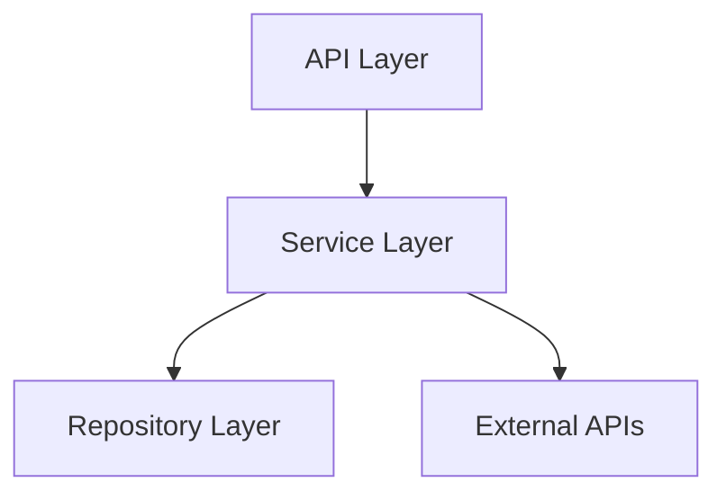
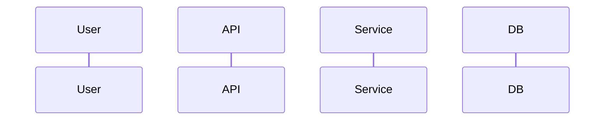

# Phase 5: Implementation Planning Workflow

## Purpose

Create `specs/$FEATURE/plan.md` - detailed implementation plan with technical design, task breakdown, and research findings.

**Command**: `/plan`
**Requires**: `specs/$FEATURE/spec.md` (no [NEEDS CLARIFICATION] markers)
**Output**: `plan.md`, `research.md`, `data-model.md` (optional), `contracts/` (optional)
**Auto-Chains**: → Phase 6 (generate-tasks)

---

## Prerequisites

```bash
# Verify spec exists and is clarified
if [ ! -f specs/$FEATURE/spec.md ]; then
  echo "ERROR: Run /feature first"
  exit 1
fi

if grep -q "NEEDS CLARIFICATION" specs/$FEATURE/spec.md; then
  echo "ERROR: Run /clarify first"
  exit 1
fi
```

---

## Step 1: Constitutional Gate Check

**Verify alignment with constitution.md:**

```markdown
## Constitutional Gate Check

| Article | Requirement | Status |
|---------|-------------|--------|
| III | ≥2 ACs per user story | [PASS/FAIL] |
| IV | spec.md exists before plan | [PASS/FAIL] |
| VI | ≤3 projects, ≤2 layers | [PASS/FAIL] |
| VII | User stories prioritized P1/P2/P3 | [PASS/FAIL] |

**Overall**: [PASS/FAIL]
```

**If FAIL**: Fix spec.md issues before proceeding.

---

## Step 2: Intelligence Gathering

**Execute BEFORE writing plan:**

```bash
# 1. Analyze existing codebase structure
project-intel.mjs --overview --json

# 2. Search for similar implementations
project-intel.mjs --search "<feature-keywords>" --json

# 3. Check dependencies
project-intel.mjs --map-imports --json

# 4. Get symbols from related files
project-intel.mjs --symbols <related-file> --json
```

**For external libraries/APIs:**

```
# Use MCP tools for documentation
mcp__Ref__ref_search_documentation("ElevenLabs Conversational AI")
mcp__Ref__ref_read_url("<doc-url>")
```

---

## Step 3: Research (Subagent Delegation)

**Launch research subagent for external dependencies:**

```python
Task(
    subagent_type="prompt-researcher",
    description="Research $DEPENDENCY",
    prompt="""
    Research the following for $FEATURE implementation:

    1. Library/API: $DEPENDENCY
    2. Key patterns to use
    3. Common pitfalls to avoid
    4. Integration examples

    Use MCP Ref and Firecrawl tools.
    Return condensed findings (max 500 tokens).
    """
)
```

**Save to research.md:**

```markdown
# Research: $FEATURE

## External Dependencies

### $DEPENDENCY
**Source**: [MCP Ref / Firecrawl]
**Version**: [Specific version]
**Key Patterns**:
- [Pattern 1]
- [Pattern 2]

**Pitfalls**:
- [Pitfall 1]
- [Pitfall 2]

**Integration Example**:
```code
[Example code]
```
```

---

## Step 4: Technical Design

### 4.1 Architecture Overview

```markdown
## Architecture

### Component Diagram


### Data Flow

```

### 4.2 Data Model (if new models needed)

**Create data-model.md:**

```markdown
# Data Model: $FEATURE

## New Tables/Collections

### $TABLE_NAME
| Column | Type | Constraints | Description |
|--------|------|-------------|-------------|
| id | UUID | PK | Primary key |
| user_id | UUID | FK users.id | Owner |
| created_at | TIMESTAMP | NOT NULL | Creation time |

## Relationships
- $TABLE belongs_to User
- $TABLE has_many $OTHER

## Indexes
- idx_$TABLE_user_id ON $TABLE(user_id)

## Migrations
- Migration file: NNNN_create_$TABLE.py
```

### 4.3 API Contracts (if new endpoints)

**Create contracts/ directory:**

```markdown
# API Contract: $ENDPOINT

## POST /api/v1/$resource

### Request
```json
{
  "field1": "string",
  "field2": 123
}
```

### Response (200)
```json
{
  "id": "uuid",
  "status": "created"
}
```

### Errors
- 400: Invalid request
- 401: Unauthorized
- 500: Server error
```

---

## Step 5: Task Breakdown

**Map user stories to implementation tasks:**

```markdown
## Task Breakdown

### US-1: [Story Title]

| Task | Description | Est. | Dependencies |
|------|-------------|------|--------------|
| T1.1 | Create data model | S | None |
| T1.2 | Implement repository | M | T1.1 |
| T1.3 | Implement service | M | T1.2 |
| T1.4 | Create API endpoint | S | T1.3 |
| T1.5 | Write tests | M | T1.4 |

### US-2: [Story Title]
[Continue pattern...]
```

**Estimate Key:**
- S (Small): < 1 hour
- M (Medium): 1-4 hours
- L (Large): 4-8 hours
- XL (Extra Large): > 8 hours (should be broken down)

---

## Step 6: Generate plan.md

**Template:**

```markdown
# Implementation Plan: $FEATURE

**Spec**: [specs/$FEATURE/spec.md](spec.md)
**Created**: [timestamp]
**Status**: Ready for Implementation

---

## Overview

### Objective
[What this plan achieves]

### Scope
[What's in/out of scope for implementation]

### Dependencies
| Dependency | Type | Status | Notes |
|------------|------|--------|-------|
| $DEP | Library | Ready | v1.2.3 |

---

## Architecture

[Architecture diagrams from Step 4]

---

## Data Model

[Reference to data-model.md if created]

---

## API Contracts

[Reference to contracts/ if created]

---

## Implementation Tasks

### Phase 1: Foundation (P1 Stories)

#### US-1: [Story Title]
**ACs**: AC-1.1, AC-1.2, AC-1.3

| ID | Task | Est. | Deps | [P] |
|----|------|------|------|-----|
| T1.1 | Create models | S | - | |
| T1.2 | Implement repo | M | T1.1 | |
| T1.3 | Implement service | M | T1.2 | |
| T1.4 | Create endpoint | S | T1.3 | |
| T1.5 | Write tests | M | T1.4 | |

### Phase 2: Enhancement (P2 Stories)
[Continue pattern...]

### Phase 3: Polish (P3 Stories)
[Continue pattern...]

---

## Risk Assessment

| Risk | Probability | Impact | Mitigation |
|------|-------------|--------|------------|
| [Risk 1] | Medium | High | [Strategy] |

---

## Testing Strategy

### Unit Tests
- [ ] Test coverage target: X%
- [ ] Mock external dependencies

### Integration Tests
- [ ] API endpoint tests
- [ ] Database integration

### E2E Tests
- [ ] Happy path flows
- [ ] Error scenarios

---

## Rollback Plan

1. [Step to revert if issues]
2. [Database migration rollback]

---

## References

- Research: [research.md](research.md)
- Data Model: [data-model.md](data-model.md)
- Spec: [spec.md](spec.md)
```

---

## Step 7: Parallelization Markers

**Add [P] markers for parallel tasks:**

```markdown
| ID | Task | Est. | Deps | [P] |
|----|------|------|------|-----|
| T1.1 | Create VoiceCall model | S | - | |
| T1.2 | Create VoiceConfig model | S | - | [P] T1.1 |
| T1.3 | Implement repository | M | T1.1, T1.2 | |
```

**[P] Rule**: Tasks with no dependency overlap can run in parallel.

---

## Quality Gates

| Gate | Requirement | Check |
|------|-------------|-------|
| Constitutional | All articles pass | Gate check complete |
| Research | External deps documented | research.md exists |
| Coverage | All US mapped to tasks | Task count matches |
| Estimates | No XL tasks | All tasks ≤ L |
| Dependencies | Clear task order | Deps column populated |
| Risks | Risks identified | Risk table has entries |

---

## Auto-Chain to Phase 6

**After plan.md complete:**

```markdown
## Phase 5 → Phase 6 Handoff

✅ plan.md created
✅ research.md created (if external deps)
✅ data-model.md created (if new models)
✅ All quality gates pass
✅ X tasks mapped to Y user stories

**Automatically invoking**: generate-tasks
```

---

## Version

**Version**: 1.0.0
**Last Updated**: 2025-12-30
