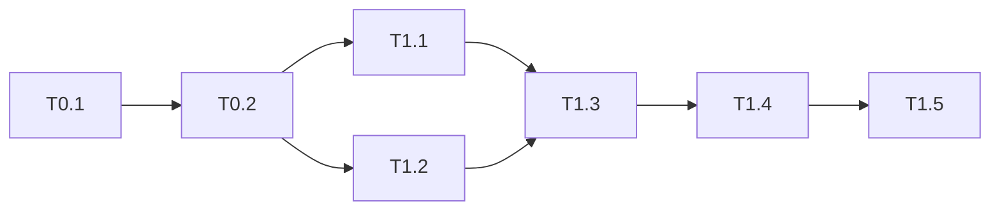

# Phase 6: Task Generation Workflow

## Purpose

Transform plan.md task breakdown into `specs/$FEATURE/tasks.md` - an executable task list with acceptance criteria, organized by user story priority.

**Invoked By**: Phase 5 completion (automatic)
**Requires**: `specs/$FEATURE/plan.md`
**Output**: `specs/$FEATURE/tasks.md`
**Auto-Chains**: → Phase 7 (`/audit`)

---

## Prerequisites

```bash
# Verify plan exists
if [ ! -f specs/$FEATURE/plan.md ]; then
  echo "ERROR: Run /plan first"
  exit 1
fi
```

---

## Step 1: Extract Tasks from Plan

**Parse plan.md for all tasks:**

```bash
# Extract task table
grep -E "^\| T[0-9]" specs/$FEATURE/plan.md
```

**Group by user story:**

```
US-1 Tasks: T1.1, T1.2, T1.3, T1.4, T1.5
US-2 Tasks: T2.1, T2.2, T2.3
US-3 Tasks: T3.1, T3.2
```

---

## Step 2: Map Acceptance Criteria

**For each task, derive ACs from user story ACs:**

| Task | Parent US | Parent ACs | Task-Specific ACs |
|------|-----------|------------|-------------------|
| T1.1 | US-1 | AC-1.1 | AC-T1.1.1: Model has all fields |
| T1.2 | US-1 | AC-1.1 | AC-T1.2.1: CRUD operations work |
| T1.3 | US-1 | AC-1.2 | AC-T1.3.1: Business logic correct |

**AC Rule**: Each task must have ≥1 specific acceptance criterion.

---

## Step 3: Generate tasks.md

**Template:**

```markdown
# Tasks: $FEATURE

**Plan**: [plan.md](plan.md)
**Spec**: [spec.md](spec.md)
**Created**: [timestamp]
**Total Tasks**: X | **Completed**: 0

---

## Progress Summary

| Phase/User Story | Tasks | Completed | Status |
|------------------|-------|-----------|--------|
| Setup | 2 | 0 | Pending |
| US-1: [Title] | 5 | 0 | Pending |
| US-2: [Title] | 3 | 0 | Pending |
| US-3: [Title] | 2 | 0 | Pending |
| **Total** | **12** | **0** | **0%** |

---

## Phase 0: Setup

### T0.1: Project Setup
- **Status**: [ ] Pending
- **Priority**: P0
- **Estimate**: S
- **Dependencies**: None
- **ACs**:
  - [ ] AC-T0.1.1: Directory structure created
  - [ ] AC-T0.1.2: Dependencies installed

### T0.2: Configuration
- **Status**: [ ] Pending
- **Priority**: P0
- **Estimate**: S
- **Dependencies**: T0.1
- **ACs**:
  - [ ] AC-T0.2.1: Environment variables configured
  - [ ] AC-T0.2.2: Config files created

---

## US-1: [Story Title] (P1)

**User Story**: As a [user], I want to [action], so that [benefit]
**Parent ACs**: AC-1.1, AC-1.2, AC-1.3

### T1.1: Create Data Model
- **Status**: [ ] Pending
- **Priority**: P1
- **Estimate**: S
- **Dependencies**: T0.2
- **Parallelizable**: [P] with T1.2
- **ACs**:
  - [ ] AC-T1.1.1: Model class created with all fields
  - [ ] AC-T1.1.2: Model validates input correctly
  - [ ] AC-T1.1.3: Unit tests pass (≥80% coverage)

### T1.2: Create Repository
- **Status**: [ ] Pending
- **Priority**: P1
- **Estimate**: M
- **Dependencies**: T1.1
- **ACs**:
  - [ ] AC-T1.2.1: CRUD operations implemented
  - [ ] AC-T1.2.2: Queries optimized with indexes
  - [ ] AC-T1.2.3: Integration tests pass

### T1.3: Implement Service
- **Status**: [ ] Pending
- **Priority**: P1
- **Estimate**: M
- **Dependencies**: T1.2
- **ACs**:
  - [ ] AC-T1.3.1: Business logic implemented
  - [ ] AC-T1.3.2: Error handling complete
  - [ ] AC-T1.3.3: Unit tests pass

### T1.4: Create API Endpoint
- **Status**: [ ] Pending
- **Priority**: P1
- **Estimate**: S
- **Dependencies**: T1.3
- **ACs**:
  - [ ] AC-T1.4.1: Endpoint responds correctly
  - [ ] AC-T1.4.2: Request validation works
  - [ ] AC-T1.4.3: API tests pass

### T1.5: Integration Testing
- **Status**: [ ] Pending
- **Priority**: P1
- **Estimate**: M
- **Dependencies**: T1.4
- **ACs**:
  - [ ] AC-T1.5.1: End-to-end flow works
  - [ ] AC-T1.5.2: Edge cases handled
  - [ ] AC-T1.5.3: Performance acceptable

---

## US-2: [Story Title] (P2)

[Continue pattern...]

---

## US-3: [Story Title] (P3)

[Continue pattern...]

---

## Dependency Graph



---

## Parallelization Opportunities

| Parallel Group | Tasks | Reason |
|----------------|-------|--------|
| Group 1 | T1.1, T1.2 | Independent models |
| Group 2 | T2.1, T3.1 | Different stories |

---

## Version History

| Version | Date | Changes |
|---------|------|---------|
| 1.0 | [date] | Initial task list |
```

---

## Step 4: Update Master Todo

**Add reference to todos/master-todo.md:**

```markdown
### Spec $NUMBER: [Feature Name]
- Status: Ready for Implementation
- Spec: [specs/$FEATURE/spec.md](specs/$FEATURE/spec.md)
- Plan: [specs/$FEATURE/plan.md](specs/$FEATURE/plan.md)
- Tasks: [specs/$FEATURE/tasks.md](specs/$FEATURE/tasks.md)
- Progress: 0/X tasks
```

---

## Quality Gates

| Gate | Requirement | Check |
|------|-------------|-------|
| Coverage | All plan tasks in tasks.md | Count matches |
| ACs | Each task has ≥1 AC | No empty AC sections |
| Dependencies | Dependencies are valid | No circular deps |
| Priorities | Tasks organized P1 → P2 → P3 | Order correct |
| Parallelization | [P] markers present | Parallel groups identified |

---

## Task Status Updates

**During implementation, update status immediately:**

```markdown
### T1.1: Create Data Model
- **Status**: [x] Complete  ← Update immediately
- **Completed**: 2025-12-30
- **ACs**:
  - [x] AC-T1.1.1: Model class created with all fields
  - [x] AC-T1.1.2: Model validates input correctly
  - [x] AC-T1.1.3: Unit tests pass (≥80% coverage)
```

**Also update Progress Summary table:**

```markdown
| Phase/User Story | Tasks | Completed | Status |
|------------------|-------|-----------|--------|
| US-1: [Title] | 5 | 1 | In Progress |
```

---

## Auto-Chain to Phase 7

**After tasks.md complete:**

```markdown
## Phase 6 → Phase 7 Handoff

✅ tasks.md created
✅ X tasks with Y acceptance criteria
✅ All tasks have dependencies mapped
✅ Parallelization opportunities identified
✅ Master todo updated

**Automatically invoking**: /audit
```

---

## Version

**Version**: 1.0.0
**Last Updated**: 2025-12-30
