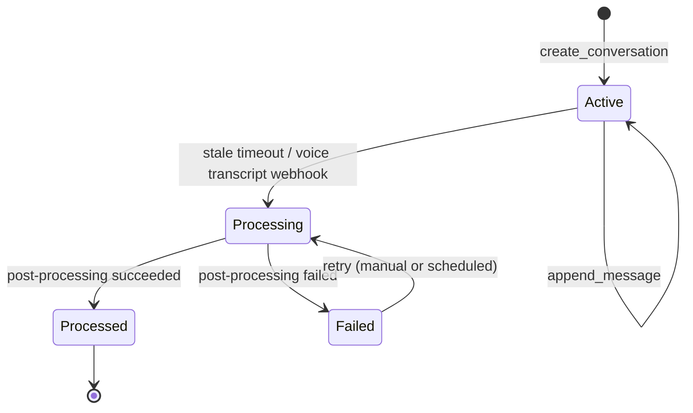

# Conversation lifecycle + definitions

This doc defines **what counts as a “conversation”**, when it ends, and what continuity context should carry over.

It’s the “make it unambiguous” layer so engineering decisions don’t drift.

---

## Key definitions

### Turn
A single message with a `role` and `content` stored in `conversations.messages`.

### Text session
A contiguous burst of text turns separated by less than **T inactivity minutes**.

Current behavior:

- An “active” conversation row exists per user (Telegram).
- When no message is received for ~15 minutes, SessionDetector marks that conversation as stale.

### Voice call
A single ElevenLabs call session (identified by `elevenlabs_session_id`). Each call creates a new `conversations` row with `platform='voice'`.

### Conversation (DB row)
A persisted transcript + analysis container: `conversations`.

Key fields:

- `messages`: JSONB turn list
- `started_at` / `ended_at`
- `platform`: `telegram` or `voice`
- `status`: `active` | `processing` | `processed` | `failed`
- `conversation_summary`, `emotional_tone`, `extracted_entities`

### Continuity horizon
We treat continuity as three time horizons:

1. **Working memory**: minutes–hours (verbatim turns)
2. **Same-day episodic memory**: hours–1 day (daily summary + key moments)
3. **Long-term semantic memory**: days–months (Graphiti facts/episodes)

---

## State machine (conversation row)

### Current triggers

- **Text**: `SessionDetector.detect_and_queue()` marks stale `active` conversations as `processing`.
- **Voice**: transcript webhook immediately creates conversation row and runs post-processing.

---

## Continuity rules (product requirements)

These define what context must be available at runtime.

### Rule C1 — within-session continuity
When a text conversation is `active`, the LLM input must include the last **N turns**.

- This is the only reliable way to handle follow-ups like “yes”, “why”, “lol”.
- Summaries and graphs are not enough.

### Rule C2 — cross-session continuity (same day)
When a new text session starts (i.e., no active conversation row exists), the prompt must still include:

- “Last time we talked…” (last session summary)
- today’s running summary + key moments
- open threads and unresolved promises

### Rule C3 — cross-modality continuity
Events from voice calls must land in the same memory artifacts used for text prompts:

- daily summaries
- open threads
- Graphiti episodes

### Rule C4 — conversation end semantics
A text session ends when **no message has been received for T minutes**.

- Current default: `T=15`.
- Product requirement: regardless of session end, the user should not feel like continuity is lost.

### Rule C5 — idempotent processing
Processing a conversation multiple times should not create duplicate threads or corrupt summaries.

---

## Recommended session boundaries

These are recommended defaults for implementation and tuning.

- Text session inactivity timeout: **15 minutes** (keep existing; it’s fine)
- Working memory window (text): **last 20–40 turns** (configurable)
- Same-day buffer window: **today summary + key moments**, plus *optional* last ~10 turns if budget allows

---

## Edge cases to handle

1. **Rapid-fire double texts**
   - Ensure turn order is deterministic.

2. **Out-of-order webhooks / delivery delays**
   - Use `timestamp` ordering within `conversations.messages`.

3. **Stuck processing**
   - Add retry rules: a conversation stuck in `processing` for > X minutes should be marked failed and retried.

4. **Long conversations**
   - Summarize older turns and keep recent verbatim turns.

---

## Engineering pointers

- Text session management: `nikita/db/repositories/conversation_repository.py`
- Stale detection: `nikita/context/session_detector.py`
- Cron endpoint: `nikita/api/routes/tasks.py`
- Voice transcript webhook: `nikita/api/routes/voice.py`

The concrete injection policy is specified in [Context stack spec](./context_stack_spec.md).
