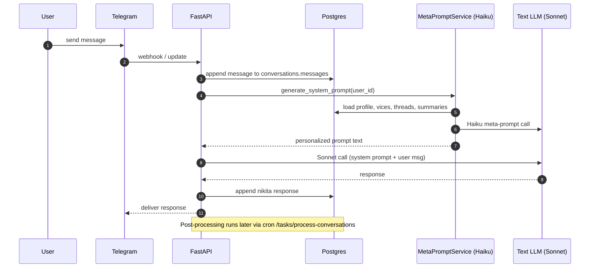
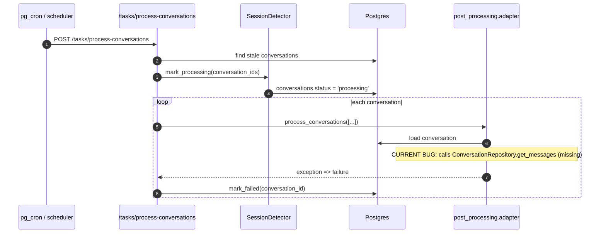

# System diagram: Memory + Continuity (Text + Voice)

**Purpose**: Give coding agents a shared mental model of the current system and the proposed “single memory stack” target.

> Diagrams use Mermaid. If you view this in GitHub, diagrams render automatically.

---

## 1) High-level architecture

```mermaid
flowchart LR
  subgraph Client
    TG[Telegram]
    Portal[Portal / Web]
    VoiceWidget[Voice Widget]
  end

  subgraph API[FastAPI Backend]
    TGRoute[telegram routes]
    VoiceRoute[voice routes]
    TasksRoute[tasks routes]

    TextAgent[Text Agent (PydanticAI)]
    MetaPrompt[MetaPromptService]

    VoiceInbound[InboundCallHandler]
    VoiceService[VoiceService]
    VoiceServerTools[Voice Server Tools]

    LegacyPP[Legacy PostProcessor\nnikita.context.post_processor]
    NewPP[New PostProcessingPipeline\nnikita.post_processing.*]
  end

  subgraph Data[Data Stores]
    DB[(Supabase Postgres)]
    Neo4j[(Neo4j / Graphiti)]
  end

  subgraph External
    Anthropic[Anthropic Models\n(Sonnet / Haiku)]
    Eleven[ElevenLabs ConvAI]
  end

  TG --> TGRoute --> TextAgent --> Anthropic
  TextAgent --> MetaPrompt --> Anthropic

  VoiceWidget --> VoiceRoute --> VoiceService
  VoiceRoute --> VoiceInbound

  VoiceService --> Eleven
  Eleven --> VoiceServerTools
  VoiceServerTools --> DB

  TGRoute --> DB
  MetaPrompt --> DB
  MetaPrompt --> Neo4j

  TasksRoute --> NewPP --> DB
  NewPP --> Neo4j

  VoiceRoute --> LegacyPP --> DB
  LegacyPP --> Neo4j

  DB --> MetaPrompt
  Neo4j --> MetaPrompt
```

### Key takeaway

- **Text runtime** depends on `MetaPromptService` but does **not** include chat history in the model input.
- **Voice runtime** is constrained: inbound pre-call can’t call LLM; it uses `users.cached_voice_prompt`.
- **Voice post-processing** is immediate and uses the **legacy** pipeline.
- **Text post-processing** is async via `/tasks/process-conversations` and uses the **new** pipeline.

---

## 2) Text message sequence (current)



### Continuity failure mode

Because **no message history** is passed to Sonnet, follow-ups like “why?” are effectively unanswered unless the user repeats context.

---

## 3) Text post-processing sequence (current)



### Result

- Text conversations often **never produce** threads/thoughts/summary rollups/graph updates.
- MetaPromptService then has less to work with, worsening continuity.

---

## 4) Voice call sequence (current)

```mermaid
sequenceDiagram
  autonumber
  participant U as User
  participant Eleven as ElevenLabs
  participant API as FastAPI
  participant DB as Postgres
  participant LegacyPP as context.PostProcessor
  participant MP as MetaPromptService

  Note over U,Eleven: Inbound pre-call webhook
  Eleven->>API: inbound webhook (get prompt + vars)
  API->>DB: load user + cached_voice_prompt
  API-->>Eleven: return cached prompt + dynamic vars

  U->>Eleven: voice conversation

  Note over U,Eleven: Call ends; transcript webhook fires
  Eleven->>API: transcript webhook
  API->>DB: create conversations row (platform='voice', transcript)
  API->>LegacyPP: process_conversation(conversation_id)
  LegacyPP->>DB: threads, thoughts, daily summary, processed flags
  LegacyPP->>DB: mark_processed + conversation_summary
  LegacyPP->>MP: generate_system_prompt(skip_logging=True)
  MP->>DB: load updated context
  MP-->>LegacyPP: prompt
  LegacyPP->>DB: user.cached_voice_prompt = prompt
  API-->>Eleven: 200 OK
```

### Why voice often feels better

Voice reliably runs the legacy PostProcessor and refreshes caches after every call.

---

## 5) Target architecture: single memory stack

```mermaid
flowchart TB
  subgraph PromptInput[Prompt Input (every turn / session start)]
    WM[Working memory\n(last N turns)]
    TD[Today buffer\n(daily summary + key moments)]
    OS[Open threads + thoughts]
    RS[Relationship state\n(chapter, metrics, conflict)]
    LT[Long-term memory\n(Graphiti facts/episodes/events)]
  end

  WM --> Assemble[Prompt Assembly]
  TD --> Assemble
  OS --> Assemble
  RS --> Assemble
  LT --> Assemble

  Assemble --> TextLLM[Text LLM]
  Assemble --> VoiceLLM[Voice LLM / Eleven prompt]

  subgraph PostProcessing[Post-Processing (after session)]
    PP[Unified pipeline]
    Summ[Daily summaries + key moments]
    Threads[Threads + thoughts]
    Graph[Graph updates]
    Cache[Prompt cache refresh]
  end

  TextLLM --> PP
  VoiceLLM --> PP
  PP --> Summ --> TD
  PP --> Threads --> OS
  PP --> Graph --> LT
  PP --> Cache
```

---

## 6) Repo entry points (for coding agents)

### Text

- Message ingestion + DB writes: `nikita/platforms/telegram/message_handler.py`
- LLM run: `nikita/agents/text/agent.py` (`generate_response`)
- Prompt generation: `nikita/context/template_generator.py` → `nikita/meta_prompts/service.py`

### Voice

- Inbound pre-call (cached prompt): `nikita/agents/voice/inbound.py`
- Call initiation (signed URL): `nikita/agents/voice/service.py`
- Transcript webhook + post-processing: `nikita/api/routes/voice.py`
- Server tools (during call): `nikita/agents/voice/server_tools.py`

### Post-processing

- Stale session detection: `nikita/context/session_detector.py`
- Cron endpoint: `nikita/api/routes/tasks.py`
- New pipeline (currently broken): `nikita/post_processing/adapter.py` + `pipeline.py`
- Legacy pipeline (works + produces threads/thoughts): `nikita/context/post_processor.py`
