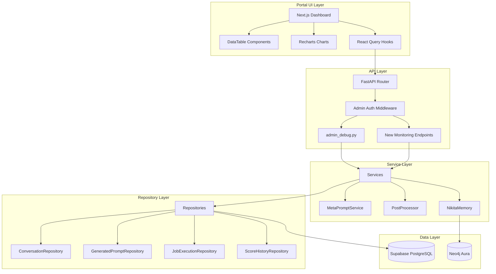
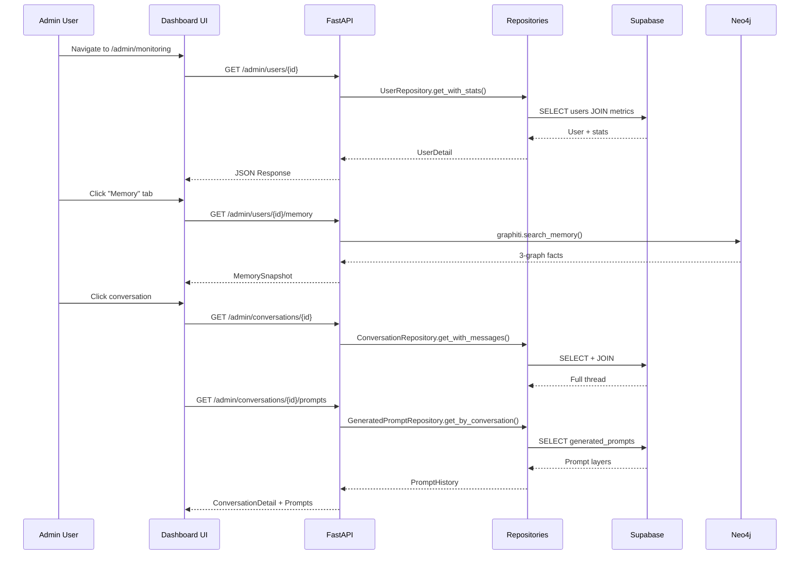

# Admin Monitoring Dashboard - Tree-of-Thought Analysis

**Created**: 2026-01-22
**Phase**: 2 - Synthesis & Dependency Visualization

---

## 1. System Layers Diagram



---

## 2. Data Flow Diagram



---

## 3. Component Dependency Tree

```
Admin Monitoring Dashboard
├── FOUNDATION (Must build first)
│   ├── F1: Admin Auth Middleware Enhancement
│   │   └── Deps: auth.py (exists)
│   ├── F2: Base Monitoring Schemas
│   │   └── Deps: admin.py schemas (extend)
│   └── F3: Shared UI Components
│       └── Deps: shadcn/ui (exists)
│
├── PARALLEL WORK (Can build concurrently)
│   ├── P1: User Monitoring Module
│   │   ├── P1.1: User List Endpoint (extend)
│   │   ├── P1.2: User Detail Endpoint (extend)
│   │   ├── P1.3: User Memory Endpoint (NEW)
│   │   └── P1.4: User Scores Endpoint (NEW)
│   │
│   ├── P2: Conversation Module
│   │   ├── P2.1: Conversation List (exists)
│   │   ├── P2.2: Conversation Detail (exists)
│   │   ├── P2.3: Conversation Prompts (NEW)
│   │   └── P2.4: Pipeline Status (NEW)
│   │
│   ├── P3: Prompts Module
│   │   ├── P3.1: Prompts List (exists)
│   │   ├── P3.2: Prompt Detail (exists)
│   │   └── P3.3: Prompt Layers View (NEW)
│   │
│   ├── P4: Scoring Module
│   │   ├── P4.1: Score History List (extend)
│   │   ├── P4.2: Score Timeline Chart (NEW)
│   │   └── P4.3: Boss Encounters View (NEW)
│   │
│   ├── P5: Voice Module
│   │   ├── P5.1: Voice Sessions List (exists)
│   │   ├── P5.2: Session Detail (exists)
│   │   └── P5.3: Transcript View (extend)
│   │
│   ├── P6: Jobs Module
│   │   ├── P6.1: Job List (exists)
│   │   ├── P6.2: Job Detail (extend)
│   │   └── P6.3: Pipeline Stage View (NEW)
│   │
│   └── P7: Memory Module
│       ├── P7.1: Memory Overview (NEW)
│       ├── P7.2: User Graph View (NEW)
│       ├── P7.3: Relationship Graph View (NEW)
│       └── P7.4: Nikita Graph View (NEW)
│
└── INTEGRATION (After parallel work)
    ├── I1: Cross-Module Navigation
    ├── I2: Dashboard Overview Page
    ├── I3: Error Aggregation View
    └── I4: System Health Metrics
```

---

## 4. Build Order Analysis

### Phase A: Foundation (Sequential - 2-3 hours)

| Task | Deps | Type | Effort |
|------|------|------|--------|
| F1: Extend auth middleware | None | Extend | 30min |
| F2: New response schemas | F1 | NEW | 1h |
| F3: DataTable + Card components | None | Extend | 1h |

### Phase B: Backend Endpoints (Parallel - 4-6 hours)

| Task | Deps | Type | Effort |
|------|------|------|--------|
| P1.3: User Memory | F2 | NEW | 1h |
| P1.4: User Scores | F2 | NEW | 45min |
| P2.3: Conversation Prompts | F2 | NEW | 45min |
| P2.4: Pipeline Status | F2, P6.3 | NEW | 1h |
| P3.3: Prompt Layers | F2 | NEW | 45min |
| P4.2: Score Timeline | F2 | NEW | 1h |
| P4.3: Boss Encounters | F2 | NEW | 45min |
| P6.3: Pipeline Stage | F2 | NEW | 1h |
| P7.1-P7.4: Memory Views | F2 | NEW | 2h |

### Phase C: Frontend Components (Parallel - 6-8 hours)

| Task | Deps | Type | Effort |
|------|------|------|--------|
| User Tab | P1.* backend | Extend | 1.5h |
| Conversations Tab | P2.* backend | Extend | 2h |
| Prompts Tab | P3.* backend | Extend | 1.5h |
| Scoring Tab | P4.* backend | NEW | 2h |
| Voice Tab | P5.* backend | Extend | 1h |
| Jobs Tab | P6.* backend | Extend | 1.5h |
| Memory Tab | P7.* backend | NEW | 2h |

### Phase D: Integration (Sequential - 2-3 hours)

| Task | Deps | Type | Effort |
|------|------|------|--------|
| I1: Cross-module navigation | All tabs | NEW | 1h |
| I2: Dashboard overview | All tabs | NEW | 1h |
| I3: Error aggregation | P6.* | NEW | 45min |
| I4: Health metrics | I2, I3 | NEW | 30min |

---

## 5. API Endpoints Summary

### Existing (Extend)

| Endpoint | Current | Enhancement |
|----------|---------|-------------|
| GET /admin/users | List all | Add pagination, filters |
| GET /admin/users/{id} | Basic detail | Add metrics, game state |
| GET /admin/conversations | List all | Add date range filter |
| GET /admin/conversations/{id} | Thread only | Add pipeline status |
| GET /admin/prompts/recent | Recent list | Add user filter |
| GET /admin/jobs | Job list | Add failure filter |
| GET /admin/voice/sessions | Voice list | Add transcript preview |

### New (Create)

| Endpoint | Purpose | Response |
|----------|---------|----------|
| GET /admin/users/{id}/memory | 3-graph snapshot | MemorySnapshot |
| GET /admin/users/{id}/scores | Score timeline | ScoreTimeline |
| GET /admin/conversations/{id}/prompts | All conversation prompts | PromptHistory |
| GET /admin/conversations/{id}/pipeline | 9-stage status | PipelineStatus |
| GET /admin/prompts/{id}/layers | Prompt layer breakdown | PromptLayers |
| GET /admin/scores/timeline | Score chart data | ChartData |
| GET /admin/scores/boss | Boss encounter list | BossEncounters |
| GET /admin/jobs/{id}/stages | Pipeline stages | StageDetails |
| GET /admin/memory/stats | Memory health | MemoryStats |
| GET /admin/metrics/overview | System overview | SystemMetrics |
| GET /admin/errors | Error log | ErrorList |

---

## 6. UI Component Tree

```
/admin/monitoring (TabLayout)
├── Tab: Overview
│   ├── SystemHealthCard
│   │   ├── ActiveUsersMetric
│   │   ├── ConversationsToday
│   │   ├── ProcessingSuccessRate
│   │   └── AverageResponseTime
│   ├── RecentActivityFeed
│   └── AlertsPanel
│
├── Tab: Users
│   ├── UserListTable (DataTable)
│   │   ├── Columns: email, chapter, score, last_active
│   │   ├── Filters: chapter, engagement_state
│   │   └── Actions: View Detail
│   └── UserDetailPanel (Drawer)
│       ├── UserInfoCard
│       ├── GameStateCard
│       ├── ConversationsList (mini)
│       └── ScoreChart (mini)
│
├── Tab: Conversations
│   ├── ConversationListTable
│   │   ├── Columns: user, platform, status, created_at
│   │   ├── Filters: platform, status, date_range
│   │   └── Actions: View Thread
│   └── ConversationDetailPanel
│       ├── MessageThread
│       ├── PromptsList (collapsible)
│       ├── PipelineStatus (9 stages)
│       └── ScoringDelta
│
├── Tab: Prompts
│   ├── PromptListTable
│   │   ├── Columns: user, template, tokens, created_at
│   │   └── Actions: View Layers
│   └── PromptDetailPanel
│       ├── SystemPromptLayer
│       ├── HumanizationLayer
│       ├── ContextLayer
│       ├── TokenBreakdown
│       └── ContextSnapshot (JSON viewer)
│
├── Tab: Scoring
│   ├── ScoreTimelineChart (Recharts)
│   │   ├── Lines: trust, intimacy, attraction, commitment
│   │   └── DateRangePicker
│   ├── ScoreHistoryTable
│   └── BossEncountersTable
│       ├── Columns: chapter, outcome, reasoning
│       └── Actions: View Detail
│
├── Tab: Voice
│   ├── VoiceSessionsTable
│   │   ├── Columns: user, duration, turns, created_at
│   │   └── Actions: View Transcript
│   └── SessionDetailPanel
│       ├── TranscriptView
│       ├── TurnScoring
│       └── ElevenLabsMetadata
│
├── Tab: Memory
│   ├── MemoryStatsCards
│   │   ├── UserGraphCount
│   │   ├── RelationshipGraphCount
│   │   └── NikitaGraphCount
│   ├── UserGraphTable
│   │   └── Columns: fact, source, created_at
│   ├── RelationshipGraphTable
│   │   └── Columns: episode, type, created_at
│   └── NikitaGraphTable
│       └── Columns: event, type, created_at
│
├── Tab: Jobs
│   ├── JobListTable
│   │   ├── Columns: job_name, status, duration, created_at
│   │   ├── Filters: status, job_name
│   │   └── Actions: View Detail
│   └── JobDetailPanel
│       ├── ExecutionTimeline
│       ├── StageBreakdown (9 stages)
│       ├── ResultJSON
│       └── StackTrace (if failed)
│
└── Tab: Errors
    ├── ErrorStatsCards
    │   ├── TotalErrors24h
    │   ├── ByCategory
    │   └── TrendChart
    └── ErrorLogTable
        ├── Columns: type, message, user, created_at
        ├── Filters: type, severity, date_range
        ├── Search: message contains
        └── Actions: View Stack Trace
```

---

## 7. Critical Dependencies

### Database Additions Needed

```sql
-- Index for performance
CREATE INDEX IF NOT EXISTS idx_conversations_status ON conversations(status);
CREATE INDEX IF NOT EXISTS idx_conversations_platform ON conversations(platform);
CREATE INDEX IF NOT EXISTS idx_job_executions_status ON job_executions(status);
CREATE INDEX IF NOT EXISTS idx_generated_prompts_user_id ON generated_prompts(user_id);
```

### Repository Methods Needed

| Repository | Method | Purpose |
|------------|--------|---------|
| UserRepository | get_with_full_stats() | User + metrics + game state |
| ConversationRepository | get_by_user_with_pagination() | User's conversations |
| ConversationRepository | get_pipeline_status() | 9-stage status |
| GeneratedPromptRepository | get_by_conversation_id() | All prompts for conv |
| ScoreHistoryRepository | get_timeline_data() | Chart-ready data |
| ScoreHistoryRepository | get_boss_encounters() | Boss-only events |
| MemoryRepository (NEW) | get_graph_stats() | Neo4j stats |

### Service Methods Needed

| Service | Method | Purpose |
|---------|--------|---------|
| AdminMonitoringService (NEW) | get_system_overview() | Aggregate metrics |
| AdminMonitoringService (NEW) | get_error_summary() | Error categorization |
| NikitaMemory | get_memory_snapshot() | All 3 graphs for user |

---

## 8. Risk Analysis

| Risk | Mitigation | Impact |
|------|------------|--------|
| Neo4j cold start (60-73s) | Add loading state, cache stats | Medium |
| Large conversation threads | Server-side pagination | Low |
| Token budget complexity | Pre-computed summaries | Low |
| Cross-tab state sync | React Query cache | Medium |

---

## 9. Implementation Order Summary

```
Week 1: Foundation + Backend
├── Day 1-2: Foundation (F1-F3) + Schemas
└── Day 3-5: Backend endpoints (P1-P7)

Week 2: Frontend + Integration
├── Day 1-3: Tab components (all 8)
├── Day 4: Integration (I1-I2)
└── Day 5: Polish + E2E tests
```

---

## 10. Validation Checkpoint

**Before proceeding to Phase 3 (SDD Specification), confirm:**

1. ✅ Tabbed layout with 8 sections acceptable?
2. ✅ New endpoints list complete?
3. ✅ UI component hierarchy makes sense?
4. ✅ Build order (Foundation → Parallel → Integration) approved?
5. ✅ No missing data sources?
