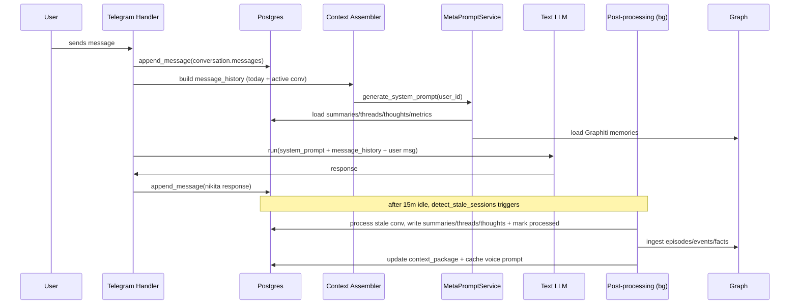
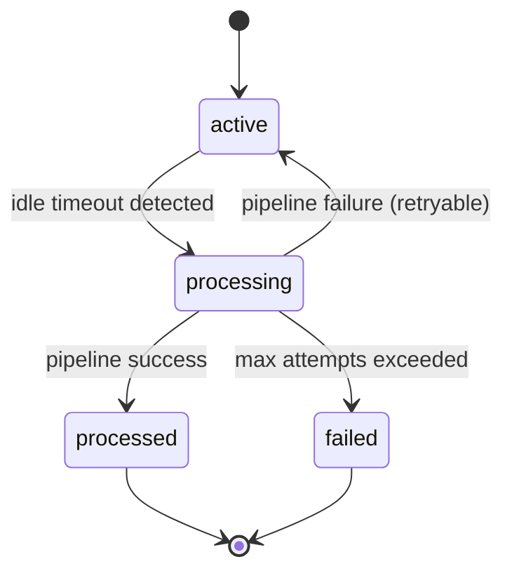

# PRD: Nikita Conversation Continuity & Memory System (Text + Voice)

**Document version:** 1.0 (2026-01-19)
**Owner:** Product (you)
**Primary goal:** Stop “starting from zero” and make Nikita consistently continuous across **text** and **voice**, with sane multi-tier memory injection.

---

## 1) Problem statement

Users experience **rapid continuity loss**: after short gaps, Nikita behaves as if the conversation restarted with minimal or no awareness of what was just discussed, and she fails to carry over relationship state, emotional moments, open loops, and recent history.

This breaks the core illusion: Nikita should feel like a persistent, coherent person with shared history.

---

## 2) What we believe is happening today (verified from repo)

### 2.1 Text flow stores messages, but the model is not given message history

* Text messages are appended into `conversations.messages` (JSON array) via `ConversationRepository.append_message(...)` and used by Telegram handler.

  * `nikita/platforms/telegram/message_handler.py`
  * `nikita/db/repositories/conversation_repository.py`
* However, the **text agent call** currently passes only the *latest user message* into the model run (`generate_response(deps, message)`), and does **not** provide prior turns as `message_history`.

  * `nikita/agents/text/handler.py`
  * `nikita/agents/text/agent.py`

**Impact:** even if the DB contains messages, the LLM sees “system prompt + single user message”, so it can’t maintain short-term continuity.

---

### 2.2 Text post-processing is intended to run, but it’s broken and likely leaves conversations stuck

Text continuity relies heavily on post-processing to create:

* conversation summaries (`conversations.conversation_summary`)
* extracted entities / facts (`conversations.extracted_entities`)
* threads (`conversation_threads`)
* thoughts (`nikita_thoughts`)
* daily summaries (`daily_summaries`)
* knowledge graph updates (Graphiti / Neo4j)
* cached prompt/context packages (`context_packages`) and potentially cached voice prompt sync

The scheduled job endpoint:

* `POST /tasks/process-conversations`

  * implemented in `nikita/api/routes/tasks.py`
  * uses stale detection: `nikita/context/session_detector.py`
  * calls the *new* pipeline: `from nikita.post_processing import process_conversations`

But the adapter called by that pipeline has a hard bug:

* `nikita/post_processing/adapter.py` calls `conv_repo.get_messages(conv_id)`
* `ConversationRepository` has **no** `get_messages` method

  * verified in `nikita/db/repositories/conversation_repository.py`

So post-processing for text likely fails early, and stale conversations get set to `status='processing'` without being finalized to `processed` or rolled back.

**Impact on “starts from zero”:**

* `SessionDetector.detect_stale_sessions` marks stale conversations as `processing`
* Telegram handler only reuses conversations with `status='active'` (`get_active_conversation`)
* So after a gap, a new conversation gets created, and since post-processing failed, the memory artifacts never update → “amnesia”.

---

### 2.3 Voice uses the old post-processor successfully (and caches voice prompts), but text does not

Voice webhook processing uses:

* `nikita/context/post_processor.py` (the “old pipeline”)

  * inside `nikita/api/routes/voice.py` around transcript handling
* After successful post-processing, voice caches the next call’s prompt:

  * `users.cached_voice_prompt`, `users.cached_voice_prompt_at`

Voice pre-call webhook path (`nikita/agents/voice/inbound.py`) uses `cached_voice_prompt` because it cannot call LLM/Neo4j in pre-call.

**Impact:** voice is closer to “continuous” than text, and text updates may not propagate to voice caching.

---

## 3) Goals & success metrics

### P0 Goals (must ship)

1. **Short-term continuity (same day / same session)**

   * Nikita should remember what was said earlier today and within the current conversation.
2. **Robust post-processing**

   * Post-processing must reliably run for text and update memory artifacts; no “stuck in processing”.
3. **Cross-channel continuity (text ↔ voice)**

   * Voice should reflect the latest relationship and recent context from text, and vice versa.

### Success metrics

* **Continuity score (qual + measurable):**

  * ≥ 90% of new sessions include at least **one correct callback** from the last 24 hours (or “today” in user timezone).
* **Post-processing health:**

  * ≥ 99% success rate for `/tasks/process-conversations`
  * 0 conversations stuck in `status='processing'` for > 30 minutes
* **Prompt continuity coverage:**

  * ≥ 95% of text LLM calls include message history window (bounded by tokens)
* **Latency:**

  * Text response P95 +< 250ms overhead for history assembly (DB-only)
  * Post-processing can be slower (background), but must be reliable.

---

## 4) Non-goals (explicitly out of scope for this PRD)

* Building a new UI.
* Building a full “RAG semantic search” system from scratch (you already have Graphiti + embeddings table; we’ll leverage what exists).
* Overhauling scoring/chapter mechanics.
* Rewriting the whole agent stack (we’ll wire what exists).

---

## 5) Definitions

* **Conversation (DB):** row in `conversations` table; holds a session transcript in `messages[]`, status fields, summary fields.
* **Session boundary:** for text, “stale” after N minutes inactivity (currently 15). For voice, the call end event.
* **Short-term memory:** raw or lightly formatted recent turns (today / current conversation).
* **Mid-term memory:** daily summaries, open threads, active thoughts.
* **Long-term memory:** stable facts, relationship episodes, Nikita life events in Graphiti.
* **Context Package:** precomputed bundle stored in `context_packages` (expires ~24h) for fast injection.

---

## 6) Required memory layers (what must be injected)

This is the continuity spec in concrete terms.

### Layer A — Immediate conversation window (P0)

**For text:** inject the recent conversation turns as actual `message_history` (not just summarized text).

* Must include enough to track:

  * last question asked
  * commitments / promises
  * tone shifts
  * names / references used minutes ago

**Default:** last **~30–80 turns** (bounded by tokens), pulled from:

* current active conversation
* plus earlier conversations from **today** (user timezone), backfilled until token budget reached

### Layer B — Today recap (P0)

Inject a short “Earlier today” summary, updated as conversations get processed (or computed on-demand if missing).

* Stored in `daily_summaries` (existing)
* Also appropriate inside `context_packages`

### Layer C — Open loops (threads, promises, cliffhangers) (P0)

Inject open `conversation_threads` (and optionally `nikita_thoughts`) so Nikita:

* follows up naturally
* remembers what she said she would do
* doesn’t drop emotional moments

### Layer D — Relationship state & emotional state (P0)

Inject:

* relationship score and key hidden metrics (`user_metrics`)
* engagement state (`engagement_state`)
* Nikita emotional state (`nikita_emotional_states` or emotional_state module output)

### Layer E — Long-term memory (P0)

Inject relevant Graphiti memories:

* `user_facts`
* `relationship_episodes`
* `nikita_events`

MetaPromptService already queries all 3 graphs; the missing piece is **making sure graphs are updated** and included consistently.

---

## 7) Functional requirements

### FR-1: Text agent must receive message history (P0)

**Requirement:** Every text model run must include a bounded message history window.

**Implementation notes (repo touchpoints):**

* Build message history from `conversations.messages` (JSON list with `{role, content, timestamp}`)
* Pass it into the model run call in the PydanticAI agent invocation.

**Where:**

* `nikita/agents/text/handler.py` is where we currently call `generate_response(deps, message)` with no history.
* Add a history loader that:

  1. finds current active conversation and gathers recent messages
  2. optionally backfills from other conversations “today”
  3. token-prunes to a budget (see FR-7)

**Acceptance criteria:**

* Given a user says “as I said earlier…” within 24 hours, Nikita can correctly reference the earlier detail ≥ 90% of time.
* A unit test validates message_history is passed for a known conversation.

---

### FR-2: Fix text post-processing pipeline so it actually runs end-to-end (P0)

**Requirement:** `/tasks/process-conversations` must successfully process stale text conversations and finalize DB state.

**Current bug to fix (verified):**

* `nikita/post_processing/adapter.py` calls `ConversationRepository.get_messages` (doesn’t exist)

**Required behavior:**

* Pipeline must read transcript from the `Conversation` model’s `messages` field (or implement `get_messages` properly).
* On success: set `status='processed'`, `processed_at=now`, store summary/entities, etc.
* On failure: do **not** leave in `status='processing'` indefinitely.

**Status state machine (required):**

* `active` → `processing` → (`processed` | `active` retryable | `failed`)
* If processing fails, either:

  * revert to `active` and increment `processing_attempts` (so it gets retried up to max)
  * OR mark `failed` and schedule explicit retry job

**Acceptance criteria:**

* No conversation stays `processing` longer than 30 minutes.
* Failures are logged per-conversation and surfaced in `job_executions`.
* A regression test simulates the adapter path and verifies no AttributeError.

---

### FR-3: Define and enforce conversation boundaries for continuity (P0)

**Requirement:** session boundaries must not cause memory reset.

**Text:**

* Keep the 15-minute stale boundary, but:

  * ensure that the **new conversation** still pulls “today history” into message_history
  * ensure post-processing for the prior conversation runs reliably

**Voice:**

* Call is a session; continuity across calls depends on cached prompt + memory artifacts.

**Acceptance criteria:**

* A new text conversation created after 20 minutes still has “today” context.

---

### FR-4: Context package generation + retrieval (P1 but strongly recommended)

**Requirement:** Use `context_packages` as a fast, bounded memory bundle with 24h expiry.

**Why:** makes “today continuity” cheap and reliable, and avoids re-deriving context on every message.

**Contents (minimum viable):**

* today_summary
* last_conversation_summary
* open_threads (top N)
* top relationship episodes (top N)
* top user facts (top N)
* nikita state snapshot (mood/energy + conflict_state)
* token budget metadata + “generated_at”

**Read path:**

* On new conversation start (or first message after stale gap), fetch latest non-expired context package and include in system prompt injection.

**Acceptance criteria:**

* context package exists and updates at least daily and after successful post-processing.
* expiry works (24h) and old packages are cleaned.

---

### FR-5: Keep voice and text in sync (P0)

**Requirement:** After **text** post-processing succeeds, also refresh voice cache (`users.cached_voice_prompt`) or provide equivalent data to voice pre-call.

**Approach options (choose one):**

* **Option A (simple):** After processing a conversation, regenerate prompt via MetaPromptService and store into `users.cached_voice_prompt`.
* **Option B (cheaper):** Store a context package; voice pre-call composes a stable prompt template + dynamic variables + package injection.

**Acceptance criteria:**

* A user who has a deep text conversation and then calls voice the same day gets a prompt that reflects those new developments.

---

### FR-6: MetaPromptService must include last conversation summary + timezone-correct “today” (P0)

**Requirement:** The prompt generation should include:

* `last_conversation_summary` (currently present in model but not populated in MetaPromptService)
* “today” windows computed using `users.timezone` (not UTC-only assumptions)

**Acceptance criteria:**

* If yesterday and today differ by timezone, “Earlier today” refers to user’s local day.

---

### FR-7: Token budgeting and graceful degradation (P0)

**Requirement:** Never blow context limits; degrade gracefully.

**Rules:**

* Reserve a budget for:

  * system prompt (MetaPromptService) ~ up to 10k–12k tokens
  * message_history window ~ e.g. 1.5k–3k tokens
  * user message + response overhead

**Mechanism:**

* Use `nikita/context/utils/token_counter.py` (already referenced by MetaPromptService) to prune:

  * keep most recent turns
  * keep the last user question + Nikita answer pair even if pruning
  * keep “emotional peaks” if you have tags (optional)

**Acceptance criteria:**

* Under heavy chat, system continues working without errors; history is pruned deterministically.

---

### FR-8: Observability & debugging (“why did she forget?”) (P0)

**Requirement:** Provide a way to introspect what context was injected.

Minimum:

* Log generated prompts (`generated_prompts` already exists)
* Store `context_snapshot` including:

  * which conversation IDs were included as history
  * how many messages and tokens
  * which memory sources used (threads/thoughts/graphs/packages)
  * whether post-processing is lagging/failing

Optional:

* Admin debug endpoint to view:

  * last prompt
  * last context package
  * last processed conversation summary
  * stale processing failures

**Acceptance criteria:**

* Engineers can answer: “Was the model given the information and still forgot, or was it not injected?”

---

## 8) Proposed architecture

### 8.1 Sequence: Text message handling (target)

### 8.2 Conversation status machine (target)

---

## 9) Options considered (and recommended approach)

### Option 1 — Fix new `nikita/post_processing` pipeline and keep it as the one true pipeline

**Pros**

* Aligns with Spec 029 (“wire humanization modules into production”)
* Produces `context_packages` as designed
* Centralizes all modules (life sim, emotional state, conflicts, touchpoints)

**Cons**

* Currently broken in adapter; may have other integration gaps
* More moving parts → higher chance of partial failures unless carefully hardened

**Score (1–10)**

* Continuity impact: 9
* Engineering risk: 6
* Time-to-fix: 6
* Long-term maintainability: 8
  **Total:** 29/40

---

### Option 2 — Revert text to old `nikita/context/post_processor` (like voice) + add missing pieces incrementally

**Pros**

* Known working path (voice relies on it)
* Faster path to restore continuity baseline

**Cons**

* Doesn’t automatically activate humanization modules in `nikita/post_processing/`
* Still need to add context_packages and possibly other features

**Score**

* Continuity impact: 8
* Engineering risk: 8
* Time-to-fix: 8
* Long-term maintainability: 6
  **Total:** 30/40

---

### Option 3 — Hybrid: use old post-processor for critical writes + new pipeline for package composition/humanization later

**Pros**

* Fast continuity fix + gradual rollout
* Can stage risk (feature flag new pipeline steps)

**Cons**

* Two pipelines temporarily = complexity
* Requires careful ordering to avoid inconsistent state

**Score**

* Continuity impact: 9
* Engineering risk: 7
* Time-to-fix: 7
* Long-term maintainability: 7
  **Total:** 30/40

**Recommendation:** **Option 2 or 3** for fastest continuity recovery with controlled risk.
If you need “stop the bleeding immediately,” do **Option 2** first, then evolve toward Option 1.

---

## 10) Implementation requirements (hand-off checklist for coding agent)

### 10.1 P0 tasks (must)

1. **Text message history injection**

   * Add a history loader in `nikita/agents/text/handler.py`
   * Pass `message_history` into the PydanticAI agent run

2. **Fix `/tasks/process-conversations` pipeline failure**

   * Fix `nikita/post_processing/adapter.py` to read `Conversation.messages` correctly
   * Ensure pipeline marks conversation state on success/failure (no stuck `processing`)

3. **Populate `last_conversation_summary` in MetaPromptService**

   * Update `nikita/meta_prompts/service.py` context loading to set it
   * Ensure “today” is timezone-correct

4. **After successful text post-processing, refresh voice cache**

   * Update `users.cached_voice_prompt` similarly to voice webhook behavior

5. **Add observability**

   * Ensure `generated_prompts.context_snapshot` includes:

     * conversation IDs used for history
     * token counts per layer
     * whether package was used

---

### 10.2 P1 tasks (strongly recommended)

* Implement `context_packages` end-to-end:

  * store after post-processing
  * read at conversation start
  * inject into prompt consistently

* Add admin/debug tooling:

  * show last prompt + last context package + last processing errors

---

## 11) Test plan (minimum bar)

### Unit tests

* **History builder**

  * Given a conversation with 10 turns, ensure last N included in correct role order
  * Token pruning deterministic

* **Post-processing state transitions**

  * Pipeline success → `processed`
  * Pipeline failure → not stuck in `processing`

### Integration tests

* Simulate:

  1. user talks for 5 mins
  2. wait > 15 mins
  3. send another message
* Assert:

  * new response references prior context (via injected history or summary)
  * prior conversation is eventually processed

### Observability checks

* `generated_prompts` row exists for a response
* `context_snapshot` shows injected layers and counts

---

## 12) Data model mapping (what to use for what)

* **Short-term transcript:** `conversations.messages`
* **Conversation boundary:** `conversations.last_message_at`, `status`, `ended_at`
* **Mid-term memory (summaries):** `daily_summaries`
* **Open loops:** `conversation_threads`
* **Inner-life hooks:** `nikita_thoughts`
* **Relationship & progression:** `users.relationship_score`, `users.chapter`, `user_metrics`, `engagement_state`, `nikita_emotional_states`
* **Fast cache bundle:** `context_packages`
* **Voice prompt cache:** `users.cached_voice_prompt`

---

## 13) Deliverables from engineering

1. **Continuity baseline restored for text** (history injected + post-processing reliable)
2. **No stuck “processing” conversations**
3. **Cross-channel parity:** voice reflects recent text via cache refresh
4. **Debug visibility**: prompt/context snapshot tells us what the model saw

---

## Appendix: Why this PRD will actually fix “starts from zero”

Two independent causes are currently producing “amnesia”:

1. **The model is not given the recent chat turns** → fixed by FR-1 (message history injection).
2. **Post-processing is failing and leaving conversations in `processing`** → fixed by FR-2 (pipeline repair + status finalization).

Once both are fixed, you get:

* immediate continuity (the model sees the context)
* durable continuity (memory artifacts update and re-inject later)

That’s the whole spellbook. No mystical incantations required—just wiring, reliability, and token discipline.
