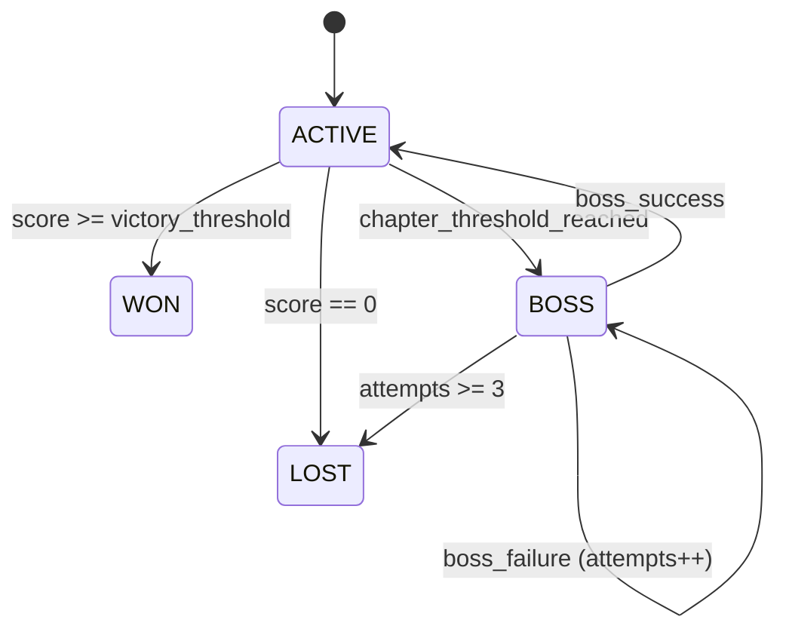

# 1. What “feels real” means in this game

Nikita “feels real” when the player experiences **continuity**, **agency**, and **consequences**:

- **Continuity**: she remembers, has emotional carry-over, and doesn’t contradict herself.
- **Agency**: she has her own life, makes choices, has priorities, and sometimes says “no.”
- **Consequences**: the relationship can deepen, stagnate, or end; choices matter.

In system terms, “feels real” emerges from **closed-loop dynamics**:

1) **User says something →** 2) **system loads context & simulates Nikita’s current life →**
3) **Nikita responds in-character →** 4) **system extracts updates (memory, mood, score, story) →**
5) **future context changes**.

This spec defines a ToT diagram that makes these loops explicit and controllable.

---

# 2. Diagram conventions: nodes, edges, and hierarchy

This section defines a **diagram schema** you can use for:
- a visual mindmap,
- a graph database (conceptual), or
- a prompt-assembly “map of the system.”

## 2.1 Node taxonomy

Each node in the ToT diagram MUST have:

- `id` (stable unique string, e.g. `CTX_ENGINE`)
- `label` (human readable)
- `type` (from enums below)
- `parent_id` (for hierarchy; `null` for root)
- `description` (1–6 sentences)
- `attributes` (typed key-value bag)
- `interfaces` (inputs/outputs)
- `state` (optional, if the node represents a stateful entity)
- `failure_modes` (optional)
- `metrics` (optional)

**NodeType enum (recommended):**
- `Entity`: a “thing” with identity (User, Nikita, Friend, Session)
- `Process`: a transformation pipeline (Context Collection, Prompt Generation)
- `State`: a state machine or state bundle (Mood, Chapter/Boss state)
- `DataStore`: persistence/caches (Postgres tables, Redis keys)
- `Policy`: guardrails and invariants (Constitution, Safety)
- `DecisionPoint`: a branching design choice (memory format, cache TTL)
- `ExternalService`: third-party system (LLM API, ElevenLabs, Firecrawl)

## 2.2 Edge taxonomy

Edges encode relationships and dependencies between nodes.

Each edge MUST have:
- `from`
- `to`
- `relation_type` (enum below)
- `description`
- `direction` (`one_way` | `two_way`)
- `trust_boundary` (`true` if crossing untrusted input boundary)
- `latency_budget_ms` (optional)
- `failure_impact` (`low` | `medium` | `high`)

**RelationType enum (recommended):**
- `depends_on` (A requires B to function)
- `reads` / `writes` (data flow to/from stores)
- `produces` / `consumes` (process I/O)
- `triggers` (A causes B to run)
- `influences` (A changes parameters/behavior of B)
- `constrains` (policy limits process)
- `caches` (cache relationship)
- `summarizes` (compression/abstraction relationship)
- `is_part_of` (composition cross-links)

## 2.3 Hierarchy vs cross-links

- The **hierarchy** is the “main tree” (parent-child).
- **Cross-links** are edges across branches (feedback loops, data dependencies).
- A node may have multiple cross-links, but MUST have exactly one parent (tree).

---

# 3. Root hierarchy: the Nikita system ToT tree (spec)

Below is the canonical hierarchy (the “tree” part).
Cross-links and feedback loops are specified later.

> Note: Node IDs are stable identifiers you can use to render diagrams or drive prompt assembly.

## 3.1 Root

- `NIKITA_SYSTEM` (Root, type: `Entity`)
  - `EXPERIENCE_LAYER` (type: `Process`)
  - `RUNTIME_PIPELINE` (type: `Process`)
  - `STATE_AND_DATA` (type: `DataStore`)
  - `CROSS_CUTTING_GOVERNANCE` (type: `Policy`)

## 3.2 Experience layer

### 3.2.1 Nikita Persona

- `NIKITA_PERSONA` (Entity)
  - `PERSONA_CORE` (State)
    - traits (confident, playful, emotionally intelligent)
    - conversational style (warm, teasing, assertive)
    - boundaries/anti-goals (not therapist; game framing)
  - `BACKSTORY_MODEL` (State)
    - stable biography anchors (age, work domain, upbringing, values)
    - mutable details (today’s plans, evolving career beats)
    - contradiction constraints
  - `GOALS_AND_DRIVES` (State)
    - relationship drive (stay connected, test trust)
    - life drive (career, friends, hobbies)
    - conflict drive (boss tests, jealousy tests)
  - `EMOTIONAL_CONTINUITY` (State)
    - mood state variables
    - emotional memory (carry-over from events & conversations)

### 3.2.2 Player model

- `PLAYER_MODEL` (Entity)
  - `USER_PROFILE` (State)
    - demographics, preferences, relationship goals
  - `PLAYER_INTENT` (State)
    - current goal inference (comfort, flirting, logistics)
  - `SHARED_HISTORY` (State)
    - conversation history & summarizations
    - shared memories (events, rituals, promises)

### 3.2.3 Relationship (dyad)

- `RELATIONSHIP_DYAD` (State)
  - `SCORES_AND_METRICS` (State)
  - `CHAPTER_STATE_MACHINE` (State)
  - `BOSS_FIGHT_STATE` (State)
  - `DECAY_DYNAMICS` (State)

## 3.3 Runtime pipeline

This aligns with the Nikita v2 architecture: Input → Context → Prompt → Agent → Post-processing → Persist/cache.

- `INPUT_ADAPTERS` (Process)
  - `TELEGRAM_HANDLER` (ExternalService/Process)
  - `ELEVENLABS_WEBHOOK_HANDLER` (ExternalService/Process)
  - `PORTAL_API` (Process)
  - `MESSAGE_ROUTER` (Process)

- `CONTEXT_ENGINE` (Process)
  - `CTX_COLLECTOR_USER_PROFILE`
  - `CTX_COLLECTOR_MEMORY`
  - `CTX_COLLECTOR_LIFE_SIM`
  - `CTX_COLLECTOR_GAME_STATE`
  - `CTX_COLLECTOR_TEMPORAL`
  - `CTX_COLLECTOR_SOCIAL_CIRCLE`
  - `CTX_PACKAGE_ASSEMBLY` (Process)
  - `CTX_PRIORITIZATION` (DecisionPoint)

- `PROMPT_GENERATION` (Process)
  - `PROMPT_TEMPLATES` (DataStore)
  - `TOKEN_BUDGETER` (Process/DecisionPoint)
  - `CHANNEL_VARIANTS` (DecisionPoint)

- `AGENT_LAYER` (Process)
  - `AGENT_ROUTER` (DecisionPoint)
  - `TEXT_AGENT` (ExternalService/Process)
  - `VOICE_AGENT` (ExternalService/Process)
  - `RESPONSE_HANDLER` (Process)

- `POST_PROCESSING_PIPELINE` (Process)
  - `PHASE_1_EXTRACTION` (Process)
  - `PHASE_2_STATE_UPDATES` (Process)
  - `PHASE_3_BACKGROUND` (Process)
  - `PHASE_4_FINALIZATION` (Process)

- `BACKGROUND_RESEARCH` (Process)
  - `TOPIC_DETECTOR` (Process)
  - `RESEARCH_QUEUE` (DataStore)
  - `FIRECRAWL_FETCH` (ExternalService)
  - `RESEARCH_SUMMARIZER` (ExternalService/Process)

## 3.4 State and data

- `PERSISTENCE_LAYER` (DataStore)
  - `SUPABASE_POSTGRES` (DataStore)
    - `TABLE_USERS`
    - `TABLE_USER_METRICS`
    - `TABLE_USER_FACTS_PGVECTOR`
    - `TABLE_NIKITA_STATE`
    - `TABLE_CONVERSATIONS`
    - `FN_MATCH_USER_FACTS`
  - `REDIS_CACHE` (DataStore)
    - `KEY_CONTEXT_USER`
    - `KEY_VOICE_CONTEXT_USER`
  - `OBSERVABILITY_LOGS` (DataStore)

- `STATE_MODELS` (State)
  - `CONTEXT_PACKAGE_MODEL`
  - `NIKITA_STATE_MODEL`
  - `USER_PROFILE_MODEL`
  - `USER_METRICS_MODEL`
  - `CONVERSATION_MODEL`
  - `MEMORY_FACT_MODEL`

## 3.5 Cross-cutting governance

- `TECHNICAL_CONSTITUTION` (Policy)
  - `SINGLE_SOURCE_OF_TRUTH_DB`
  - `PARALLEL_BY_DEFAULT`
  - `GRACEFUL_DEGRADATION`
  - `VOICE_TEXT_PARITY`
  - `TYPE_SAFETY_ASYNC_FIRST`

- `SAFETY_AND_SECURITY` (Policy)
  - `PROMPT_INJECTION_DEFENSES`
  - `LEAST_PRIVILEGE_TOOLING`
  - `PII_AND_GDPR_BOUNDARIES`
  - `CONTENT_BOUNDARIES` (anti-therapy, anti-deception)

- `PERFORMANCE_BUDGETS` (Policy)
  - `CTX_LATENCY_BUDGET`
  - `VOICE_TOOL_BUDGET`
  - `PROMPT_TOKEN_BUDGET`
  - `PIPELINE_BUDGET`

---

# 4. Entity definitions and attributes

This section defines “what each thing is” and what must be tracked for it to feel coherent.

## 4.1 Nikita Persona

**Definition:** The stable identity and behavioral policy that makes Nikita recognizably herself across sessions and channels.

**Split the persona into two layers (critical):**
1) **Stable persona (policy + biography anchors)** — rarely changes.
2) **Dynamic state (mood + activity + recent events + active conflicts)** — changes frequently.

This matches the v2 architecture: a fixed identity section plus dynamic context sections in the prompt generator.

### 4.1.1 Persona core attributes (stable)

- `age`: 26
- `archetype`: “cool girlfriend who keeps you on your toes”
- `traits` (canonical list, used for prompt identity section):
  - confident
  - playful
  - emotionally intelligent
  - assertive warmth
- `communication_style`:
  - uses callbacks to prior convos
  - teasing jealousy (clever, not abusive)
  - flirty but can turn serious
  - avoids revealing mechanics explicitly (stakes are felt, not stated)

### 4.1.2 Backstory model (stable anchors + mutable fields)

**Goal:** allow “dynamic backstory” without contradiction drift.

**Anchors (SHOULD be immutable per season/version):**
- where she lives (city/neighborhood)
- job domain (broad: “marketing”, “design”, “finance”; not too specific unless you can simulate it)
- core values (loyalty, ambition, independence)
- social circle roster (3–5 named friends)

**Mutable fields (MAY evolve):**
- current workplace project
- weekly schedule variants
- evolving conflicts (“deadline week”, “friend drama”)
- “life trajectory beats” (promotion, move, hobby changes)

**Key rule:** mutable fields must be generated by the Life Simulation system and stored as state, not improvised every turn, otherwise you get contradictions.

### 4.1.3 Emotional continuity (dynamic)

Nikita’s mood is modeled as a 4D continuous state:

- `energy` (0–100)
- `social` (0–100)
- `stress` (0–100)
- `happiness` (0–100)

**Additional dynamic state recommended (to support “feels real”):**
- `current_activity`
- `recent_events` (bounded list, 3–5)
- `active_conflict` (optional)
- `social_circle` (friends + recent mentions)

These map directly to the existing `NikitaState` model and DB table.

## 4.2 Player model

### 4.2.1 User profile

**Definition:** stable facts about the player, captured explicitly (onboarding) and implicitly (memory extraction).

Key attributes align with the `UserProfile` model:
- `display_name`
- optional `occupation`, `hobbies`, `relationship_goals`, etc.

### 4.2.2 Relationship with Nikita

Represented by game metrics (scored relationship) + narrative state.

Key attributes align with `UserMetrics`:
- `relationship_score` (0–100 total)
- four sub-scores (0–25 each): intimacy, passion, trust, secureness
- `chapter_number`, `in_boss_fight`, `boss_attempts`, `game_status`

### 4.2.3 Shared memories

**Definition:** the player’s and Nikita’s common history, made usable via retrieval.

In v2 this is implemented as:
- `Conversation` JSON record (messages)
- `UserFact` semantic facts + embeddings in pgVector
- optional conversation summary for prompt compression

Best-practice note: memory systems typically combine **semantic similarity** with **recency** and/or **importance**, and may split **episodic** vs **semantic** memory.

## 4.3 Context Engine

**Definition:** the orchestrator that collects and prioritizes all context needed for response generation. It is critical path.

Key properties from v2:
- 6 collectors executed in parallel via `asyncio.gather`
- individual collector timeouts (1–3s)
- total budget <5s
- graceful degradation on non-critical failures

### 4.3.1 ContextPackage contract (central “spine”)

`ContextPackage` is the shared contract consumed by text and voice agents.

Required fields:
- identity: `user_id`, `conversation_id`, `channel`
- user context: `user_profile`, `user_metrics`
- memory: `relevant_facts`, `conversation_summary`
- Nikita: `nikita_state`
- temporal: `current_time`, `time_of_day`, `day_of_week`, `hours_since_last_interaction`, `relevant_date_context`
- current message: `current_message`, `message_timestamp`
- metadata: `collection_duration_ms`, `collection_errors`

### 4.3.2 Memory prioritization algorithms (DecisionPoint: `CTX_PRIORITIZATION`)

**Baseline in v2:** pgVector similarity search + confidence + recency as described in context engine + memory spec.

**Recommended scoring function (for diagram spec):**
For each candidate memory fact `m`:

```
score(m) = w_sim * sim(m, query)
         + w_rec * recency_decay(m.timestamp)
         + w_conf * m.confidence
         + w_ref * reference_boost(m.last_referenced)
         - w_dup * redundancy_penalty(m)
```

Where:
- `sim` is cosine similarity from pgVector.
- `recency_decay` could be exponential or piecewise.
- `redundancy_penalty` prevents 10 near-duplicates in the prompt.

Trade-off: higher sophistication increases complexity; flat facts are simple and robust but can lose narrative richness.

## 4.4 Life Simulation System

**Definition:** Nikita’s off-screen world model that evolves even without user messages.

In v2, life sim includes:
- 4D mood
- activity simulation by time of day
- random life events
- social circle with 3–5 friends
- conflicts/storylines

### 4.4.1 Off-screen event generation

Events must be:
- **stored** (so they can be referenced consistently)
- **bounded** (recent_events list max length)
- **valenced** (positive/neutral/negative)
- **causal** (can affect mood + conversation tone)

### 4.4.2 Daily routine simulation

A schedule model maps (hour, day_of_week) → activity; events can override schedule (e.g., “deadline”).

### 4.4.3 Life trajectory evolution

Trajectory is “slow state” (weeks/months) vs mood is “fast state” (minutes/hours).

Suggested trajectory dimensions:
- career arc (stable → stressed → breakthrough)
- friendship arcs (friend conflict → resolution)
- health/energy baseline (sleep debt accumulation)
- relationship arc with user (trust stabilizes after chapters)

Trajectory updates should occur:
- on boss fight outcomes,
- on repeated interaction patterns,
- on long gaps (decay),
- on injected life events.

### 4.4.4 Relationship dynamics inside life sim

Two-way coupling:
- user interactions influence Nikita mood and “storylines”
- Nikita’s mood influences response tone and scoring outcomes (because user reacts)

This creates an intentional feedback loop (see §7).

## 4.5 Conversation Pipeline

**Definition:** deterministic stages around LLM generation that ensure continuity and update system state.

In v2:
- pre-processing = context collection + prompt generation
- generation = text/voice agent (Pydantic AI + Claude; ElevenLabs voice)
- post-processing = extraction → updates → background → finalization

### 4.5.1 Pre-processing responsibilities

- normalize message input (channel adapters)
- allocate `conversation_id`
- load ContextPackage (parallel collectors)
- build system prompt within budget (prompt generator)
- choose agent route (text vs voice)

### 4.5.2 Generation responsibilities

- produce in-character response
- follow channel-specific formatting constraints
- optionally call tools (memory search, scoring) depending on agent design

Pydantic AI supports:
- dependency injection for tools/system prompts
- structured output via `output_type` (Pydantic model / typed schema)

### 4.5.3 Post-processing responsibilities (closed-loop update)

Pipeline phases:
1) extraction (entities, sentiment, topics)
2) updates (memory, life sim, scoring)
3) background (research, summary rollup)
4) finalization (DB commit, cache invalidation)

## 4.6 Tech stack components

From v2 architecture:
- FastAPI + async/await runtime
- Pydantic models everywhere
- Supabase Postgres + pgVector for semantic memory
- Redis cache (TTL 5 min) for voice latency
- Firecrawl for background web research
- LLM(s) for response + extraction/scoring summarization

Best-practice references:
- FastAPI async guidance
- asyncio task cancellation/structured concurrency details
- pgvector indexing trade-offs and tuning (HNSW/IVF)
- ElevenLabs dynamic variables + server tools docs

---

# 5. Relationship matrices

## 5.1 Component → DataStore matrix (R/W/T)

Legend:
- **R** = read
- **W** = write
- **T** = triggers async work
- **C** = caches (writes to cache)
- **I** = invalidates cache

| Component | users | user_metrics | user_facts | nikita_state | conversations | redis context | research queue |
|---|---:|---:|---:|---:|---:|---:|---:|
| Input Adapters / MessageRouter | R (auth/profile lookup) |  |  |  | W (append msg) |  |  |
| ContextEngine: UserProfileCollector | R |  |  |  |  |  |  |
| ContextEngine: GameStateCollector |  | R |  |  |  |  |  |
| ContextEngine: MemoryCollector |  |  | R |  |  |  |  |
| ContextEngine: LifeSimCollector |  |  |  | R/W (init defaults) |  |  |  |
| ContextEngine: TemporalCollector |  |  |  |  |  |  |  |
| PromptGenerator |  |  |  |  |  |  |  |
| TextAgent |  |  |  |  |  |  |  |
| VoiceAgent tools |  |  | R | R |  | R |  |
| PostProcessing: Entity/Sentiment/Topic |  |  |  |  | R |  |  |
| PostProcessing: MemoryUpdate |  |  | W |  |  |  |  |
| PostProcessing: LifeSimUpdate |  |  |  | W |  |  |  |
| PostProcessing: ScorePersist |  | W |  |  | W (score delta) |  |  |
| PostProcessing: Finalization |  | W (last interaction) |  |  | W (status) | I |  |
| BackgroundResearch |  |  | W (topic facts) |  |  |  | W/R |

This matrix mirrors v2’s single-DB rule and Redis-as-cache-only rule.

## 5.2 ContextPackage field provenance matrix

| ContextPackage field | Source node | DataStore | Notes |
|---|---|---|---|
| `user_profile` | UserProfileCollector | users | critical |
| `user_metrics` | GameStateCollector | user_metrics | includes decay calc  |
| `relevant_facts` | MemoryCollector | user_facts (pgVector) | similarity search  |
| `nikita_state` | LifeSimCollector | nikita_state | may generate event/mood shift  |
| `temporal` | TemporalCollector | computed | time_of_day, hours_since_last  |
| `conversation_summary` | (optional) SummaryRollup | conversations | compression step (phase 3)  |

## 5.3 Entity dependency matrix (high level)

| Entity/System | Depends on | Produces/Updates | Primary risks |
|---|---|---|---|
| Nikita Persona | Prompt policies + life sim state + shared memories | Response tone + choices | drift/contradiction |
| User/Player model | onboarding + fact extraction + metrics | intent signals + preferences | mis-inference, privacy |
| Context Engine | DB + memory + life sim + temporal | ContextPackage | timeouts, staleness |
| Life Simulation | time + events + interactions | NikitaState updates | incoherent events |
| Conversation Pipeline | ContextPackage + agent output | memory/score updates | loop instability |
| Tech stack | FastAPI async + Pydantic + DB + cache | low latency, parity | partial failures, tool abuse |

---

# 6. Architectural decision points and trade-offs

This section defines the major branching choices and their consequences. These are *diagram nodes of type `DecisionPoint`*.

## 6.1 Memory representation strategy (`DP_MEMORY_REPRESENTATION`)

Options:
1) **Flat semantic facts** (current v2 choice)
   - Pros: simple, fast, works well with pgVector; easy prompt formatting.
   - Cons: can lose narrative causality; harder to represent sequences.

2) **Episodic summaries + semantic facts** (hybrid)
   - Pros: better long-term continuity; reduces token budget use.
   - Cons: summary drift; requires consolidation policies.

3) **Graph memory / relational story graph**
   - Pros: explicit relationships, less contradiction.
   - Cons: complexity; v2 constitution explicitly rejected Neo4j.

Best-practice context: research and architectures like MemGPT and memory-centric agent work emphasize hierarchical memory and summarization/retention mechanisms.

**Recommended for diagram:** keep v2 as baseline; represent hybrid episodic memory as a future decision branch.

## 6.2 Memory retrieval scoring (`DP_MEMORY_RETRIEVAL_SCORING`)

- **Similarity only**: simplest, but can retrieve “semantically close but wrong” facts.
- **Similarity + recency + confidence**: v2 direction.
- **Add importance weighting**: more “humanlike,” but requires a stable importance model.
- **Add negative constraints**: remove contradicting facts; increases consistency.

Trade-off: better accuracy vs extra compute and more failure modes.

## 6.3 Life simulation granularity (`DP_LIFE_SIM_GRANULARITY`)

- **Light sim (mood + activity + a few events)** (v2)
  - Pros: cheap, interpretable, consistent.
  - Cons: limited long-arc storytelling.

- **Medium sim (trajectory arcs + conflict resolution)**
  - Pros: deeper “life feels real.”
  - Cons: increased state surface area → more contradictions unless persisted carefully.

- **Heavy sim (multi-agent friend simulation)**
  - Pros: emergent stories.
  - Cons: runaway complexity; expensive; higher safety risk.

## 6.4 Voice vs text parity (`DP_VOICE_TEXT_PARITY`)

v2 requires identical context structure for both.

Decision point is not “parity or not”, but **how** to achieve it:

- **Cache the exact ContextPackage** for voice tool calls (Redis)
  - Pros: parity guaranteed.
  - Cons: staleness risk; invalidation complexity.

- **Recompute context for voice** each tool call
  - Pros: always fresh.
  - Cons: may violate 2s voice budget.

v2 chooses cache + fallback.

## 6.5 pgVector index choice (`DP_VECTOR_INDEX`)

Common options:
- **HNSW**: high recall, low latency, larger index.
- **IVFFlat**: faster build, smaller, tuning required, recall trade-offs.

v2 uses HNSW with `m=16`, `ef_construction=64`, matching common examples.

## 6.6 Prompt injection risk posture (`DP_PROMPT_INJECTION_POSTURE`)

Key reality check: LLMs do not enforce a strong boundary between “instructions” and “data,” so prompt injection cannot be fully eliminated; the goal is impact reduction.

This matters *especially* because Nikita uses:
- retrieval from stored user content (untrusted)
- web scraping via Firecrawl (highly untrusted)

Mitigation patterns:
- separate system policies from retrieved content
- never treat retrieved content as instructions
- least privilege tools
- audit outputs for unsafe tool calls or data leakage

---

# 7. Circular dependencies, feedback loops, and cascading effects

This is where the “realness” magic lives… and where bugs become personality disorders.

## 7.1 Primary closed-loop: conversation → state update → future context

**Loop A (core):**

1. User message (input adapters)
2. ContextEngine loads (memories + mood + metrics + temporal)
3. PromptGenerator builds prompt
4. Agent generates response
5. Post-processing extracts + updates:
   - store new facts
   - update Nikita mood/events
   - update relationship metrics
   - invalidate/warm cache
6. Next turn uses updated state

This loop is explicitly designed in v2 architecture.

### Cascading effects to watch

- **Memory error cascade:** one wrong extracted fact → retrieved later → reinforced by repetition → “false canon.”
  *Mitigation:* confidence scoring, duplicate detection, contradiction checks, and avoid storing speculative claims as facts.

- **Mood drift cascade:** event generation too negative → stress rises → responses harsher → user responds defensively → scoring drops → boss triggers → game over spiral.
  *Mitigation:* mood clamps, recovery mechanics, event valence balancing, chapter-specific tuning.

- **Cache staleness cascade (voice):** stale context → voice response contradicts text response → trust breaks instantly.
  *Mitigation:* invalidate after post-processing; short TTL; fallback to DB.

## 7.2 Secondary loop: life sim ↔ user behavior

- Life sim generates “she had a bad day” event → user becomes caring → intimacy increases → Nikita happiness increases → sim generates more positive social events → user feels rewarded.

This is healthy *if tuned*; it becomes manipulative if too strongly optimized.

## 7.3 Background research loop: topic mention → web → memory → future identity drift risk

- User mentions topic X → TopicDetector queues → Firecrawl scrapes → summarizer stores as memory → later Nikita references it.

Risks:
- **Indirect prompt injection** via scraped content trying to override instructions.
- **Knowledge drift**: “facts” from low-quality sources become canon.
- **Tone drift**: research summary phrasing leaks into Nikita’s voice.

Mitigations:
- treat all scraped content as untrusted; summarize with strict format; store as “topic knowledge” separate from “user facts.”
- include source quality heuristics; set confidence ~0.7 by default (matches v2).
- never inject raw scraped text into the main system prompt; only inject curated bullet facts.

## 7.4 Feedback loop catalog (for diagram)

Each loop can be represented as a named subgraph:

- `LOOP_CORE_CONVO`
- `LOOP_MOOD_BEHAVIOR`
- `LOOP_RESEARCH_KNOWLEDGE`
- `LOOP_DECAY_RETENTION`

Each loop should list:
- `trigger_event`
- `state_variables_affected`
- `positive_feedback_paths`
- `negative_feedback_paths`
- `stability_controls` (clamps, cooldowns, grace periods)

---

# 8. System dynamics and state transition specs

State machines here are described textually, with optional Mermaid blocks for clarity.

## 8.1 Relationship / game state machine

Based on product definition + metrics model.

### States

- `ACTIVE`
- `WON`
- `LOST`

`ACTIVE` contains nested substates:
- `CHAPTER_1` … `CHAPTER_6` (or 1–5 depending on final design)
- `BOSS_FIGHT` (overlay state)

### Events

- `EV_SCORE_DELTA_APPLIED`
- `EV_CHAPTER_THRESHOLD_REACHED`
- `EV_BOSS_TRIGGERED`
- `EV_BOSS_SUCCESS`
- `EV_BOSS_FAILURE`
- `EV_BOSS_FAILURE_MAX`
- `EV_DECAY_TICK`
- `EV_SCORE_ZERO`
- `EV_SCORE_HIGH_VICTORY` (e.g., ≥80)

### Transition rules (textual)

- `ACTIVE + EV_SCORE_ZERO → LOST`
- `ACTIVE + EV_BOSS_FAILURE_MAX → LOST`
- `ACTIVE + EV_SCORE_HIGH_VICTORY → WON`
- `ACTIVE:CHAPTER_N + EV_CHAPTER_THRESHOLD_REACHED → ACTIVE:CHAPTER_(N+1)` *if boss passed*
- `ACTIVE + EV_BOSS_TRIGGERED → ACTIVE:BOSS_FIGHT`
- `BOSS_FIGHT + EV_BOSS_SUCCESS → ACTIVE:CHAPTER_(N+1)` (boss clears)
- `BOSS_FIGHT + EV_BOSS_FAILURE → BOSS_FIGHT` (attempts++)
- `BOSS_FIGHT + EV_BOSS_FAILURE_MAX → LOST`

**Note:** boss attempt cap is 3 in product spec.

### Mermaid sketch (optional)



## 8.2 Conversation record state machine

From v2 `conversations.status` & pipeline flow.

States:
- `ACTIVE` (receiving messages)
- `PROCESSING` (response being generated / pipeline running)
- `COMPLETED` (finalized)

Transitions:
- `ACTIVE → PROCESSING` on message receipt
- `PROCESSING → COMPLETED` after phase 4 finalization
- `PROCESSING → ACTIVE` (optional) if streaming model keeps session open (implementation-specific)

## 8.3 Nikita mood/activity state transitions

Mood is continuous; define transitions as rules:

### State variables
- `energy`, `social`, `stress`, `happiness` (0–100)
- `current_activity`
- `recent_events[]`
- `active_conflict?`

### Transition drivers
1) **Time-based** updates (daily rhythm)
2) **Event-based** updates (life event valence)
3) **Interaction-based** updates (sentiment/topics)

### Rules (textual)

- Clamp all mood dimensions to [0, 100].
- If `hours_since_last_interaction` exceeds grace period, apply:
  - relationship decay (metrics)
  - optionally increase `stress` and decrease `social` (she feels ignored) — tune carefully.

- When a **negative life event** is added:
  - `stress += 5..15`
  - `happiness -= 3..10`
  - `energy -= 0..5`

- When user interaction sentiment is positive:
  - `happiness += 3..8`
  - `social += 5..12`
  - `stress -= 0..5`

- When user interaction sentiment is negative:
  - `stress += 5..12`
  - `happiness -= 3..8`
  - `social -= 0..6`

### Activity transitions
- compute activity from schedule (hour/day)
- override if event keywords imply override (deadline → working_late)
- store `current_activity` so it remains stable within a reasonable window (avoid changing it every request unless time moved)

## 8.4 Memory lifecycle state machine (fact-level)

From memory system spec + best practices.

States for a candidate “memory item”:
- `EXTRACTED_CANDIDATE`
- `VALIDATED`
- `STORED`
- `RETRIEVED`
- `REFERENCED`
- `UPDATED` (confidence/metadata)
- `DEPRECATED` (optional future)

Transitions:
- `EXTRACTED_CANDIDATE → VALIDATED` if passes:
  - category valid
  - confidence above threshold
  - not a question/speculation
  - not disallowed PII policy breach
- `VALIDATED → STORED` (embedding generated + inserted)
- `STORED → RETRIEVED` on similarity search
- `RETRIEVED → REFERENCED` if the fact is actually used in final prompt/response
- `REFERENCED → UPDATED` (update last_referenced, maybe confidence)

Duplicate detection transition:
- `VALIDATED → UPDATED(existing)` if similarity > 0.95 (v2 rule).

## 8.5 Cache lifecycle (voice parity)

From cache strategy spec.

States:
- `MISS`
- `HIT_FRESH`
- `HIT_STALE` (rare, but possible if invalidation fails)
- `INVALIDATED`

Rules:
- Warm cache after text conversation OR login (optional).
- Invalidate after any state change that affects agent context (scores, chapter, mood, memories).
- TTL default 300s.

Voice tool call:
- try cache (HIT within ~100ms)
- else fallback to DB/context engine with 2s timeout (MISS path)

---

# 9. Conversation pipeline: detailed ToT spec (pre → gen → post)

This section is designed to be directly usable as a ToT diagram “process branch.”

## 9.1 Pre-processing (Context loading)

Inputs:
- raw message
- user_id, channel
- conversation_id (create if missing)

Steps:
1) Normalize input (strip/validate)
2) Append message to conversation log (W conversations)
3) Collect context (parallel collectors)
4) Assemble ContextPackage
5) Generate system prompt (channel variant + boss mode if needed)

Failure modes (and desired behavior):
- Memory collector timeout → use empty facts (degrade gracefully)
- LifeSim collector timeout → default mood (balanced)
- User profile missing (critical) → error out (cannot proceed)

## 9.2 Generation (Agent)

Text path:
- build prompt
- run Pydantic AI agent with structured output (`NikitaResponse`)
- stream if desired (implementation detail)

Voice path:
- voice agent calls server tools for dynamic variables (context/memory/score) within 2s budget
- response delivered as audio stream; transcription returns later for post-processing

## 9.3 Post-processing (Extraction → Updates → Background → Finalize)

Per v2 pipeline.

Key loop-closure invariants:
- critical stages must be transactional (score persist, finalization)
- cache invalidation happens after DB commits
- background work must not block user response

---

# 10. Prompt engineering implications (diagram-driven)

The ToT diagram should be usable as a “prompt assembly plan”:

## 10.1 System prompt sectioning (stable vs dynamic)

Use the prompt generator’s structure:
- Identity (stable)
- Game state (dynamic)
- User context (dynamic)
- Nikita state (dynamic)
- Relevant memories (dynamic, truncatable)
- Social circle (dynamic, truncatable)
- Temporal context (dynamic, truncatable)
- Conversation guidelines (stable)
- Boss fight mode (conditional, stable within encounter)

## 10.2 Memory formatting best practices

Rules:
- format memories as *facts* with minimal narrative flourish
- include confidence/recency metadata only if it helps the model choose (usually not shown verbatim)
- avoid injecting contradictions; if conflicts exist, prefer highest-confidence newest fact

Token management:
- keep facts short
- include fewer, better facts rather than many weak ones

## 10.3 Guarding against prompt injection and “confused deputy” problems

Because Nikita consumes untrusted text (user content, web content), the prompt MUST:
- clearly separate system policies from external content
- explicitly label retrieved content as untrusted “notes”
- avoid giving the model authority to change its own policies based on retrieved text

This aligns with OWASP prompt injection guidance and NCSC’s framing that LLMs are inherently confusable.

## 10.4 Tool calling strategy: least privilege

- Tools should be narrowly scoped (get_context, search_memory, score_turn).
- Voice server tools must be fast and safe; dynamic variable assignment must not allow injection into privileged instructions.
- Avoid tools that can exfiltrate secrets or execute arbitrary actions.

---

# 11. Appendix A — Node catalog (diagram-friendly YAML)

This appendix provides a compact machine-readable-ish catalog for building the ToT diagram.
(You can extend it; keep IDs stable.)

```yaml
nodes:
  - id: NIKITA_SYSTEM
    label: Nikita AI Companion Game System
    type: Entity
    parent_id: null

  - id: EXPERIENCE_LAYER
    label: Experience Layer
    type: Process
    parent_id: NIKITA_SYSTEM

  - id: NIKITA_PERSONA
    label: Nikita Persona
    type: Entity
    parent_id: EXPERIENCE_LAYER

  - id: PLAYER_MODEL
    label: Player Model
    type: Entity
    parent_id: EXPERIENCE_LAYER

  - id: RELATIONSHIP_DYAD
    label: Relationship Dyad
    type: State
    parent_id: EXPERIENCE_LAYER

  - id: RUNTIME_PIPELINE
    label: Runtime Pipeline
    type: Process
    parent_id: NIKITA_SYSTEM

  - id: CONTEXT_ENGINE
    label: Context Engine
    type: Process
    parent_id: RUNTIME_PIPELINE

  - id: PROMPT_GENERATION
    label: Prompt Generation
    type: Process
    parent_id: RUNTIME_PIPELINE

  - id: AGENT_LAYER
    label: Agent Layer
    type: Process
    parent_id: RUNTIME_PIPELINE

  - id: POST_PROCESSING_PIPELINE
    label: Post-processing Pipeline
    type: Process
    parent_id: RUNTIME_PIPELINE

  - id: STATE_AND_DATA
    label: State and Data
    type: DataStore
    parent_id: NIKITA_SYSTEM

  - id: TECHNICAL_CONSTITUTION
    label: Technical Constitution
    type: Policy
    parent_id: CROSS_CUTTING_GOVERNANCE

edges:
  - from: CONTEXT_ENGINE
    to: SUPABASE_POSTGRES
    relation_type: reads
    direction: one_way
    trust_boundary: false
    failure_impact: high
    description: ContextEngine reads persistent user, metrics, memories, and Nikita state.

  - from: POST_PROCESSING_PIPELINE
    to: SUPABASE_POSTGRES
    relation_type: writes
    direction: one_way
    trust_boundary: false
    failure_impact: high
    description: Post-processing persists scores, life sim updates, and new facts.

  - from: BACKGROUND_RESEARCH
    to: FIRECRAWL_FETCH
    relation_type: depends_on
    direction: one_way
    trust_boundary: true
    failure_impact: low
    description: Background research scrapes untrusted web content; treat as hostile input.

  - from: TECHNICAL_CONSTITUTION
    to: CONTEXT_ENGINE
    relation_type: constrains
    direction: one_way
    trust_boundary: false
    failure_impact: high
    description: Parallel collectors, graceful degradation, async-first.
```

---

# 12. References

## 12.1 Internal (project docs)

- **MASTER-SPEC.md** (v2.0.0) — overall architecture, data contracts, scoring loop, and budgets.
- **constitution.md** (v2.0.0) — binding architectural principles (single source of truth DB, parallel-by-default, graceful degradation, voice-text parity, async/type safety).
- **product.md** (v2.0.0) — product framing (“Don’t Get Dumped”), personas, journeys, chapters/boss fights.
- **002-context-engine/spec.md** — 6 parallel collectors, ContextPackage assembly, timeouts, circuit breakers.
- **003-prompt-generator/spec.md** — prompt structure, section priorities, token budgeting, channel variants, boss mode.
- **010-life-simulator/spec.md** — 4D mood, activity schedule, events, social circle, conflict/storylines.
- **011-memory-system/spec.md** — pgVector fact storage, embeddings, similarity search, duplicate detection.
- **012-background-research/spec.md** — Firecrawl async research, topic detection, summarization, storage as “topic” facts.
- **013-post-processing/spec.md** — 4-phase pipeline, extraction + state updates + background tasks + finalization.
- **014-cache-strategy/spec.md** — Redis cache keys/TTL/invalidation, voice context formatting.

## 12.2 External (best practices & primary sources)

### Security / prompt injection

- OWASP LLM Prompt Injection Prevention Cheat Sheet  
  https://cheatsheetseries.owasp.org/cheatsheets/LLM_Prompt_Injection_Prevention_Cheat_Sheet.html
- OWASP Top 10 for Large Language Model Applications  
  https://owasp.org/www-project-top-10-for-large-language-model-applications/
- OWASP GenAI Security Project — LLM01 Prompt Injection  
  https://genai.owasp.org/llmrisk/llm01-prompt-injection/
- UK NCSC blog: “Prompt injection is not SQL injection (it may be worse)”  
  https://www.ncsc.gov.uk/blog-post/prompt-injection-is-not-sql-injection
- CETaS (Alan Turing Institute): “Indirect prompt injection: Generative AI’s greatest security flaw”  
  https://cetas.turing.ac.uk/publications/indirect-prompt-injection-generative-ais-greatest-security-flaw

### Frameworks / runtime concurrency

- FastAPI: Concurrency and async/await  
  https://fastapi.tiangolo.com/async/
- Python docs: `asyncio` Tasks / cancellation semantics  
  https://docs.python.org/3/library/asyncio-task.html
- PydanticAI documentation  
  https://ai.pydantic.dev/agents/  
  https://ai.pydantic.dev/output/  
  https://ai.pydantic.dev/dependencies/  
  https://ai.pydantic.dev/api/tools/

### Vector search / pgvector performance

- Google Cloud: “Faster similarity search performance with pgvector indexes”  
  https://cloud.google.com/blog/products/databases/faster-similarity-search-performance-with-pgvector-indexes
- AWS Database Blog: “Optimize generative AI applications with pgvector indexing…”  
  https://aws.amazon.com/blogs/database/optimize-generative-ai-applications-with-pgvector-indexing-a-deep-dive-into-ivfflat-and-hnsw-techniques/
- Neon: “Understanding vector search and HNSW index with pgvector”  
  https://neon.com/blog/understanding-vector-search-and-hnsw-index-with-pgvector
- Microsoft (Azure Cosmos DB for PostgreSQL): “How to optimize performance when using pgvector”  
  https://learn.microsoft.com/en-us/azure/cosmos-db/postgresql/howto-optimize-performance-pgvector
- Crunchy Data: “HNSW Indexes with Postgres and pgvector”  
  https://www.crunchydata.com/blog/hnsw-indexes-with-postgres-and-pgvector

### Voice agent tooling

- ElevenLabs docs: Dynamic variables  
  https://elevenlabs.io/docs/agents-platform/customization/personalization/dynamic-variables
- ElevenLabs docs: Server tools  
  https://elevenlabs.io/docs/agents-platform/customization/tools/server-tools

### Memory-centric agent research

- MemGPT (arXiv:2310.08560)  
  https://arxiv.org/abs/2310.08560
- Mem0 (arXiv:2504.19413)  
  https://arxiv.org/abs/2504.19413
- A-MEM (arXiv:2502.12110)  
  https://arxiv.org/abs/2502.12110
