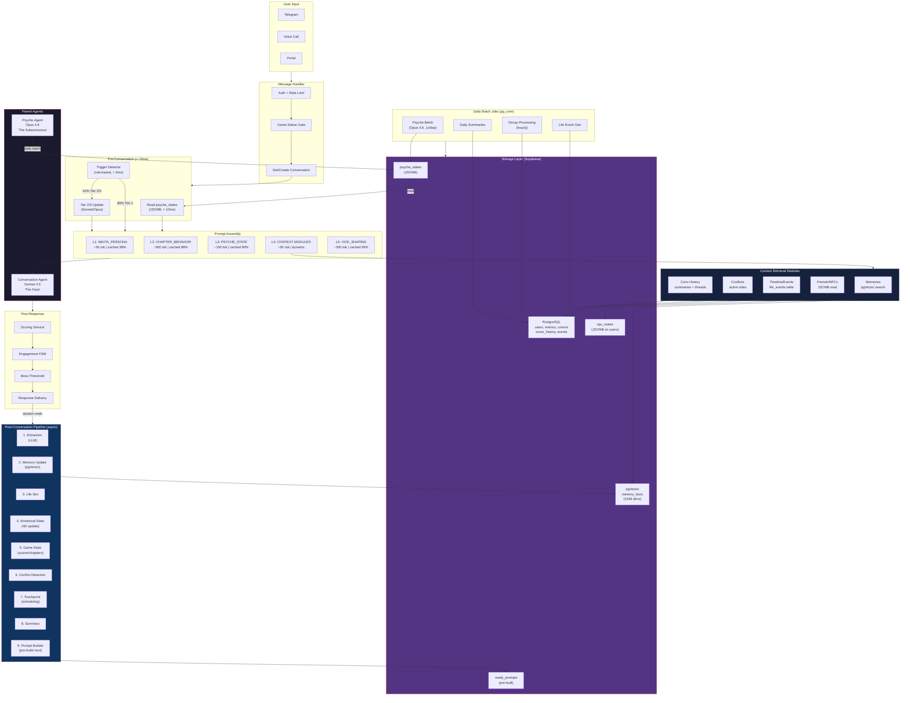

# Gate 4: System Architecture Diagram — Nikita v2

**Date**: 2026-02-17
**Gate**: 4 (Architecture Specification)
**Status**: Ready for user validation
**Next**: Gate 5 (Implementation Spec) -> Spec 049

---

## Design Philosophy (from Gate 3 feedback)

1. **Context retrieval modules** are the organizing principle — each module tracks information and retrieves it when needed
2. **Paired agents** — Conversation Agent (Sonnet 4.5) + Psyche Agent (Opus 4.6) working together
3. **Conflict injection is CORE** — not deferred, not optional
4. **NPCs are just JSONB tracking** — part of life sim, not a separate system
5. **Prompt caching everywhere** — minimize cost and token generation
6. **No over-engineering** — simplify, simplify, simplify

---

## Section 1: System Overview

```
+=========================================================================+
|                     NIKITA v2 — SYSTEM ARCHITECTURE                     |
+=========================================================================+

                        USER MESSAGE (Telegram / Voice / Portal)
                                        |
                                        v
+-----------------------------------------------------------------------+
|                         MESSAGE HANDLER                                |
|  Auth -> Rate Limit -> Game Status Gate -> Get/Create Conversation     |
+-----------------------------------------------------------------------+
                                        |
                    +-------------------+-------------------+
                    |                                       |
                    v                                       v
    +-------------------------------+     +-------------------------------+
    |   PSYCHE STATE READ (<10ms)   |     |   TRIGGER DETECTOR (<5ms)    |
    |   Read cached psyche_states   |     |   Rule-based tier routing    |
    |   from daily batch            |     |   T1=90% T2=8% T3=2%        |
    +-------------------------------+     +-------------------------------+
                    |                                       |
                    |   +---------- TIER 2/3 ONLY ---------+
                    |   |   (Sonnet quick / Opus deep)
                    |   |   Updates psyche state fields
                    |   |
                    v   v
    +-----------------------------------------------------------------------+
    |                    PROMPT ASSEMBLY (Jinja2 Template)                   |
    |                                                                       |
    |   LAYER 1: NIKITA_PERSONA (static, ~2K tok)          [CACHED ~99%]   |
    |   LAYER 2: CHAPTER_BEHAVIORS (per chapter, ~500 tok)  [CACHED ~98%]   |
    |   LAYER 3: PSYCHE_STATE (briefing, ~150 tok)          [CACHED ~90%]   |
    |   LAYER 4: CONTEXT MODULES (dynamic, ~3K tok)         [per-request]   |
    |            +-- Memories (pgVector semantic search)                     |
    |            +-- Friends/NPCs (JSONB read)                              |
    |            +-- Timeline/Life Events (today's events)                  |
    |            +-- Conflicts (active state + temperature)                 |
    |            +-- Conversation History (summaries + threads)             |
    |   LAYER 5: VICE SHAPING (top vices, ~200 tok)         [CACHED ~95%]   |
    +-----------------------------------------------------------------------+
                                        |
            +-----------+---------------+--------------+
            |           |                              |
            v           v                              v
    +---------------+  +--------------------+  +---------------+
    | CONVERSATION  |  |   MESSAGE HISTORY  |  |   TOOLS       |
    | AGENT         |  |   (up to 80 turns  |  |   recall_     |
    | Sonnet 4.5    |  |    3K token budget) |  |   memory()    |
    |               |  |                    |  |   note_user_  |
    |  "The Face"   |  |                    |  |   fact()      |
    +---------------+  +--------------------+  +---------------+
            |
            v
    +-----------------------------------------------------------------------+
    |                        RESPONSE DELIVERY                              |
    |   Scoring -> Engagement Update -> Text Patterns -> Delayed Send       |
    +-----------------------------------------------------------------------+
            |
            v
    +-----------------------------------------------------------------------+
    |              POST-CONVERSATION PIPELINE (pg_cron, async)              |
    |                                                                       |
    |   Stage 1: EXTRACTION (LLM) -----> facts, threads, thoughts          |
    |   Stage 2: MEMORY UPDATE ---------> pgVector writes                   |
    |   Stage 3: LIFE SIM --------------> daily events (emotional-driven)   |
    |   Stage 4: EMOTIONAL STATE -------> 4D model update                   |
    |   Stage 5: GAME STATE ------------> scores, chapters, decay           |
    |   Stage 6: CONFLICT DETECTION ----> temperature + injection triggers  |
    |   Stage 7: TOUCHPOINT ------------> proactive message scheduling      |
    |   Stage 8: SUMMARY ---------------> daily recap                       |
    |   Stage 9: PROMPT BUILDER --------> pre-build next system prompt      |
    +-----------------------------------------------------------------------+
            |
            v
    +-----------------------------------------------------------------------+
    |                    DAILY BATCH JOBS (pg_cron)                         |
    |                                                                       |
    |   PSYCHE BATCH (Opus 4.6, 1x/day) --> psyche_states table            |
    |   LIFE SIM GENERATION -----------> next-day events                    |
    |   DECAY PROCESSING (hourly) -----> score -= decay_rate                |
    |   SUMMARY GENERATION ------------> daily conversation summaries       |
    +-----------------------------------------------------------------------+
            |
            v
    +-----------------------------------------------------------------------+
    |                       STORAGE LAYER                                   |
    |                                                                       |
    |   SUPABASE POSTGRESQL                                                 |
    |   +-------------------+  +-------------------+  +-----------------+  |
    |   | memory_facts      |  | psyche_states     |  | users           |  |
    |   | (pgVector 1536)   |  | (JSONB)           |  | user_metrics    |  |
    |   | user/nikita/rel   |  | attachment, defense|  | vice_prefs     |  |
    |   +-------------------+  | tone, guidance    |  | engagement      |  |
    |                          +-------------------+  +-----------------+  |
    |   +-------------------+  +-------------------+  +-----------------+  |
    |   | conversations     |  | life_events       |  | ready_prompts   |  |
    |   | (messages JSONB)  |  | (JSONB per day)   |  | (text + voice)  |  |
    |   | daily_summaries   |  | npc_states (JSONB)|  | score_history   |  |
    |   +-------------------+  +-------------------+  +-----------------+  |
    +-----------------------------------------------------------------------+
```

---

## Section 2: Paired Agent Model

```
THE PAIRED AGENT MODEL
======================

            PSYCHE AGENT                    CONVERSATION AGENT
            (Opus 4.6)                      (Sonnet 4.5)
            "The Subconscious"              "The Face"

            Runs: 1x daily batch            Runs: every message
            + triggered (2-3% of msgs)

            Input:                          Input:
            - 7-day conversation history    - System prompt (assembled)
            - Memory facts (all types)      - Psyche briefing (~150 tok)
            - Score trajectory              - Message history (80 turns)
            - Life events                   - User message
            - Current psyche state
                                            Output:
            Output:                         - Nikita's response
            - PsycheState (JSONB):          - Tool calls (memory ops)
              attachment_activation
              defense_mode
              behavioral_guidance
              internal_monologue
              vulnerability_level
              emotional_tone
              topics_to_encourage
              topics_to_avoid

            +------ FLOW ------+
            |                  |
            v                  |
    psyche_states table -------+-------> injected as ~150 tokens
                                        in system prompt LAYER 3

    CRITICAL: Connected through DATABASE, NOT tool calls.
    Psyche writes -> DB stores -> Conversation reads.

    Cost: ~$2.25/mo (batch) + ~$4.80/mo (hybrid triggers) = ~$7.05/mo/user
    Latency: 0ms (90% cached) | 300ms (8% Sonnet) | 3s (2% Opus)
```

### Trigger Tiers

| Tier | % of msgs | Model | Trigger | Latency |
|------|-----------|-------|---------|---------|
| 1 | 90% | None | Read cached psyche_states | <10ms |
| 2 | 8% | Sonnet 4.5 | Score delta >5, keyword detection | ~300ms |
| 3 | 2% | Opus 4.6 | Boss encounter, crisis, chapter transition | ~3s |

---

## Section 3: Context Retrieval Modules

Every module follows the universal pattern:

```
TRACK (write) --> STORE (persist) --> RETRIEVE (read) --> INJECT (prompt)
```

### Module 1: Memories (pgVector Semantic Search)

| Aspect | Detail |
|--------|--------|
| **Track** | ExtractionStage extracts facts from conversations; `note_user_fact()` tool during conversation |
| **Store** | `memory_facts` table (pgVector 1536, cosine similarity, hash-based dedup). 3 types: user / nikita / relationship |
| **Retrieve** | Semantic search on user message + fixed queries ("shared moments", "nikita life events") |
| **Inject** | Section 6 of `system_prompt.j2` (~800 tok text, ~300 tok voice) |
| **Cache** | ~85% hit rate (facts change slowly between conversations) |

### Module 2: Friends / NPCs (JSONB State)

| Aspect | Detail |
|--------|--------|
| **Track** | LifeSimStage generates NPC interactions; conversations mentioning friends update NPC state |
| **Store** | `npc_states` JSONB column on users table. 5 NPCs: Emma/Lena, Marcus/Viktor, Sarah/Yuki, Mom, Ex. Schema: `{name, relationship, last_event, sentiment, events[5]}` |
| **Retrieve** | Direct JSONB read (<5ms) |
| **Inject** | Part of Section 1 (Identity) and Section 4 (Current State). "Lena thinks...", "Viktor texted me..." |
| **Cache** | N/A (JSONB read is fast enough, no caching needed) |

### Module 3: Timeline / Life Events (Daily Generation)

| Aspect | Detail |
|--------|--------|
| **Track** | LifeSimStage generates events based on: emotional state (4D), weekly routine, monthly meta-instructions, circadian model |
| **Store** | `life_events` table (JSONB per day per user). Event cascade: morning -> afternoon -> evening. Mood persists across events |
| **Retrieve** | `get_today_events()` in pipeline + prompt builder |
| **Inject** | Section 4 of `system_prompt.j2` (~600 tokens). "What's Happening in Your Life Today" |
| **Cache** | ~0% (daily events change every day, but read is fast) |

### Module 4: Conflicts (Injection Triggers + Active State)

| Aspect | Detail |
|--------|--------|
| **Track** | ConflictStage evaluates: 4D emotional thresholds, conversation count triggers, player behavior patterns (score deltas), life sim stress events |
| **Store** | `conflict_state` JSONB column on users. Tracks: temperature (0-100), conflict type, repair attempts, Gottman ratio, boss phase |
| **Retrieve** | Direct read from user state |
| **Inject** | Section 5 of `system_prompt.j2`. "CONFLICT ACTIVE: {type}" + boss encounter phases |
| **Cache** | ~95% (conflict state changes rarely, read from JSONB) |

### Module 5: Psyche State (Daily Batch + Triggered Updates)

| Aspect | Detail |
|--------|--------|
| **Track** | Psyche Agent (Opus 4.6): daily batch (full 7-day analysis) + triggered (Tier 2 Sonnet / Tier 3 Opus) on high-delta events |
| **Store** | `psyche_states` table (JSONB, one row per user). PsycheState model: attachment, defense, guidance, monologue, vulnerability, tone, topics |
| **Retrieve** | Direct JSONB read (<10ms) before each conversation |
| **Inject** | Layer 3 of prompt assembly (~150 tokens). "Attachment activation: X | Defense: Y | Guidance: {instruction}" |
| **Cache** | ~90% (changes on trigger or daily batch only) |

---

## Section 4: System Prompt Assembly

```
PROMPT ASSEMBLY: HOW ALL CONTEXT BECOMES ONE PROMPT
====================================================

Total budget: 5,500-6,500 tokens (text) | 1,800-2,200 tokens (voice)

Layer 1: IDENTITY (Static)                              ~400 tokens
  Source: base_personality.yaml / NIKITA_PERSONA
  Cache: Anthropic prompt caching, ~99% hit rate
  Content: Name, age, personality, quirks, background

Layer 2: IMMERSION + PLATFORM (Static per platform)     ~500 tokens
  Source: system_prompt.j2 sections 2-3
  Cache: ~99% hit rate (only changes on platform switch)
  Content: Never-break-character rules, texting/voice style

Layer 3: PSYCHE STATE (Semi-static)                     ~150 tokens
  Source: psyche_states table (read before conversation)
  Cache: ~90% hit rate (changes on trigger or daily batch)
  Content: Attachment, defense mode, behavioral guidance
  Invalidation: Tier 2/3 trigger, daily batch

Layer 4: DYNAMIC CONTEXT (Per-conversation)             ~3,000 tokens
  Source: All 5 context retrieval modules
  Cache: NOT cached (changes every conversation)
  Sub-sections:
    4a. Current State (activity, mood, energy, events)   ~600 tok
    4b. Relationship State (chapter, score, engagement)  ~500 tok
    4c. Memory (facts, episodes, nikita events)          ~800 tok
    4d. Continuity (last conv, threads, time gap)        ~600 tok
    4e. Inner Life (thoughts, monologue, preoccupations) ~500 tok

Layer 5: CHAPTER BEHAVIOR (Changes on chapter transition) ~300 tokens
  Source: prompts/chapters/chapter_{N}.prompt
  Cache: ~98% hit rate (changes only on chapter transition)
  Content: Response style, what she's testing, behavioral guidelines

Layer 6: VICE SHAPING (Changes on vice discovery)        ~200 tokens
  Source: UserVicePreference top 5
  Cache: ~95% hit rate (vices change slowly)
  Content: What makes her light up, behavioral leanings

Layer 7: RESPONSE GUIDELINES (Static per platform)       ~700 tokens
  Source: system_prompt.j2 footer
  Cache: ~99% hit rate
  Content: How to read energy, create tension, calibrate depth


TRUNCATION PRIORITY (if over budget, cut from bottom):
  1. Vice Shaping (cut first)
  2. Chapter Behavior
  3. Inner Life
```

### Caching Strategy

| Component | Tokens | Hit Rate | Invalidation | Savings |
|-----------|--------|----------|--------------|---------|
| NIKITA_PERSONA | ~2,000 | ~99% | Never (static) | ~$15/mo |
| CHAPTER_BEHAVIORS | ~500 | ~98% | Chapter transition | ~$3/mo |
| PSYCHE_STATE | ~150 | ~90% | Trigger or daily batch | ~$1/mo |
| VICE_SHAPING | ~200 | ~95% | Vice discovery | ~$1/mo |
| PLATFORM_STYLE | ~300 | ~99% | Never (per platform) | ~$2/mo |
| **Total cache savings** | | | | **~$22/mo/user** |

---

## Section 5: Complete Data Flow

```
COMPLETE DATA FLOW: Message In --> Storage --> Next Prompt
==========================================================

[1] USER SENDS MESSAGE
    |
    v
[2] MESSAGE HANDLER
    Auth, rate limit, game status check
    Get/create conversation, append message
    |
    v
[3] PRE-CONVERSATION READS (parallel, <15ms total)
    +-- Read psyche_states (JSONB)        <10ms
    +-- Run trigger detector (rules)       <5ms
    +-- [If Tier 2/3] Update psyche state  300ms-3s
    |
    v
[4] PROMPT ASSEMBLY
    Load from ready_prompts table (pre-built by pipeline)
    OR build on-the-fly from template + context modules
    |
    v
[5] CONVERSATION AGENT (Sonnet 4.5)
    System prompt + message history + user message
    May call: recall_memory(), note_user_fact()
    Output: Nikita's response
    |
    v
[6] POST-RESPONSE PROCESSING (synchronous, during request)
    +-- ScoringService: metric deltas
    +-- EngagementStateMachine: state update
    +-- TextPatterns: emoji, length, punctuation
    +-- BossThreshold: check if boss encounter triggers
    |
    v
[7] RESPONSE DELIVERY
    Queue with delay (timing simulation per chapter)
    Send via Telegram / return to voice / push to portal
    |
    v
[8] SESSION ENDS (detected by 15min inactivity, pg_cron)
    |
    v
[9] POST-CONVERSATION PIPELINE (9 stages, sequential)
    |
    +-- [EXTRACTION] LLM extracts facts, threads, thoughts, tone
    |       |
    |       v
    +-- [MEMORY UPDATE] Write to pgVector (dedup, embed)
    |       |
    |       v
    +-- [LIFE SIM] Generate/read today's events
    |       |
    |       v
    +-- [EMOTIONAL] Update 4D state from events + conversation
    |       |
    |       v
    +-- [GAME STATE] Calculate scores, check chapter, apply decay
    |       |
    |       v
    +-- [CONFLICT] Evaluate triggers, check breakup threshold
    |       |
    |       v
    +-- [TOUCHPOINT] Schedule proactive messages
    |       |
    |       v
    +-- [SUMMARY] Update daily conversation summary
    |       |
    |       v
    +-- [PROMPT BUILDER] Pre-build next system prompt
            |
            +-- Enrich context (load memory, state, summaries)
            +-- Render Jinja2 template (unified, platform-aware)
            +-- Optional Haiku enrichment (narrative polish)
            +-- Enforce token budget (truncate if over)
            +-- Store in ready_prompts table
            |
            v
    READY FOR NEXT CONVERSATION (prompt pre-built, <10ms load)

[10] DAILY BATCH JOBS (pg_cron)
     +-- Psyche Batch: Opus 4.6 analyzes 7-day history --> psyche_states
     +-- Life Events: Generate next day's events for all users
     +-- Decay: Apply hourly score decay
     +-- Summaries: Generate daily conversation summaries
```

---

## Section 6: Meta-Instruction Hierarchy

```
META-INSTRUCTION HIERARCHY
===========================

MONTHLY META-INSTRUCTIONS (behavioral arcs)
  |   "This month, Nikita is processing father's birthday"
  |   "This month, work project is at crisis point"
  |   Set by: Manual or LLM-generated monthly planning job
  |   Stored: meta_instructions JSONB on users table
  |   Scope: Shapes which life events get generated
  |
  v
WEEKLY ROUTINE (predefined patterns)
  |   Mon: Work from home, focused, short responses
  |   Tue: Coffee with Lena, social energy
  |   Wed: Deep work, unavailable 2-6PM
  |   Thu: Therapy (bi-weekly), reflective mood
  |   Fri: Social, Yuki's party invitations
  |   Sat: Lazy morning, chemistry hobby, evening out
  |   Sun: Recovery, domestic, meal prep, plants
  |   Set by: Static config + monthly meta-instructions modify
  |   Stored: routine_config JSONB on users table
  |   Scope: Determines base activity and availability
  |
  v
DAILY EVENTS (generated from emotional state + routine)
  |   Morning: [based on routine + emotional state]
  |   Afternoon: [event cascade from morning]
  |   Evening: [shaped by day's trajectory]
  |   Set by: LifeSimStage + daily batch
  |   Stored: life_events table (JSONB per day)
  |   Scope: What she talks about, her mood, her availability
  |
  v
PER-CONVERSATION GUIDANCE (from psyche state)
      "Be slightly distant, test if they notice"
      "Vulnerability window is open, share about therapy"
      "Defense mode: intellectualization after last interaction"
      Set by: Psyche Agent (batch + triggers)
      Stored: psyche_states table
      Scope: Tone, depth, topics for THIS conversation
```

---

## Section 7: Deterministic vs LLM Layers

```
WHAT IS COMPUTED DETERMINISTICALLY vs WHAT NEEDS LLM
=====================================================

DETERMINISTIC (no LLM, pure math/rules):
  +-- Composite score calculation (weighted average of 4 metrics)
  +-- Decay processing (hourly rate by chapter)
  +-- Boss threshold checks (score >= chapter threshold)
  +-- Chapter transition logic (score + day range)
  +-- Engagement state machine (6-state FSM, transition rules)
  +-- Rate limiting (20/min, 500/day)
  +-- Trigger detection tiers (rule-based keyword + delta checks)
  +-- Game over conditions (score=0, 3 boss fails, engagement timeout)
  +-- Circadian model (time-of-day activity/energy lookup)
  +-- Vice intensity tracking (accumulation from signals)
  +-- Conflict temperature gauge (threshold-based detection)
  +-- Token budget management (counting, truncation)
  +-- Prompt caching invalidation rules

LLM-REQUIRED (needs inference):
  +-- [Sonnet 4.5] Conversation response (every message)
  +-- [Sonnet 4.5] Scoring analysis (metric deltas per interaction)
  +-- [Opus 4.6]   Psyche batch analysis (1x daily)
  +-- [Sonnet/Opus] Psyche triggered analysis (8-10% of messages)
  +-- [Haiku 4.5]  Prompt enrichment (narrative polish, optional)
  +-- [Sonnet 4.5] Fact extraction (post-conversation pipeline)
  +-- [Sonnet 4.5] Daily summary generation (1x daily)
  +-- [Sonnet 4.5] Boss judgment (during boss encounters)
  +-- [Sonnet 4.5] Life event generation (daily batch)
  +-- [Sonnet 4.5] Vice signal detection (during scoring)
```

---

## Section 8: Storage Layer Map

```
STORAGE: WHAT LIVES WHERE
==========================

SUPABASE POSTGRESQL (existing tables)
+------------------------------------------------------------------+
| TABLE              | TYPE      | PURPOSE                         |
|--------------------|-----------|---------------------------------|
| users              | Relational| Primary entity (22+ columns)    |
| user_metrics       | Relational| Intimacy, passion, trust, sec.  |
| user_vice_prefs    | Relational| 8 vice categories + intensity   |
| engagement_state   | Relational| 6-state FSM                     |
| user_profile       | Relational| Name, age, location, backstory  |
| conversations      | JSONB msgs| Text/voice sessions             |
| daily_summaries    | Text      | Per-day LLM summaries           |
| score_history      | Relational| Score changes over time         |
| scheduled_events   | Relational| Pending message deliveries      |
| ready_prompts      | Text      | Pre-built system prompts        |
| job_execution      | Relational| pg_cron job tracking            |
+------------------------------------------------------------------+

SUPABASE pgVECTOR (semantic search)
+------------------------------------------------------------------+
| TABLE              | DIMS  | PURPOSE                             |
|--------------------|-------|-------------------------------------|
| memory_facts       | 1536  | User/nikita/relationship facts      |
|                    |       | Cosine similarity search            |
|                    |       | Hash-based deduplication            |
+------------------------------------------------------------------+

NEW TABLE (proposed)
+------------------------------------------------------------------+
| TABLE              | TYPE  | PURPOSE                             |
|--------------------|-------|-------------------------------------|
| psyche_states      | JSONB | PsycheState per user (1 row each)   |
|                    |       | Fields: attachment_activation,      |
|                    |       | defense_mode, behavioral_guidance,  |
|                    |       | internal_monologue, vulnerability,  |
|                    |       | emotional_tone, topics, generated_at|
+------------------------------------------------------------------+

NEW COLUMNS ON EXISTING TABLES (proposed)
+------------------------------------------------------------------+
| TABLE.COLUMN                    | TYPE        | PURPOSE           |
|---------------------------------|-------------|-------------------|
| users.routine_config            | JSONB       | Weekly routine    |
| users.meta_instructions         | JSONB       | Monthly arc       |
| users.last_conflict_at          | TIMESTAMPTZ | Conflict cooldown |
| users.npc_states                | JSONB       | 5 NPC tracking    |
| user_metrics.vulnerability_exch | INT         | V-exchange count  |
+------------------------------------------------------------------+

PROMPT CACHING (Anthropic API level)
+------------------------------------------------------------------+
| COMPONENT          | TOKENS | HIT RATE | INVALIDATION            |
|--------------------|--------|----------|-------------------------|
| NIKITA_PERSONA     | ~2,000 | ~99%     | Never (static)          |
| CHAPTER_BEHAVIORS  | ~500   | ~98%     | Chapter transition      |
| PSYCHE_STATE       | ~150   | ~90%     | Trigger or daily batch  |
| VICE_SHAPING       | ~200   | ~95%     | Vice discovery          |
| PLATFORM_STYLE     | ~300   | ~99%     | Never (per platform)    |
+------------------------------------------------------------------+
```

---

## Section 9: Conflict System (CORE)

```
CONFLICT INJECTION — CORE MECHANIC (NOT DEFERRED)
===================================================

BOSS ENCOUNTERS (5, one per chapter):
  Ch1: "Abandonment Crisis" — anxious-preoccupied activation
  Ch2: "Handle My Intensity" — conflict tolerance test
  Ch3: "Trust Test" — jealousy/external pressure
  Ch4: "Vulnerability Threshold" — match her vulnerability
  Ch5: "Ultimate Test" — support independence + affirm connection

  Flow: 3-5 turn multi-phase (not single message)
  [OPENING] -> [ESCALATION] -> [CRISIS PEAK] -> [RESOLUTION]
  Outcome: PASS (breakthrough) / PARTIAL (truce) / FAIL (rupture)

NON-BOSS CONFLICTS (ongoing, natural):
  Sources:
    - Life sim stress events (work crisis -> she's short)
    - Player behavior (clingy -> she pulls back)
    - Score drops (repeated > 3pt drops -> micro-friction)
    - Boundary tests (she tests independence)
    - NPC drama (Viktor situation, Lena's opinions)

  Temperature gauge: 0-100%
    0-30%:   Normal. No conflict behavior.
    30-60%:  Tension. Shorter responses, slight edge.
    60-80%:  Active friction. Direct challenges, testing.
    80-100%: Crisis. Boss encounter or breakup risk.

  Injection probability:
    Simple interval model (NOT full Bayesian engine)
    P(conflict) increases linearly after minimum_interval per chapter
    Ch1: min 5 convs, Ch5: min 15 convs between conflicts
    Life sim stress events can override minimum interval

  Gottman Ratio: 5:1 positive-to-negative target
    Tracked in: conflict_state JSONB
    Repair attempts: player can de-escalate
    Four horsemen detection: criticism, contempt, defensiveness, stonewalling

CONFLICT STATE (stored per user):
  {
    "temperature": 45,
    "type": "boundary_test",
    "started_at": "2026-02-15T14:00:00Z",
    "repair_attempts": 2,
    "positive_count": 12,
    "negative_count": 3,
    "gottman_ratio": 4.0,
    "boss_phase": null  // or 0-4 during boss encounter
  }
```

---

## Section 10: Gate Progression

```
GATE PROGRESSION: How We Got Here
===================================

GATE 1: RESEARCH (Docs 01-11)
  Grounding in psychology: attachment theory, Gottman, appraisal theory
  Library/tool audit: Pydantic AI, ElevenLabs, Versu analysis
  Competitive landscape: Replika, Character.ai, Paradot
  Fact-check + critique (Doc 09): 3 contradictions, 24 challenged claims

GATE 2: IDEATION + USER DECISIONS (Docs 12-19)
  Cognitive architecture proposal (dual-process theory)
  System analysis (Doc 10 codebase audit)
  Library audit (Doc 10b pricing validation: Opus 4.6 = 3x cheaper)
  USER DECISIONS:
    - Paired agents (conversation + psyche) = YES
    - Life sim enhanced = YES
    - Conflict injection = CORE, not deferred
    - NPCs = just context tracking
    - Photo/media system = DEFERRED

GATE 3: EVALUATION + SYNTHESIS (Docs 20-23)
  Scoring matrix: Life Sim #1 (87.0), Psyche Agent #2 (81.0)
  Feasibility: All 5 priorities FEASIBLE, 23-35 days total
  Devil's advocate: 5 challenges identified with mitigations
  USER FEEDBACK (critical overrides):
    - Psyche agent cost overestimated, runs 1x/day + caching
    - "Simplify everything" — context retrieval modules
    - "Minimize cost and token generation"
    - "No over-engineering"
    - Conflict injection is CORE — must stay

GATE 4: ARCHITECTURE SPECIFICATION (this document)
  Verified against codebase: 9 pipeline stages, agent code, templates
  Mapped current system prompt (731-line Jinja2 template, 11 sections)
  Defined 5 context retrieval modules with storage/retrieval patterns
  Produced diagrams for validation

  NEXT: Gate 5 (Implementation Spec) -> Spec 049 concrete code changes
```

---

## Section 11: Mermaid Diagram



---

## Section 12: Cost Profile

| Component | Model | Frequency | Cost/user/month |
|-----------|-------|-----------|----------------|
| Conversation response | Sonnet 4.5 | Every message (~100/day) | ~$35-40 |
| Scoring analysis | Sonnet 4.5 | Every message | (included above) |
| Psyche batch | Opus 4.6 | 1x/day | ~$2.25 |
| Psyche hybrid triggers | Sonnet/Opus | 8-10% of messages | ~$4.80 |
| Life sim events | Haiku 4.5 | Daily batch | ~$0.50 |
| Prompt enrichment | Haiku 4.5 | Optional, post-pipeline | ~$1.20 |
| Fact extraction | Sonnet 4.5 | Post-conversation | ~$2.50 |
| Daily summaries | Sonnet 4.5 | 1x/day | ~$1.00 |
| Monthly meta-instructions | Opus 4.6 | 1x/month | ~$0.01 |
| **Subtotal** | | | **~$47-52** |
| **Prompt caching savings** | | | **-$15-22** |
| **Net total** | | | **~$30-37/mo** |

**Optimization levers:**
- Prompt caching (Anthropic API): saves ~40% on static prompt layers
- Pre-built prompts (`ready_prompts` table): eliminates per-request assembly
- Batch psyche analysis (1x/day): avoids per-message Opus calls
- Haiku for low-stakes tasks: 10x cheaper than Sonnet for narrative polish

---

## Section 13: Database Changes Summary

### New Table (1)

```sql
CREATE TABLE psyche_states (
    id UUID PRIMARY KEY DEFAULT gen_random_uuid(),
    user_id UUID NOT NULL REFERENCES users(id) ON DELETE CASCADE,
    state JSONB NOT NULL,           -- PsycheState model
    generated_at TIMESTAMPTZ NOT NULL DEFAULT now(),
    model TEXT NOT NULL,            -- 'opus-4.6' or 'sonnet-4.5'
    token_count INT,
    UNIQUE(user_id)                 -- one row per user, upserted
);

CREATE INDEX idx_psyche_states_user ON psyche_states(user_id);
```

### New Columns (5)

```sql
-- 1. Weekly routine template
ALTER TABLE users ADD COLUMN routine_config JSONB DEFAULT '{}';

-- 2. Monthly behavioral arc
ALTER TABLE users ADD COLUMN meta_instructions JSONB DEFAULT '{}';

-- 3. Conflict cooldown tracking
ALTER TABLE users ADD COLUMN last_conflict_at TIMESTAMPTZ;

-- 4. NPC state tracking (5 NPCs per user)
ALTER TABLE users ADD COLUMN npc_states JSONB DEFAULT '[]';

-- 5. Vulnerability exchange counter
ALTER TABLE user_metrics ADD COLUMN vulnerability_exchanges INT DEFAULT 0;
```

### Migration Impact

- **1 new table**: `psyche_states` (~1 row per active user)
- **5 new columns**: 3 JSONB + 1 TIMESTAMPTZ + 1 INT (all nullable/defaulted, zero downtime)
- **No existing data migration**: All new columns have safe defaults
- **RLS**: `psyche_states` needs row-level security policy matching `users` pattern

---

## Summary: What Changed from Current System

| Component | Current | Proposed | Effort |
|-----------|---------|----------|--------|
| Agent model | Single (Sonnet 4.5) | Paired (Sonnet + Opus) | Medium |
| Psyche state | None | psyche_states table + batch job | 2-3 days |
| Life sim | Basic event gen | Emotional-driven + weekly routine | 3-4 days |
| NPCs | Not tracked | JSONB column, 5 NPCs | 1 day |
| Conflicts | Basic detection | Temperature gauge + multi-phase boss | 3-4 days |
| Prompt template | 11-section Jinja2 | Same + psyche layer + meta-instructions | 1-2 days |
| Meta-instructions | None | Monthly -> weekly -> daily -> per-conv | 2-3 days |
| Prompt caching | Partial | Full strategy (5 cache layers) | 1 day |

**Total estimated effort**: 15-20 engineering days (phased over 3-4 weeks)

---

*This specification is ready for user validation before proceeding to Gate 5 (Implementation Spec -> Spec 049).*
