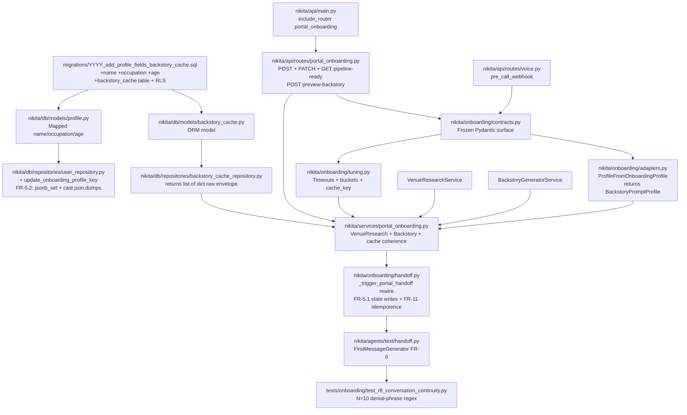
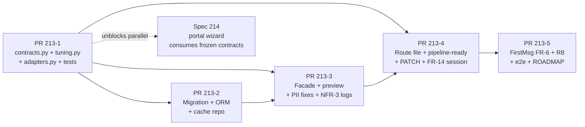
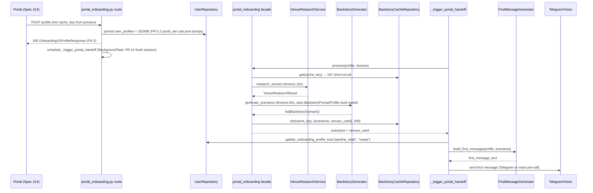
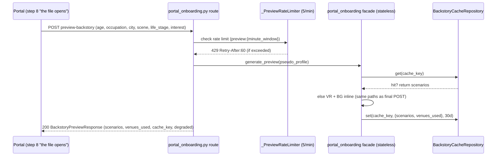

# Implementation Plan: Spec 213 — Onboarding Backend Foundation

**Spec**: `specs/213-onboarding-backend-foundation/spec.md` (1058 lines, 14 FRs + 2 amendments, 7 USs, 30 ACs)
**Status**: Ready for /tasks → /audit → /implement
**GATE 2**: PASS (10 iterations, absolute zero across all 6 validators)
**Brief**: `.claude/plans/onboarding-overhaul-brief.md`
**Target**: 5 PRs, each ≤400 LOC, sequential dependency chain

---

## Overview

### Objective
Wire the full engagement pipeline (venue research + backstory generation + pipeline-readiness gate + conversation continuity) into the portal onboarding path. Collect richer profile (name, age, occupation). Ship a frozen `contracts.py` surface in PR #1 so Spec 214 (portal wizard) can work in parallel once that PR lands.

### Non-Goals
- Portal UI changes → Spec 214
- Voice agent prompt structural changes beyond consuming new contracts
- Multi-language backstory support
- Retroactive migration of existing users' `name`/`age`/`occupation`

---

## Architecture

### Module Dependency Graph (Post-Fix)

### PR Dependency DAG

### Request Flow: POST /onboarding/profile (final submission)

### Request Flow: POST /onboarding/preview-backstory (pre-submit reveal, FR-4a)

**Cache coherence invariant**: portal echoes `cache_key` on final POST → facade short-circuits → ZERO duplicate Claude calls. Envelope shape identical across both writers: `{"scenarios": [...], "venues_used": [venue_names]}`.

---

## Tasks by User Story

### US-1 (P1): New user completes portal onboarding with full profile — 4 ACs
Maps across all 5 PRs (infrastructure for the happy path).

| ID | Task | Est. | PR | [P] | Deps |
|----|------|------|----|----|------|
| T1.1 | Define `OnboardingV2ProfileRequest` + `Response` in `contracts.py` with full validators | S | 213-1 | — | — |
| T1.2 | Define `BackstoryOption` + `tone` Literal in `contracts.py` | S | 213-1 | [P] T1.1 | — |
| T1.3 | Add `test_contracts.py` Pydantic validation tests (reject bad age/occupation/city) | S | 213-1 | — | T1.1, T1.2 |
| T1.4 | Write migration `add_profile_fields_and_backstory_cache.sql` (+name +occupation +age on user_profiles, +backstory_cache table, RLS DDL) | M | 213-2 | — | — |
| T1.5 | Add `Mapped` columns to `nikita/db/models/profile.py::UserProfile` | S | 213-2 | — | T1.4 |
| T1.6 | Add `test_rls_user_profiles.py` integration test (5 RLS policies) | M | 213-2 | — | T1.4 |
| T1.7 | AC-1.5 test scaffolding: `TestFirstMessageGeneratorWithBackstory::test_no_meta_opener` regex assertion | S | 213-5 | — | T5.1 |

### US-2 (P1): Pipeline-readiness gate prevents premature interaction — 4 ACs

| ID | Task | Est. | PR | [P] | Deps |
|----|------|------|----|----|------|
| T2.1 | `PipelineReadyResponse` + `PipelineReadyState` Literal in `contracts.py` (FR-2a) | S | 213-1 | [P] T1.1 | — |
| T2.2 | `GET /pipeline-ready/{user_id}` route with 403 shape + venue/backstory status | M | 213-4 | — | T3.2, T2.1 |
| T2.3 | `test_pipeline_ready_states` parametrized over 4 states | S | 213-4 | — | T2.2 |
| T2.4 | `test_polling_terminates` ASGI-level (AC-2.2 side_effect sequence) | M | 213-4 | — | T2.2 |
| T2.5 | `test_cross_user_403_with_correct_body` (AC-2.4) | S | 213-4 | — | T2.2 |

### US-3 (P1): City research times out without breaking onboarding — 4 ACs

| ID | Task | Est. | PR | [P] | Deps |
|----|------|------|----|----|------|
| T3.1 | Facade `process` with `asyncio.wait_for(VENUE_RESEARCH_TIMEOUT_S)` + degraded path | M | 213-3 | — | T1.1–T1.6 |
| T3.2 | Pipeline state transitions in `_bootstrap_pipeline` (FR-5.1): pending → ready / degraded / failed | M | 213-3 | — | T3.1 |
| T3.3 | `test_venue_timeout` (monotonic time assertion) + AC-3.2 caplog | M | 213-3 | [P] T3.2 | T3.1 |
| T3.4 | `test_first_message_falls_back_to_scene_only` (AC-3.3) | S | 213-5 | — | T5.1 |

### US-4 (P1): Backstory generation fails gracefully — 4 ACs

| ID | Task | Est. | PR | [P] | Deps |
|----|------|------|----|----|------|
| T4.1 | Facade catches `BackstoryGeneratorService` exceptions → returns `[]` | S | 213-3 | — | T3.1 |
| T4.2 | `test_backstory_failure_returns_empty` (AC-4.1 patch source module) | S | 213-3 | [P] T4.1 | T4.1 |
| T4.3 | `test_backstory_failure_log_no_pii` (AC-4.3 caplog + PII audit) | S | 213-3 | [P] T4.1 | T4.1 |
| T4.4 | `test_first_message_keeps_flavor_on_backstory_fail` (AC-4.2) | S | 213-5 | — | T5.1 |

### US-5 (P1): User replies with first-message verbatim, Nikita acknowledges — 4 ACs

| ID | Task | Est. | PR | [P] | Deps |
|----|------|------|----|----|------|
| T5.1 | FirstMessageGenerator FR-6 (uses profile + backstory scenarios) | M | 213-5 | — | T1.1, T3.2 |
| T5.2 | `test_r8_conversation_continuity.py::test_loads_seeded_turn` (AC-5.1) | S | 213-5 | — | T5.1 |
| T5.3 | `test_agent_receives_history` (AC-5.2) | S | 213-5 | [P] T5.2 | T5.1 |
| T5.4 | `test_no_denial_phrases` N=10 parametrized (AC-5.3) | S | 213-5 | [P] T5.2 | T5.1 |

### US-6 (P2): Re-onboarding user resumes from last step — 4 ACs

| ID | Task | Est. | PR | [P] | Deps |
|----|------|------|----|----|------|
| T6.1 | `PATCH /onboarding/profile` route (FR-5.2 jsonb_set partial update) | M | 213-4 | — | T3.1 |
| T6.2 | `test_patch_preserves_wizard_step` (AC-6.1 JSONB read after PATCH) | S | 213-4 | — | T6.1 |
| T6.3 | `test_patch_merges_jsonb` (AC-6.2) | S | 213-4 | [P] T6.2 | T6.1 |
| T6.4 | `test_patch_returns_null_for_unset_fields` (AC-6.3) | S | 213-4 | [P] T6.2 | T6.1 |
| T6.5 | `test_cache_hit_skips_claude` (AC-6.4 cross-endpoint cache coherence) | M | 213-4 | — | T3.1, T6.1 |

### US-7 (P2): Voice-first user routes correctly with full profile — 4 ACs

| ID | Task | Est. | PR | [P] | Deps |
|----|------|------|----|----|------|
| T7.1 | Voice pre-call webhook consumes `OnboardingV2ProfileResponse` shape | S | 213-5 | — | T1.1, T5.1 |
| T7.2 | `test_payload_includes_v2_profile_response` (AC-7.2) | S | 213-5 | — | T7.1 |
| T7.3 | `test_voice_prompt_includes_backstory` (AC-7.3; patch `BACKSTORY_HOOK_PROBABILITY` 0.0/1.0) | S | 213-5 | [P] T7.2 | T5.1, T7.1 |

### Cross-cutting: FR-4a Preview Backstory Endpoint (FR-4a + FR-4a.1)

| ID | Task | Est. | PR | [P] | Deps |
|----|------|------|----|----|------|
| TX.1 | `POST /onboarding/preview-backstory` route + `BackstoryPreviewRequest/Response` | M | 213-3 | — | T1.1, T3.1 |
| TX.2 | `_PreviewRateLimiter` overrides `_get_minute_window()` with `preview:` prefix | S | 213-3 | — | TX.1 |
| TX.3 | `test_cache_key_stable` + `test_degraded_returns_empty` (FR-4a facade tests) | S | 213-3 | [P] TX.2 | TX.1 |
| TX.4 | `test_profile_post_reuses_cache` + `test_rate_limit` + `test_stateless_no_jsonb_write` | M | 213-4 | — | TX.1, T6.1 |

### Cross-cutting: PII fixes + observability (FR-7, NFR-3)

| ID | Task | Est. | PR | [P] | Deps |
|----|------|------|----|----|------|
| TP.1 | Fix PII echo at `nikita/api/routes/onboarding.py:154, :239` (logger.exception extra={"user_id"...}) | S | 213-3 | — | — |
| TP.2 | RLS DDL in migration: UPDATE WITH CHECK + DELETE subquery form on user_profiles | S | 213-2 | — | T1.4 |
| TP.3 | `test_log_observability.py` caplog assertions for 4 NFR-3 events | M | 213-3 | [P] TP.1 | TP.1 |

### Cross-cutting: pipeline bootstrap idempotence (FR-11)

| ID | Task | Est. | PR | [P] | Deps |
|----|------|------|----|----|------|
| TB.1 | `_bootstrap_pipeline` reads `pipeline_state` from JSONB; skip if already ready | S | 213-3 | — | T3.2 |
| TB.2 | `test_idempotent_double_call` (side_effect=[state_none, state_ready]) | S | 213-3 | [P] TB.1 | TB.1 |

---

## Estimates Summary

| PR | Tasks | Est. Total | LOC Budget |
|----|-------|-----------|------------|
| 213-1 | T1.1, T1.2, T1.3, T2.1 | S+S+S+S ≈ 2-3hr | ~250 |
| 213-2 | T1.4, T1.5, T1.6, TP.2 | M+S+M+S ≈ 4-6hr | ~300 |
| 213-3 | T3.1-T3.3, T4.1-T4.3, TX.1-TX.3, TP.1, TP.3, TB.1-TB.2 | ~12-16hr | ~400 |
| 213-4 | T2.2-T2.5, T6.1-T6.5, TX.4 | ~10-12hr | ~400 |
| 213-5 | T1.7, T3.4, T4.4, T5.1-T5.4, T7.1-T7.3 | ~8-10hr | ~350 |

**Total**: ~36-47 hours. No XL tasks.

---

## Testing Strategy

**Pyramid target (per spec §NFR Coverage)**:
- Unit (~70%): tuning constants boundary tests, contracts validation, adapters, FirstMessageGenerator branches, cache_key stability
- Integration (~25%): facade with mocks, pipeline gate ASGI, RLS policies (live Supabase)
- E2E (~5%): `test_full_profile_personalizes_first_message` via Telegram MCP (marked `@pytest.mark.e2e` — NOT in unit CI gate)

**Coverage targets** (NFR-7): 100% on `contracts.py`, `tuning.py`, `adapters.py`; 85% on facade, repositories, routes.

**Patch convention** (per `.claude/rules/testing.md`): patch at source module, not importer.

**Non-empty fixture compliance**: every repo-mock test provides at least one non-empty path. AC-2.2 uses `side_effect=[...]` explicitly; FR-11 test uses `side_effect=[state_none, state_ready]` (NOT `return_value=None`).

**17 test files named in spec** — inventory in spec §Test File Inventory. Each AC names its test file + assertion type.

---

## Risks & Mitigations (Top 5 from spec)

| Risk | Likelihood | Impact | Mitigation |
|---|---|---|---|
| Contract churn delays Spec 214 | Medium | High | PR 213-1 ships FROZEN contracts; ADR required for any change post-merge |
| Pydantic↔ORM type confusion in facade | Low | High | `BackstoryPromptProfile` duck-typed dataclass in adapters.py; single source of truth; type-check enforced via `mypy --strict` in CI |
| Bug in facade leaks ORM session across requests | Low | Critical | FR-14 explicit fresh-session pattern; `test_portal_onboarding_session_isolation` asserts `get_session_maker` NOT invoked inside facade |
| `pipeline_state` JSONB write race (concurrent bootstrap) | Low | Medium | FR-11 idempotence check + FR-5.2 `jsonb_set` atomic merge |
| PII leak in exception echoes | Medium | High | FR-7 + log redaction unit tests (`test_log_observability.py`) + `rg` audit pre-PR |

Full 10-risk matrix in spec §Risks & Mitigations.

---

## Constitutional Compliance

| Article | Requirement | How Plan Addresses |
|---------|-------------|---------------------|
| I Intelligence-First | Query before read | plan-rewrite + 6 validators (10 iterations) + research complete |
| III Test-First | ≥2 ACs per story | 7 USs × 4 ACs = 30 ACs, every AC names test file |
| IV Spec-First | spec → plan → code | ✓ this plan references spec only |
| VI Simplicity | ≤3 projects, ≤2 abstraction layers | 1 project (nikita/), ORM + repository + facade = 3 layers max (no cycles) |
| VII User-Story-Centric | P1 → P2 → P3 order | P1: US-1..5 (PRs 213-1..5 core) / P2: US-6,7 (PRs 213-4..5 tail) |
| VIII Parallelization | [P] markers | Marked on 12 tasks with no dependency overlap within same PR |
| IX TDD Discipline | Tests BEFORE code | Enforced via /tasks TDD pairs + 2-commit rule per story |
| X Git Workflow | Two commits per story | test-commit + impl-commit per FR via `/implement` |
| XI Doc-Sync | 0 CRITICAL before PR | `/qa-review` absolute-zero + post-merge smoke |

---

## Next Steps

1. `/tasks 213` → Phase 6 → generate `tasks.md` with TDD test-commit/impl-commit pairs per FR
2. `/audit 213` → Phase 7 → final audit (plan + tasks coverage vs spec)
3. `/implement 213` → Phase 8 → formal skill invocation (NOT raw subagent dispatch per SDD rule 10)
4. Each PR through `/qa-review` → absolute-zero all severities → squash merge → post-merge smoke (auto-dispatched subagent)
5. Parallel: `/feature 214` can start once PR 213-1 merges (contracts frozen)
