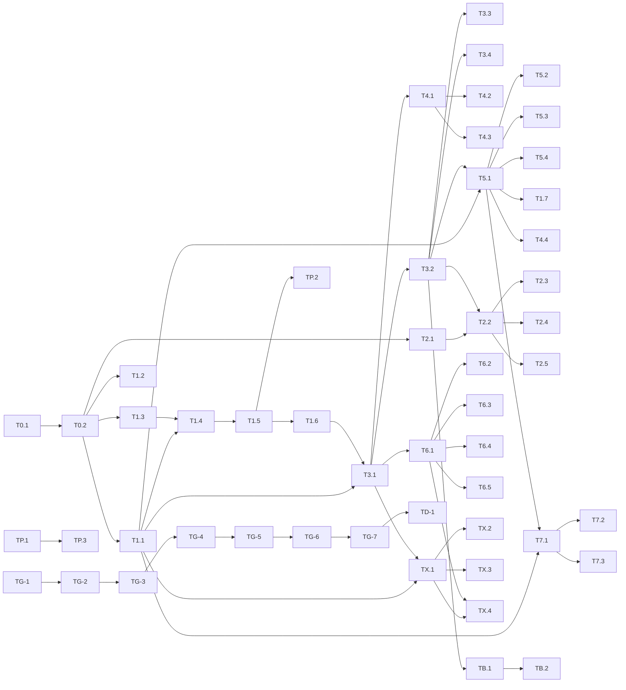

# Tasks: 213-onboarding-backend-foundation

**Plan**: plan.md | **Spec**: spec.md | **Total**: 51 tasks | **Completed**: 0
**Decomposition**: 5 PRs × ~7-12 tasks each. TDD pairs (test-commit + impl-commit) enforced per Article IX/X.

## Progress Summary

| Group | Tasks | Done | PR | Status |
|-------|-------|------|----|----|
| Phase 0 Setup | 2 | 0 | 213-1 | Pending |
| US-1 (P1) | 9 + TG-1 | 0 | 213-1, 213-2, 213-5 | Pending |
| US-2 (P1) | 6 + TG-2 | 0 | 213-1, 213-4 | Pending |
| US-3 (P1) | 4 + TG-3 | 0 | 213-3, 213-5 | Pending |
| US-4 (P1) | 4 + TG-4 | 0 | 213-3, 213-5 | Pending |
| US-5 (P1) | 4 + TG-5 | 0 | 213-5 | Pending |
| US-6 (P2) | 5 + TG-6 | 0 | 213-4 | Pending |
| US-7 (P2) | 3 + TG-7 | 0 | 213-5 | Pending |
| FR-4a preview | 4 | 0 | 213-3, 213-4 | Pending |
| PII + RLS | 3 | 0 | 213-2, 213-3 | Pending |
| Bootstrap idempotence + session | 3 | 0 | 213-3 | Pending |
| Finalization | TD-1 | 0 | 213-5 | Pending |

---

## Phase 0: Setup

### T0.1: Branch per PR + worktree
- **Status**: [ ] Pending
- **Priority**: P0
- **Est**: S | **Deps**: None
- **Steps**:
  - [ ] T0.1.1: `git checkout -b feat/213-1-contracts` (PR 213-1 base)
  - [ ] T0.1.2: Additional branches created at PR start: `feat/213-2-migration`, `feat/213-3-facade`, `feat/213-4-routes`, `feat/213-5-firstmsg-e2e`
- **ACs**:
  - [ ] Branch feat/213-1-contracts exists; HEAD on master at start

### T0.2: Import path scaffolding
- **Status**: [ ] Pending
- **Priority**: P0
- **Est**: S | **Deps**: T0.1 | **[P]**: —
- **Steps**:
  - [ ] T0.2.1: Create empty module files `nikita/onboarding/{contracts,tuning,adapters}.py` with 1-line docstring each
  - [ ] T0.2.2: Add to `nikita/onboarding/__init__.py` exports (stubs)
  - [ ] T0.2.3: Verify `python -c "from nikita.onboarding import contracts, tuning, adapters"` succeeds
- **ACs**:
  - [ ] Imports succeed; no circulars

---

## US-1: New user completes portal onboarding with full profile (P1)

**Story**: As a new user signing up via the portal, I want to provide name/age/city/scene/occupation/life_stage/interest/darkness/phone, so that Nikita's first message feels personal.
**Parent ACs**: AC-1.1 through AC-1.5

### T1.1: OnboardingV2ProfileRequest + Response in contracts.py (PR 213-1)
- **Status**: [ ] Pending | **Priority**: P1 | **Est**: S | **Deps**: T0.2 | **[P]**: with T1.2, T2.1
- **TDD Steps**:
  - [ ] T1.1.R: Write `tests/onboarding/test_contracts.py::test_v2_profile_request_rejects_bad_age` + `test_accepts_name_age_occupation` (failing)
  - [ ] T1.1.V1: Verify FAIL (NameError or ImportError on contracts classes)
  - [ ] T1.1.G: Implement `OnboardingV2ProfileRequest/Response` per spec FR-2 bodies
  - [ ] T1.1.V2: `pytest tests/onboarding/test_contracts.py -x` PASS
  - [ ] T1.1.B: Refactor if shared validators emerge
  - [ ] T1.1.C1: `test(onboarding): contracts v2 profile request/response tests`
  - [ ] T1.1.C2: `feat(onboarding): add OnboardingV2ProfileRequest/Response contracts`
- **ACs**:
  - [ ] AC-T1.1.1: `contracts.py` standalone (no `nikita.onboarding.models`, `nikita.db`, `nikita.engine.constants` imports)
  - [ ] AC-T1.1.2: Pydantic field validators reject age<18, bad phone, empty city
  - [ ] AC-T1.1.3: Response includes `chosen_option: None` default

### T1.2: BackstoryOption + tone Literal in contracts.py (PR 213-1)
- **Status**: [ ] Pending | **Priority**: P1 | **Est**: S | **Deps**: T0.2 | **[P]**: with T1.1, T2.1
- **TDD Steps**:
  - [ ] T1.2.R: `test_backstory_option_tone_literal_validates` (rejects bad tone string)
  - [ ] T1.2.V1: Verify FAIL
  - [ ] T1.2.G: Define `BackstoryOption` with `tone: Literal["mysterious","playful","tender","electric"]`
  - [ ] T1.2.V2: PASS
  - [ ] T1.2.C1: `test(onboarding): BackstoryOption tone validator`
  - [ ] T1.2.C2: `feat(onboarding): add BackstoryOption contract`

### T1.3: Tuning constants + compute_backstory_cache_key in tuning.py (PR 213-1)
- **Status**: [ ] Pending | **Priority**: P1 | **Est**: S | **Deps**: T0.2 | **[P]**: with T1.1, T1.2
- **TDD Steps**:
  - [ ] T1.3.R: `tests/onboarding/test_tuning_constants.py` — deep-equality on `AGE_BUCKETS`, `OCCUPATION_CATEGORIES`; boundary tests `age_to_bucket(24)=="young_adult"`, `age_to_bucket(25)=="twenties"`; `test_compute_backstory_cache_key_signature` asserts function at `nikita.onboarding.tuning`
  - [ ] T1.3.V1: Verify FAIL
  - [ ] T1.3.G: Implement per spec FR-4
  - [ ] T1.3.V2: PASS
  - [ ] T1.3.C1: `test(onboarding): tuning constants regression + cache_key`
  - [ ] T1.3.C2: `feat(onboarding): tuning constants + compute_backstory_cache_key`
- **ACs**:
  - [ ] AC-T1.3.1: All 4 Final constants documented with prior values (per .claude/rules/tuning-constants.md)
  - [ ] AC-T1.3.2: No `nikita.engine.constants` import in tuning.py

### T1.4: ProfileFromOnboardingProfile adapter (PR 213-1)
- **Status**: [ ] Pending | **Priority**: P1 | **Est**: S | **Deps**: T1.1, T1.3 | **[P]**: —
- **TDD Steps**:
  - [ ] T1.4.R: `tests/onboarding/test_adapters.py::test_from_pydantic_field_mapping` — assert returned dataclass has `.city` (NOT `.location_city`) and `.primary_passion` (NOT `.primary_interest`)
  - [ ] T1.4.V1: FAIL (duck-typed attributes missing)
  - [ ] T1.4.G: Implement `ProfileFromOnboardingProfile.from_pydantic` returning `BackstoryPromptProfile` dataclass
  - [ ] T1.4.V2: PASS
  - [ ] T1.4.C1: `test(onboarding): adapter field-mapping`
  - [ ] T1.4.C2: `feat(onboarding): ProfileFromOnboardingProfile + BackstoryPromptProfile`
- **ACs**:
  - [ ] AC-T1.4.1: Adapter replaces `_ProfileFromAnswers` at `nikita/platforms/telegram/onboarding/handler.py:41-56` (removed in subsequent task)

### T1.5: Migration — user_profiles columns + backstory_cache (PR 213-2)
- **Status**: [ ] Pending | **Priority**: P1 | **Est**: M | **Deps**: T1.1 merged in PR 213-1
- **TDD Steps**:
  - [ ] T1.5.R: `tests/db/test_rls_user_profiles.py::test_new_columns_queryable_with_rls` (skips if no live Supabase)
  - [ ] T1.5.V1: Verify FAIL (columns missing)
  - [ ] T1.5.G: Apply migration via Supabase MCP `apply_migration`; DDL = ADD COLUMN + backstory_cache CREATE TABLE + RLS policies (subquery form on DELETE, WITH CHECK on UPDATE)
  - [ ] T1.5.V2: PASS; verify via `list_tables` MCP
  - [ ] T1.5.C1: `test(db): RLS + new columns integration tests`
  - [ ] T1.5.C2: `feat(db): migration add profile fields + backstory_cache`
- **ACs**:
  - [ ] AC-T1.5.1: Migration filename follows `YYYYMMDDHHMMSS_*` convention
  - [ ] AC-T1.5.2: `backstory_cache` has RLS ENABLED + admin-only `is_admin()` policy
  - [ ] AC-T1.5.3: 5 existing user_profiles policies cover new columns

### T1.6: Mapped columns in nikita/db/models/profile.py (PR 213-2)
- **Status**: [ ] Pending | **Priority**: P1 | **Est**: S | **Deps**: T1.5
- **TDD Steps**:
  - [ ] T1.6.R: unit test instantiating UserProfile with `name="X", occupation="Y", age=25`
  - [ ] T1.6.V1: FAIL (no such attribute)
  - [ ] T1.6.G: Add `Mapped[str | None]` columns
  - [ ] T1.6.V2: PASS
  - [ ] T1.6.C1: `test(db): UserProfile ORM new columns`
  - [ ] T1.6.C2: `feat(db): add name/occupation/age to UserProfile ORM`

### T1.8: BackstoryCache ORM model (PR 213-2) — FR-12 coverage
- **Status**: [ ] Pending | **Priority**: P1 | **Est**: S | **Deps**: T1.5 | **[P]**: with T1.6
- **TDD Steps**:
  - [ ] T1.8.R: unit test instantiating `BackstoryCache(cache_key="X", scenarios=[...], venues_used=[...], ttl_expires_at=...)`
  - [ ] T1.8.V1: FAIL (class missing)
  - [ ] T1.8.G: Create `nikita/db/models/backstory_cache.py` with ORM fields matching migration
  - [ ] T1.8.V2: PASS
  - [ ] T1.8.C1: `test(db): BackstoryCache ORM model`
  - [ ] T1.8.C2: `feat(db): add BackstoryCache ORM`

### T1.9: BackstoryCacheRepository (PR 213-2) — FR-12 coverage
- **Status**: [ ] Pending | **Priority**: P1 | **Est**: M | **Deps**: T1.8
- **TDD Steps**:
  - [ ] T1.9.R: `tests/services/test_backstory_cache_repository.py` — get/set with TTL filter + cache_key uniqueness; return type `list[dict] | None` raw envelope (per AR2-L2 resolution)
  - [ ] T1.9.V1: FAIL
  - [ ] T1.9.G: Implement `nikita/db/repositories/backstory_cache_repository.py` — `get(cache_key) -> list[dict] | None` and `set(cache_key, scenarios: list[dict], ttl_days)`
  - [ ] T1.9.V2: PASS
  - [ ] T1.9.C1: `test(services): BackstoryCacheRepository`
  - [ ] T1.9.C2: `feat(services): add BackstoryCacheRepository`
- **ACs**:
  - [ ] AC-T1.9.1: Returns raw `list[dict]`, NOT `list[BackstoryOption]` (matches VenueCacheRepository pattern)
  - [ ] AC-T1.9.2: TTL filter at query-time (no pg_cron required)

### T1.7: AC-1.5 FirstMessageGenerator meta-opener regex test (PR 213-5)
- **Status**: [ ] Pending | **Priority**: P1 | **Est**: S | **Deps**: T5.1
- **TDD Steps**:
  - [ ] T1.7.R: `test_handoff.py::TestFirstMessageGeneratorWithBackstory::test_no_meta_opener` — regex asserts result does NOT match `r"So we meet again"`
  - [ ] T1.7.V1: FAIL initially
  - [ ] T1.7.G: Ensure FirstMessageGenerator never emits meta-opener
  - [ ] T1.7.V2: PASS
  - [ ] T1.7.C1–C2: test + impl commits

### TG-1: Git Workflow for US-1
- **Status**: [ ] Pending | **Trigger**: After T1.1–T1.7 done
- **Steps**:
  - [ ] TG-1.1: All US-1 tests green locally
  - [ ] TG-1.2: Push PR 213-1 branch → `gh pr create` → `/qa-review --pr N` → absolute-zero → squash merge
  - [ ] TG-1.3: Post-merge smoke via auto-dispatched subagent
  - [ ] TG-1.4: Repeat for PR 213-2 portions, PR 213-5 portions

---

## US-2: Pipeline-readiness gate (P1)

**Parent ACs**: AC-2.1 through AC-2.4

### T2.1: PipelineReadyResponse + PipelineReadyState (PR 213-1)
- **Status**: [ ] Pending | **Priority**: P1 | **Est**: S | **Deps**: T0.2 | **[P]**: with T1.1, T1.2
- **TDD Steps**:
  - [ ] T2.1.R: test `PipelineReadyState` Literal values (`pending|ready|degraded|failed`), `venue_research_status`, `backstory_available` defaults
  - [ ] T2.1.V1: FAIL
  - [ ] T2.1.G: Implement per FR-2a
  - [ ] T2.1.V2: PASS
  - [ ] T2.1.C1–C2: test + impl commits

### T2.2: GET /pipeline-ready/{user_id} route (PR 213-4)
- **Status**: [ ] Pending | **Priority**: P1 | **Est**: M | **Deps**: T2.1, T3.2 merged
- **TDD Steps**:
  - [ ] T2.2.R: `test_pipeline_ready_states` parametrized over 4 states
  - [ ] T2.2.V1: FAIL (404)
  - [ ] T2.2.G: Implement route + JSONB read
  - [ ] T2.2.V2: PASS
  - [ ] T2.2.C1–C2

### T2.3: Cross-user 403 body (PR 213-4)
- **Status**: [ ] Pending | **Priority**: P1 | **Est**: S | **Deps**: T2.2 | **[P]**: with T2.4
- **TDD Steps**: R→V1→G→V2 (AC-2.4 exact body shape `{"detail":"Not authorized"}`) → C1→C2

### T2.4: Polling terminates + max_wait degraded (PR 213-4)
- **Status**: [ ] Pending | **Priority**: P1 | **Est**: M | **Deps**: T2.2 | **[P]**: with T2.3
- **TDD Steps**:
  - [ ] T2.4.R: ASGI-level test; `AsyncMock(side_effect=[{"pipeline_state":"pending"}]*4 + [{"pipeline_state":"ready"}])`; assert loop exits ≤5; sibling `[{"pipeline_state":"failed"}]` → immediate exit; 10 trials parametrize. Plus `test_max_wait_returns_degraded`
  - [ ] rest of TDD + commits

### T2.5: Venue/backstory status fields exposed (FR-2a tail)
- **Status**: [ ] Pending | **Priority**: P1 | **Est**: S | **Deps**: T2.2
- **TDD**: parametrize `venue_research_status` over (`pending|complete|degraded`), `backstory_available` over (True|False) → assert response shape

### T2.6: main.py include_router registration (PR 213-4) — FR-13 coverage
- **Status**: [ ] Pending | **Priority**: P1 | **Est**: S | **Deps**: T2.2
- **TDD Steps**:
  - [ ] T2.6.R: integration test `tests/api/test_main_routes.py::test_portal_onboarding_router_registered` — request `GET /api/v1/onboarding/pipeline-ready/{uuid}` returns status ≠ 404
  - [ ] T2.6.V1: FAIL (404)
  - [ ] T2.6.G: Add to `nikita/api/main.py` lifespan: `app.include_router(portal_onboarding.router, prefix='/api/v1/onboarding', tags=['Portal Onboarding'])` after existing onboarding.router (line ~265)
  - [ ] T2.6.V2: PASS
  - [ ] T2.6.C1: `test(api): verify portal_onboarding router registered`
  - [ ] T2.6.C2: `feat(api): register portal_onboarding.router in main.py`
- **ACs**:
  - [ ] AC-T2.6.1: Resolves architecture finding AR2-L1 (main.py registration)

### TG-2: Git Workflow for US-2 → part of PR 213-4 merge

---

## US-3: City research timeout graceful (P1)

### T3.1: Facade process() with VENUE_RESEARCH_TIMEOUT_S (PR 213-3)
- **Status**: [ ] Pending | **Priority**: P1 | **Est**: M | **Deps**: T1.1–T1.6 merged
- **TDD Steps**:
  - [ ] T3.1.R: `test_venue_timeout` — patch `nikita.services.venue_research.VenueResearchService.research_venues` with sleep(30); assert `time.monotonic()` measured under `VENUE_RESEARCH_TIMEOUT_S + 1s`; assert caplog has `event="portal_handoff.venue_research"`, `outcome="timeout"`, `error_class="TimeoutError"`
  - [ ] V1 FAIL; G implement `asyncio.wait_for` wrapper; V2 PASS
  - [ ] C1–C2

### T3.2: Pipeline state transitions in _bootstrap_pipeline (PR 213-3)
- **Status**: [ ] Pending | **Priority**: P1 | **Est**: M | **Deps**: T3.1
- **TDD**: FR-5.1 transitions (pending→ready, degraded, failed) all exercised; use `update_onboarding_profile_key` helper (FR-5.2)

### T3.3: First message falls back to scene-only on timeout (PR 213-5)
- **Status**: [ ] Pending | **Priority**: P1 | **Est**: S | **Deps**: T5.1
- **TDD**: `test_first_message_falls_back_to_scene_only` (AC-3.3)

### T3.4: pipeline_state="degraded" on timeout (PR 213-3)
- **Status**: [ ] Pending | **Priority**: P1 | **Est**: S | **Deps**: T3.2
- **TDD**: caplog + JSONB-read mock asserts state=degraded (AC-3.4)

### TG-3: part of PR 213-3 / 213-5 merges

---

## US-4: Backstory failure graceful (P1)

### T4.1: Facade catches BackstoryGeneratorService exceptions → returns [] (PR 213-3)
- **Status**: [ ] Pending | **Priority**: P1 | **Est**: S | **Deps**: T3.1 | **[P]**: with T4.2
- **TDD**: `test_backstory_failure_returns_empty` — patch `nikita.services.backstory_generator.BackstoryGeneratorService.generate_scenarios` → `RuntimeError` → assert `[]` (AC-4.1). C1–C2.

### T4.2: Log redaction on backstory fail (PR 213-3)
- **Status**: [ ] Pending | **Priority**: P1 | **Est**: S | **Deps**: T4.1 | **[P]**: with T4.1
- **TDD**: `test_backstory_failure_log_no_pii` — caplog contains event/outcome/error_class fields, NO PII fields (AC-4.3). C1–C2.

### T4.3: pipeline_state="degraded" on backstory fail (PR 213-3)
- **Status**: [ ] Pending | **Priority**: P1 | **Est**: S | **Deps**: T3.2, T4.1
- **TDD**: state transition assertion (AC-4.4)

### T4.4: First message keeps flavor on backstory fail (PR 213-5)
- **Status**: [ ] Pending | **Priority**: P1 | **Est**: S | **Deps**: T5.1
- **TDD**: `test_first_message_keeps_flavor_on_backstory_fail` (AC-4.2). C1–C2.

### TG-4: part of PR 213-3 / 213-5 merges

---

## US-5: R8 conversation continuity (P1)

### T5.1: FirstMessageGenerator FR-6 (PR 213-5)
- **Status**: [ ] Pending | **Priority**: P1 | **Est**: M | **Deps**: T1.1, T3.2 merged
- **TDD**: build_first_message consumes profile + scenarios; unit tests for each flavor branch (backstory hit, backstory empty, venue timeout). C1–C2.

### T5.2: test_loads_seeded_turn (AC-5.1) (PR 213-5)
- **Status**: [ ] Pending | **Priority**: P1 | **Est**: S | **Deps**: T5.1
- **TDD**: mock `ConversationRepository.get` returning conv with `[T]`; assert history loaded. C1–C2.

### T5.3: test_agent_receives_history (AC-5.2) (PR 213-5)
- **Status**: [ ] Pending | **Priority**: P1 | **Est**: S | **Deps**: T5.1 | **[P]**: with T5.4
- **TDD**: assert `mock_run.call_args.kwargs["messages"]` contains `{"role":"assistant","content":T}`. C1–C2.

### T5.4: test_no_denial_phrases N=10 parametrize (AC-5.3) (PR 213-5)
- **Status**: [ ] Pending | **Priority**: P1 | **Est**: S | **Deps**: T5.1 | **[P]**: with T5.3
- **TDD**: patch `nikita.agents.text.agent.NikitaAgent.run` with `AsyncMock(return_value=MagicMock(output="..."))`; loop 10x; regex `r"I never said|you must be mistaken"` is None. C1–C2.

### TG-5: part of PR 213-5 merge

---

## US-6: Re-onboarding resumes (P2)

### T6.1: PATCH /onboarding/profile route (PR 213-4)
- **Status**: [ ] Pending | **Priority**: P2 | **Est**: M | **Deps**: T3.1 merged
- **TDD**: integration test — partial update preserves JSONB keys not in payload. C1–C2.

### T6.2: test_patch_preserves_wizard_step (AC-6.1) (PR 213-4)
- **Status**: [ ] Pending | **Priority**: P2 | **Est**: S | **Deps**: T6.1
- **TDD**: JSONB read after PATCH still contains `wizard_step=5`; response does NOT echo `wizard_step` (not in frozen contract).

### T6.3: test_patch_merges_jsonb (AC-6.2) (PR 213-4)
- **Status**: [ ] Pending | **Priority**: P2 | **Est**: S | **Deps**: T6.1 | **[P]**: with T6.4

### T6.4: test_patch_returns_null_for_unset_fields (AC-6.3) (PR 213-4)
- **Status**: [ ] Pending | **Priority**: P2 | **Est**: S | **Deps**: T6.1 | **[P]**: with T6.3

### T6.5: test_cache_hit_skips_claude (AC-6.4) cross-endpoint (PR 213-4)
- **Status**: [ ] Pending | **Priority**: P2 | **Est**: M | **Deps**: T3.1, T6.1, TX.1
- **TDD**: full flow preview→POST asserts Claude called EXACTLY ONCE.

### TG-6: part of PR 213-4 merge

---

## US-7: Voice-first user routing (P2)

### T7.1: Voice pre-call webhook consumes OnboardingV2ProfileResponse (PR 213-5)
- **Status**: [ ] Pending | **Priority**: P2 | **Est**: S | **Deps**: T1.1, T5.1 merged
- **TDD**: payload shape assertion

### T7.2: test_payload_includes_v2_profile_response (AC-7.2) (PR 213-5)
- **Status**: [ ] Pending | **Priority**: P2 | **Est**: S | **Deps**: T7.1

### T7.3: test_voice_prompt_includes_backstory (AC-7.3) (PR 213-5)
- **Status**: [ ] Pending | **Priority**: P2 | **Est**: S | **Deps**: T5.1, T7.1 | **[P]**: with T7.2
- **TDD**: patch `BACKSTORY_HOOK_PROBABILITY` to 1.0 → assert `"Berghain"` in result; patch to 0.0 → assert absent.

### TG-7: part of PR 213-5 merge

---

## Cross-cutting: FR-4a preview backstory endpoint

### TX.1: POST /onboarding/preview-backstory + BackstoryPreviewRequest/Response (PR 213-3)
- **Status**: [ ] Pending | **Priority**: P1 | **Est**: M | **Deps**: T1.1, T3.1
- **TDD**: happy path: request returns scenarios + venues_used + cache_key + degraded=False. C1–C2.

### TX.2: _PreviewRateLimiter overrides _get_minute_window() (PR 213-3)
- **Status**: [ ] Pending | **Priority**: P1 | **Est**: S | **Deps**: TX.1
- **TDD**: override returns `f"preview:{super()._get_minute_window()}"`; 6th call in 1min → 429 `Retry-After: 60`.

### TX.3: facade unit tests (PR 213-3)
- **Status**: [ ] Pending | **Priority**: P1 | **Est**: S | **Deps**: TX.1 | **[P]**: with TX.2
- **TDD**:
  - [ ] `test_cache_key_stable` (same inputs → identical cache_key)
  - [ ] `test_degraded_returns_empty` (backstory service failure → `degraded=True`, `scenarios=[]`, `venues_used=<venue_names>`)

### TX.4: route integration tests (PR 213-4)
- **Status**: [ ] Pending | **Priority**: P1 | **Est**: M | **Deps**: TX.1, T6.1
- **TDD**:
  - [ ] `test_profile_post_reuses_cache` (preview → POST profile reuses cache, no duplicate Claude call)
  - [ ] `test_rate_limit` (6th call → 429 + Retry-After:60)
  - [ ] `test_stateless_no_jsonb_write` (preview does NOT mutate users.onboarding_profile)

---

## Cross-cutting: PII + RLS + observability

### TP.1: Fix PII echo at onboarding.py:154,:239 (PR 213-3)
- **Status**: [ ] Pending | **Priority**: P1 | **Est**: S | **Deps**: None
- **TDD**: `test_log_observability.py` caplog asserts NO PII fields (name/age/occupation/phone) in exception records; asserts `extra={"user_id": ...}` pattern. C1–C2.

### TP.2: RLS DDL in migration (PR 213-2)
- **Status**: [ ] Pending | **Priority**: P1 | **Est**: S | **Deps**: T1.5
- **TDD**: `test_rls_user_profiles.py` asserts UPDATE policy `WITH CHECK (id = (SELECT auth.uid()))`; DELETE subquery form. Part of T1.5 DDL.

### TP.3: NFR-3 log observability for 4 events (PR 213-3)
- **Status**: [ ] Pending | **Priority**: P1 | **Est**: M | **Deps**: TP.1 | **[P]**: with TP.1
- **TDD**: 4 events with schema: `portal_handoff.venue_research`, `portal_handoff.backstory`, `portal_handoff.pipeline_state_transition`, `portal_handoff.first_message_sent`.

---

## Cross-cutting: pipeline bootstrap idempotence (FR-11)

### TB.1: _bootstrap_pipeline reads pipeline_state; skip if ready (PR 213-3)
- **Status**: [ ] Pending | **Priority**: P1 | **Est**: S | **Deps**: T3.2
- **TDD**: `test_idempotent_double_call` uses `side_effect=[state_none, state_ready]` (NOT `return_value=None` per non-empty-fixture rule).

### TB.2: Orchestrator signature unchanged (PR 213-3)
- **Status**: [ ] Pending | **Priority**: P1 | **Est**: S | **Deps**: TB.1 | **[P]**: with TB.1
- **TDD**: assert orchestrator public signature untouched (AR-L1 resolved).

### TB.3: Session isolation test (FR-14 coverage, PR 213-3)
- **Status**: [ ] Pending | **Priority**: P1 | **Est**: S | **Deps**: T3.1
- **TDD Steps**:
  - [ ] TB.3.R: `tests/services/test_portal_onboarding_facade.py::test_portal_onboarding_session_isolation` — call facade.process(profile, session=mock); assert `get_session_maker` NOT invoked inside facade (patch `nikita.services.portal_onboarding.get_session_maker` and assert `.call_count == 0`)
  - [ ] TB.3.V1: FAIL if facade spawns own session
  - [ ] TB.3.G: verify facade accepts injected session only (FR-14)
  - [ ] TB.3.V2: PASS
  - [ ] TB.3.C1: `test(services): facade session isolation regression`
  - [ ] TB.3.C2: follow-up impl commit if facade refactor required
- **ACs**:
  - [ ] AC-TB.3.1: Facade never creates its own `AsyncSession`; FR-14 pattern preserved

---

## Finalization

### TD-1: Documentation Sync + ROADMAP update (PR 213-5)
- **Status**: [ ] Pending | **Priority**: P0 | **Trigger**: After all US tasks complete
- **Steps**:
  - [ ] TD-1.1: Run `/doc-sync --focus implementation`
  - [ ] TD-1.2: Review audit report
  - [ ] TD-1.3: Apply all CRITICAL + HIGH + MEDIUM + LOW fixes (absolute-zero policy)
  - [ ] TD-1.4: `/roadmap update 213 COMPLETE`
  - [ ] TD-1.5: Update event-stream.md: `[ISO] MERGE: Spec 213 complete, all 5 PRs merged`
  - [ ] TD-1.6: Move Spec 213 from `specs/` to `specs/archive/` ONLY IF superseded (not default — spec remains living)
- **ACs**:
  - [ ] Doc-sync audit generated; 0 findings across all severities
  - [ ] ROADMAP.md shows Spec 213 = COMPLETE
  - [ ] event-stream.md updated

---

## Dependency Graph

## Parallelization

| Group | Tasks | Reason |
|-------|-------|--------|
| P1.A (PR 213-1) | T1.1, T1.2, T1.3, T2.1 | Independent contract definitions |
| P3.A (PR 213-3) | TX.2, TX.3 | Post-TX.1 both independent |
| P3.B (PR 213-3) | TP.1, TP.3 | Independent PII+log tasks |
| P3.C (PR 213-3) | T4.1, T4.2 | Failure-path tests |
| P3.D (PR 213-3) | TB.1, TB.2 | Bootstrap idempotence pair |
| P4.A (PR 213-4) | T6.2, T6.3, T6.4 | All read-only after T6.1 |
| P4.B (PR 213-4) | T2.3, T2.4 | Pipeline-ready sub-assertions |
| P5.A (PR 213-5) | T5.3, T5.4, T7.3 | All read agent output, no mutation |

## Task Organization Rules (Article V compliance)

1. ✓ Tasks grouped by User Story (P1 US-1..5 → P2 US-6,7) + cross-cutting
2. ✓ Deps explicit; no circular refs
3. ✓ Every task links ≥1 AC
4. ✓ No orphan tasks — all trace to spec FR or AC
5. ✓ TDD steps on every T* implementation task
6. ✓ TG-X per US; TD-1 finalization

## Validation Self-Check

- [x] Every AC (30 total) has an implementing task
- [x] Every task has TDD steps (R→V1→G→V2→[B]→C1→C2)
- [x] Every PR has its own branch (T0.1)
- [x] TG-X per US + TD-1 doc-sync present
- [x] Dependency graph is valid DAG (no cycles)
- [x] Article IX TDD + Article X git workflow enforced inline
