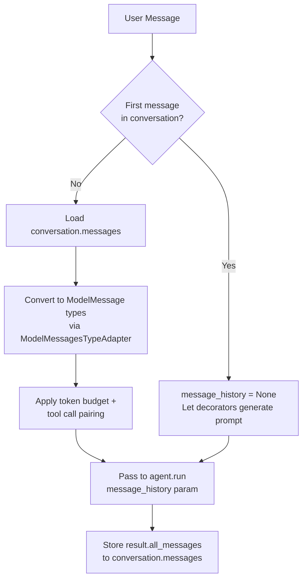
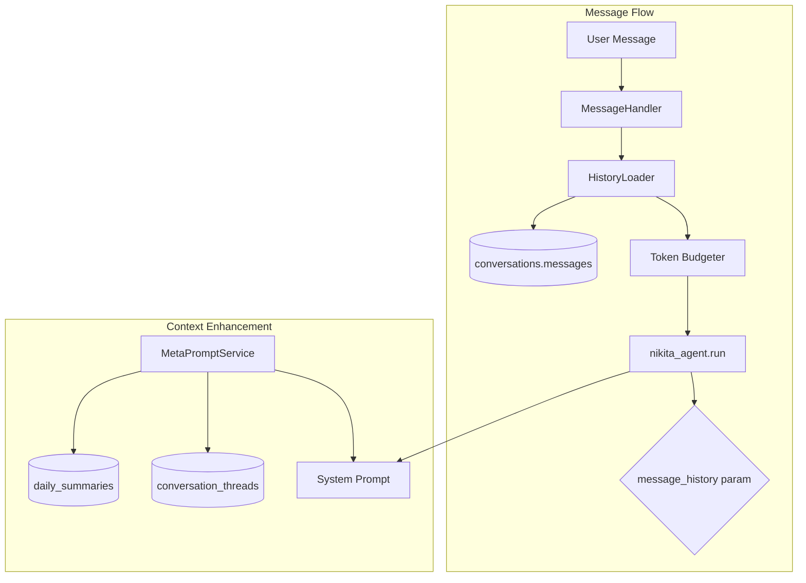
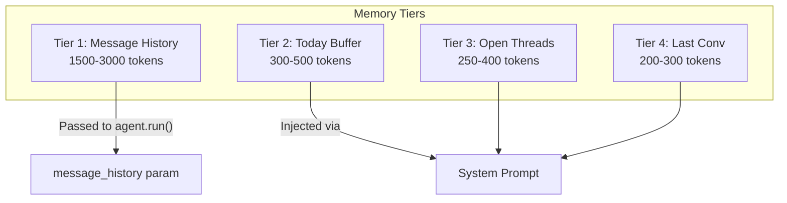

# Implementation Plan: Text Agent Message History and Continuity

**Spec**: [spec.md](spec.md) | **Status**: Ready

## Overview

**Objective**: Fix text agent "amnesia" by implementing PydanticAI message history injection, today buffer, and open threads surfacing.

**Scope**:
- Add `message_history` parameter to `agent.run()` call
- Create `HistoryLoader` class to retrieve and format conversation history
- Enhance `MetaPromptService` with today buffer and open threads
- Add context snapshot logging for debugging

## Architecture

### Session-Aware Message History Flow (from Research 2026-01-20)



**Critical**: When `message_history` is non-empty, PydanticAI does NOT regenerate the system prompt. Our `@agent.instructions` decorators only run when `message_history` is empty.

### Component Flow





## Dependencies

| Dependency | Type | Status | Notes |
|------------|------|--------|-------|
| PydanticAI | External | ✅ Installed | `message_history` param documented |
| pydantic_ai.ModelMessagesTypeAdapter | External | ✅ Available | For message serialization/deserialization |
| pydantic_ai history_processors | External | ✅ Available | For automatic truncation |
| conversations.messages | DB | ✅ Exists | JSONB column with message array |
| daily_summaries | DB | ✅ Exists | Has summary_text, key_moments |
| conversation_threads | DB | ✅ Exists | Has status column |
| MetaPromptService | Internal | ✅ Exists | Needs enhancement |

## Tasks by User Story

### US-1: Short Message Continuity (P0)

| ID | Task | Est. | Deps | [P] |
|----|------|------|------|-----|
| T1.1 | Create `HistoryLoader` class in `nikita/agents/text/history.py` | M | - | |
| T1.2 | Add `get_message_history()` to `ConversationRepository` | S | - | [P] |
| T1.3 | Implement PydanticAI `ModelMessage` formatting | M | T1.1 | |
| T1.4 | Add `message_history` param to `nikita_agent.run()` | S | T1.3 | |
| T1.5 | Implement token budgeting for history tier (≤3000 tokens) | M | T1.3 | |
| T1.6 | Write unit tests for HistoryLoader | M | T1.1-T1.5 | |

### US-2: Same-Day Return Continuity (P0)

| ID | Task | Est. | Deps | [P] |
|----|------|------|------|-----|
| T2.1 | Enhance `_load_context()` to fetch `daily_summaries` | S | - | [P] |
| T2.2 | Add `today_summary` to system prompt template | S | T2.1 | |
| T2.3 | Add `key_moments` extraction and injection | S | T2.1 | |
| T2.4 | Write unit tests for today buffer | M | T2.1-T2.3 | |

### US-3: Thread Follow-Up (P1)

| ID | Task | Est. | Deps | [P] |
|----|------|------|------|-----|
| T3.1 | Add `get_open_threads()` to `ConversationThreadRepository` | S | - | [P] |
| T3.2 | Add open threads injection to `MetaPromptService` | M | T3.1 | |
| T3.3 | Implement thread prioritization (recency, importance) | M | T3.2 | |
| T3.4 | Write unit tests for thread surfacing | M | T3.1-T3.3 | |

### US-4: Returning User Experience (P2)

| ID | Task | Est. | Deps | [P] |
|----|------|------|------|-----|
| T4.1 | Add `get_last_conversation_summary()` to repository | S | - | [P] |
| T4.2 | Populate `{{last_conversation_summary}}` template variable | S | T4.1 | |
| T4.3 | Write unit tests for last conversation | S | T4.1-T4.2 | |

### Cross-Cutting: Token Budget & Logging (P1)

| ID | Task | Est. | Deps | [P] |
|----|------|------|------|-----|
| T5.1 | Implement combined token budget manager | M | T1.5, T2.1-T2.3, T3.2, T4.2 | |
| T5.2 | Implement truncation priority logic | M | T5.1 | |
| T5.3 | Add `context_snapshot` logging to `generated_prompts` | S | T5.1 | |
| T5.4 | Write integration tests for full context build | L | All | |

## File Changes

| File | Type | Description |
|------|------|-------------|
| `nikita/agents/text/history.py` | NEW | HistoryLoader class |
| `nikita/agents/text/agent.py` | MODIFY | Add message_history to agent.run() |
| `nikita/meta_prompts/service.py` | MODIFY | Add today buffer, threads, last conv |
| `nikita/meta_prompts/models.py` | MODIFY | Add context fields |
| `nikita/db/repositories/conversation_repository.py` | MODIFY | Add get_message_history() |
| `nikita/db/repositories/thread_repository.py` | MODIFY | Add get_open_threads() |
| `tests/agents/text/test_history.py` | NEW | HistoryLoader tests |
| `tests/meta_prompts/test_continuity.py` | NEW | Today buffer, threads tests |

## Risks

| Risk | Likelihood | Impact | Mitigation |
|------|------------|--------|------------|
| Token budget overflow | MEDIUM | HIGH | Strict budgeting + deterministic truncation |
| PydanticAI message format mismatch | LOW | MEDIUM | Use documented ModelMessage types |
| Neo4j cold start during history load | KNOWN | MEDIUM | History from Supabase, not Neo4j |
| Conversation.messages schema mismatch | LOW | HIGH | Validate format before processing |
| **System prompt not regenerated** | MEDIUM | HIGH | Session detection: message_history=None for new sessions |
| **Tool call pairing errors** | MEDIUM | MEDIUM | Safe truncation + validation + tests |
| **Message format incompatibility** | LOW | MEDIUM | Use ModelMessagesTypeAdapter for conversion |

## Testing Strategy

### Unit Tests (Target: 90% coverage)
- `test_history_loader.py`: Message retrieval, formatting, truncation
- `test_today_buffer.py`: Summary loading, key moments
- `test_thread_surfacing.py`: Open threads query, prioritization
- `test_token_budget.py`: Budget enforcement, truncation order

### Integration Tests
- Full context build with real DB data
- Message history → agent.run() integration
- MetaPromptService with all 4 tiers populated

### E2E Tests
- Short message continuity ("yes" after question)
- Same-day return with today buffer
- Thread follow-up after 24h gap
- Token budget respected under load

## Implementation Order

```
Phase 1 (Day 1): Foundation
├── T1.1: HistoryLoader class
├── T1.2: get_message_history() [P]
├── T2.1: today_summary enhancement [P]
├── T3.1: get_open_threads() [P]
└── T4.1: get_last_conversation_summary() [P]

Phase 2 (Day 2): Integration
├── T1.3: ModelMessage formatting
├── T1.4: message_history param
├── T1.5: Token budgeting
├── T2.2-T2.3: Today buffer injection
└── T3.2-T3.3: Thread injection

Phase 3 (Day 3): Testing & Polish
├── T1.6, T2.4, T3.4, T4.3: Unit tests
├── T5.1-T5.3: Token budget manager + logging
└── T5.4: Integration tests
```

## Success Metrics

| Metric | Current | Target | Measurement |
|--------|---------|--------|-------------|
| Short message coherence | ~50% | ≥90% | Manual test (10 "yes" responses) |
| Same-day return callback | ~30% | ≥90% | E2E test |
| History tokens used | 0 | 1500-3000 | generated_prompts.context_snapshot |
| Context build latency | ~150ms | <200ms | generated_prompts.generation_time_ms |
