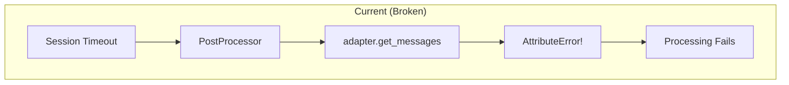
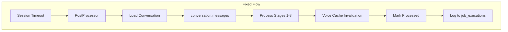
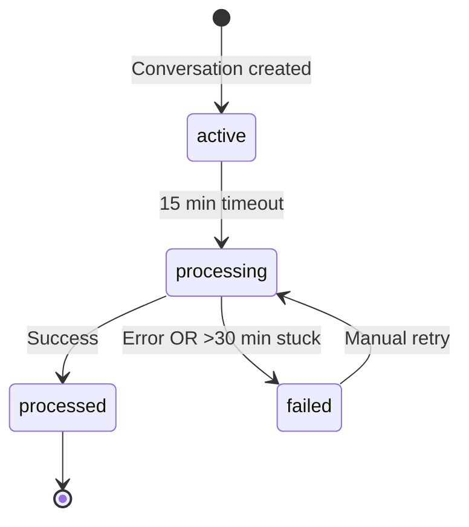

# Implementation Plan: Post-Processing Unification and Reliability

**Spec**: [spec.md](spec.md) | **Status**: Ready

## Overview

**Objective**: Fix post-processing pipeline bugs to achieve 99% reliability and voice-text consistency.

**Critical Bug**: `adapter.py:24` calls `conv_repo.get_messages()` which doesn't exist, causing all post-processing to silently fail.

## Architecture







## Dependencies

| Dependency | Type | Status | Notes |
|------------|------|--------|-------|
| Conversation.messages | DB Column | ✅ Exists | JSONB with message history |
| job_executions | DB Table | ✅ Exists | Used by pg_cron jobs |
| cached_voice_prompt | DB Column | ✅ Exists | On users table |
| processing_started_at | DB Column | ❌ Missing | Needs migration |

## Tasks by User Story

### US-1: Reliable Memory Updates (P0)

| ID | Task | Est. | Deps | [P] |
|----|------|------|------|-----|
| T1.1 | Fix adapter.py to use Conversation.messages | S | - | |
| T1.2 | Add get() method to ConversationRepository | S | - | [P] |
| T1.3 | Write unit tests for adapter fix | M | T1.1 | |
| T1.4 | Write integration test for full pipeline | M | T1.1-T1.3 | |

### US-2: Voice-Text Consistency (P0)

| ID | Task | Est. | Deps | [P] |
|----|------|------|------|-----|
| T2.1 | Add voice cache invalidation to PostProcessor | S | T1.1 | |
| T2.2 | Update server_tools.py to read summary_text | S | - | [P] |
| T2.3 | Create migration for summary_text alignment | S | - | [P] |
| T2.4 | Write tests for voice cache invalidation | M | T2.1 | |

### US-3: Processing Observability (P1)

| ID | Task | Est. | Deps | [P] |
|----|------|------|------|-----|
| T3.1 | Add job_execution logging to PostProcessor | M | T1.1 | |
| T3.2 | Log stage-level failures with context | S | T3.1 | |
| T3.3 | Add processing stats to admin dashboard | M | T3.1 | [P] |
| T3.4 | Write tests for job_execution logging | M | T3.1-T3.2 | |

### US-4: No Stuck Conversations (P1)

| ID | Task | Est. | Deps | [P] |
|----|------|------|------|-----|
| T4.1 | Add processing_started_at column migration | S | - | [P] |
| T4.2 | Implement detect_stuck() in repository | S | T4.1 | |
| T4.3 | Add stuck detection endpoint to tasks.py | M | T4.2 | |
| T4.4 | Add retry logic with exponential backoff | M | T4.1-T4.2 | |
| T4.5 | Write tests for stuck detection | M | T4.2-T4.3 | |

## File Changes

| File | Type | Description |
|------|------|-------------|
| `nikita/post_processing/adapter.py` | MODIFY | Fix get_messages bug |
| `nikita/db/repositories/conversation_repository.py` | MODIFY | Add get(), detect_stuck() |
| `nikita/context/post_processor.py` | MODIFY | Add voice cache invalidation |
| `nikita/api/routes/tasks.py` | MODIFY | Add stuck detection endpoint |
| `nikita/agents/voice/server_tools.py` | MODIFY | Read summary_text |
| `nikita/db/models/conversation.py` | MODIFY | Add processing_started_at |
| `nikita/db/migrations/versions/20260119_processing_started_at.py` | NEW | Migration |
| `tests/post_processing/test_adapter.py` | NEW | Adapter tests |
| `tests/context/test_post_processor_voice.py` | NEW | Voice cache tests |

## Database Migration

```sql
-- Migration: Add processing_started_at for stuck detection
ALTER TABLE conversations
ADD COLUMN processing_started_at TIMESTAMP WITH TIME ZONE;

-- Index for efficient stuck detection
CREATE INDEX idx_conversations_stuck_detection
ON conversations (status, processing_started_at)
WHERE status = 'processing';

-- Backfill: Copy nikita_summary_text to summary_text where null
UPDATE daily_summaries
SET summary_text = nikita_summary_text
WHERE summary_text IS NULL AND nikita_summary_text IS NOT NULL;
```

## Risks

| Risk | Likelihood | Impact | Mitigation |
|------|------------|--------|------------|
| Migration downtime | LOW | MEDIUM | Run during low traffic |
| Backward compat break | LOW | HIGH | Keep nikita_summary_text readable |
| Neo4j timeouts during processing | MEDIUM | MEDIUM | Retry logic with backoff |
| Race condition in status updates | LOW | MEDIUM | Use DB transactions |

## Testing Strategy

### Unit Tests (Target: 90% coverage)
- `test_adapter.py`: Message retrieval fix
- `test_post_processor_voice.py`: Cache invalidation
- `test_stuck_detection.py`: Status state machine

### Integration Tests
- Full pipeline with real DB
- Voice cache refresh after text processing
- Stuck detection and recovery

### E2E Tests
- Send text message → verify processing completes
- Verify voice call sees updated summary
- Verify stuck conversation recovery

## Implementation Order

```
Phase 1 (Day 1): Critical Fix
├── T1.1: Fix adapter.py (CRITICAL BUG)
├── T1.2: Add get() method [P]
├── T4.1: Add migration [P]
└── T1.3-T1.4: Tests

Phase 2 (Day 2): Voice Sync
├── T2.1: Voice cache invalidation
├── T2.2: Read summary_text [P]
├── T2.3: Summary migration [P]
└── T2.4: Tests

Phase 3 (Day 3): Reliability
├── T3.1-T3.2: Job logging
├── T4.2-T4.4: Stuck detection + retry
└── T3.3-T3.4, T4.5: Tests + admin
```

## Success Metrics

| Metric | Current | Target | Measurement |
|--------|---------|--------|-------------|
| Processing success rate | ~70% | ≥99% | job_executions.status |
| Stuck conversations | Unknown | 0 (>30 min) | DB query |
| Voice-text sync delay | N/A | <5 min | Timestamp comparison |
| Processing latency | ~45s | <60s | job_executions.duration_ms |
