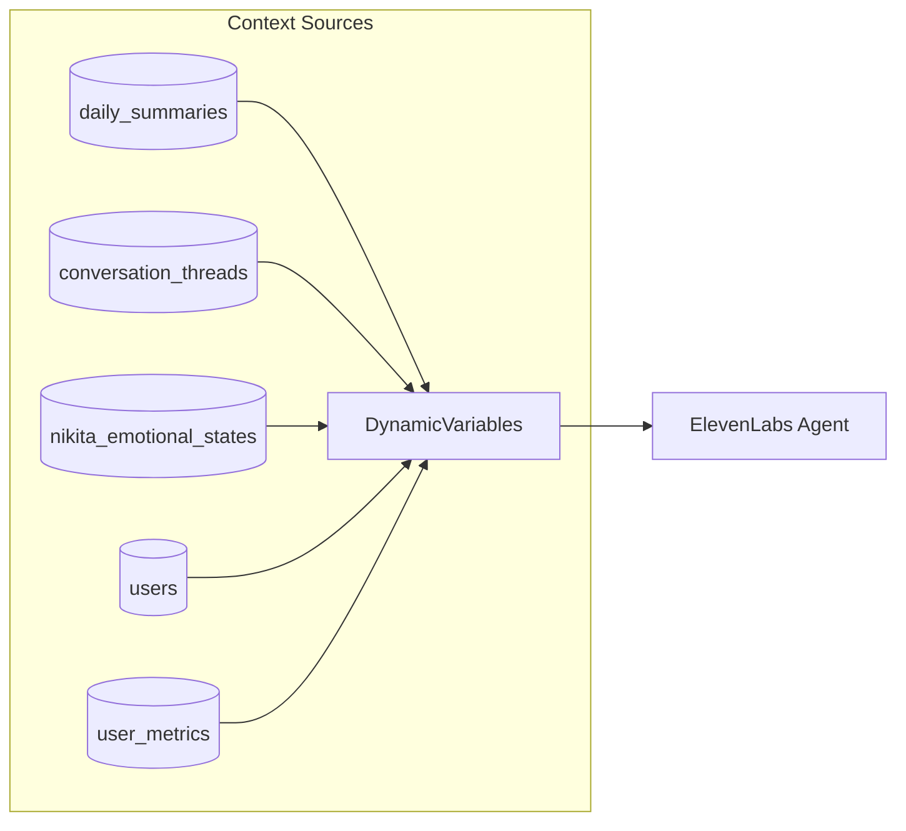

# Implementation Plan: ElevenLabs Voice Agent Optimization

**Spec**: [spec.md](spec.md) | **Status**: Ready

## Overview

**Objective**: Achieve voice-text context parity by expanding dynamic variables, enhancing server tool descriptions, and adding voice transcript post-processing.

**Key Insight**: Voice calls should feel like a continuation of text conversations, not a separate experience.

## Architecture

```mermaid
graph TD
    subgraph "Call Initiation"
        A[User calls] --> B[/voice/initiate]
        B --> C[Load User Context]
        C --> D[Build DynamicVariables]
        D --> E[30+ fields populated]
        E --> F[ElevenLabs API]
    end

    subgraph "During Call"
        F --> G[Server Tools]
        G --> H[get_context]
        G --> I[get_memory]
        G --> J[score_turn]
    end

    subgraph "After Call"
        K[call.ended webhook] --> L[Store Transcript]
        L --> M[Mark active]
        M --> N[pg_cron detects]
        N --> O[PostProcessor]
        O --> P[9 stages]
    end
```



## Dependencies

| Dependency | Type | Status | Notes |
|------------|------|--------|-------|
| DynamicVariables model | Internal | ✅ Exists | Needs expansion |
| Server tools | Internal | ✅ Working | Needs better descriptions |
| PostProcessor | Internal | ✅ Exists | Needs voice integration |
| ElevenLabs webhook | External | ✅ Working | call.ended event |
| Spec 031 fixes | Internal | ⚠️ Pending | Dependency on adapter fix |

## Tasks by User Story

### US-1: Voice Context at Call Start (P1)

| ID | Task | Est. | Deps | [P] |
|----|------|------|------|-----|
| T1.1 | Expand DynamicVariables model with 10+ new fields | M | - | |
| T1.2 | Update DynamicVariablesBuilder to populate new fields | M | T1.1 | |
| T1.3 | Add context loading in /voice/initiate endpoint | M | T1.2 | |
| T1.4 | Add context_block generation for system prompt | M | T1.2 | |
| T1.5 | Write tests for expanded dynamic variables | M | T1.1-T1.4 | |

### US-2: Mid-Call Memory Lookup (P1)

| ID | Task | Est. | Deps | [P] |
|----|------|------|------|-----|
| T2.1 | Update get_memory tool description per ElevenLabs pattern | S | - | [P] |
| T2.2 | Update get_context tool description | S | - | [P] |
| T2.3 | Update score_turn tool description | S | - | [P] |
| T2.4 | Update update_memory tool description | S | - | [P] |
| T2.5 | Write integration tests for tool descriptions | M | T2.1-T2.4 | |

### US-3: Voice Conversation Memory (P1)

| ID | Task | Est. | Deps | [P] |
|----|------|------|------|-----|
| T3.1 | Add create_voice_conversation() to repository | M | - | |
| T3.2 | Store transcript in webhook handler | M | T3.1 | |
| T3.3 | Add voice transcript to post-processing queue | M | T3.2 | |
| T3.4 | Update PostProcessor to handle voice transcripts | M | T3.3 | |
| T3.5 | Write tests for voice post-processing | M | T3.1-T3.4 | |

### US-4: Personality Consistency (P2)

| ID | Task | Est. | Deps | [P] |
|----|------|------|------|-----|
| T4.1 | Generate personalized context_block matching text | M | T1.4 | |
| T4.2 | Document ElevenLabs console changes needed | S | T4.1 | [P] |
| T4.3 | Write tests for context_block content | M | T4.1 | |

### Cross-Cutting: Logging & Debugging (P1)

| ID | Task | Est. | Deps | [P] |
|----|------|------|------|-----|
| T5.1 | Add logging for dynamic variables at initiate | S | T1.3 | |
| T5.2 | Add logging for server tool calls | S | - | [P] |
| T5.3 | Add logging for webhook events | S | T3.2 | |
| T5.4 | Write tests for logging coverage | M | T5.1-T5.3 | |

## File Changes

| File | Type | Description |
|------|------|-------------|
| `nikita/agents/voice/models.py` | MODIFY | Expand DynamicVariables |
| `nikita/agents/voice/context.py` | MODIFY | Build expanded variables |
| `nikita/agents/voice/inbound.py` | MODIFY | Load additional context |
| `nikita/agents/voice/server_tools.py` | MODIFY | Enhanced tool descriptions |
| `nikita/api/routes/voice.py` | MODIFY | Webhook transcript storage |
| `nikita/db/repositories/conversation_repository.py` | MODIFY | create_voice_conversation() |
| `nikita/context/post_processor.py` | MODIFY | Handle voice transcripts |
| `tests/agents/voice/test_dynamic_vars_expanded.py` | NEW | Dynamic vars tests |
| `tests/agents/voice/test_voice_post_processing.py` | NEW | Voice PP tests |

## Risks

| Risk | Likelihood | Impact | Mitigation |
|------|------------|--------|------------|
| ElevenLabs rate limits | LOW | MEDIUM | Context caching |
| Transcript quality | MEDIUM | MEDIUM | Handle partial transcripts |
| Spec 031 dependency | HIGH | HIGH | Implement 031 first |
| Console config errors | MEDIUM | LOW | Document steps clearly |

## Testing Strategy

### Unit Tests (Target: 90% coverage)
- `test_dynamic_vars_expanded.py`: All 30+ fields
- `test_tool_descriptions.py`: Description format
- `test_voice_post_processing.py`: Transcript handling

### Integration Tests
- Full call initiation with expanded context
- Server tool invocation and logging
- Voice transcript → post-processing flow

### E2E Tests (Manual)
- ElevenLabs playground: verify dynamic variables
- Test call: verify context_block in responses
- Post-call: verify memories created

## Implementation Order

```
Phase 1 (Day 1): Dynamic Variables
├── T1.1: Expand model
├── T1.2: Build expanded vars
├── T1.3: Load in /initiate
└── T1.5: Tests

Phase 2 (Day 2): Server Tools + Logging
├── T2.1-T2.4: Update descriptions [P]
├── T5.1-T5.3: Add logging [P]
└── T2.5, T5.4: Tests

Phase 3 (Day 3): Voice Post-Processing
├── T3.1: create_voice_conversation()
├── T3.2: Webhook transcript storage
├── T3.3-T3.4: Post-processing integration
└── T3.5: Tests

Phase 4 (Day 4): Personality + Polish
├── T1.4, T4.1: context_block
├── T4.2: Console documentation
└── T4.3: Tests
```

## Success Metrics

| Metric | Current | Target | Measurement |
|--------|---------|--------|-------------|
| Dynamic vars count | ~20 | ≥30 | Code inspection |
| Tool call latency | ~1.5s | <2s | Logs |
| Voice post-processing | 0% | 99% | job_executions |
| Context load time | ~150ms | <100ms | Logs |

## ElevenLabs Console Changes

**Document for manual execution**:
1. Agent system prompt: Add `{{context_block}}` placeholder
2. Tool descriptions: Copy from T2.1-T2.4 implementation
3. Dynamic variables: Configure placeholders matching model
4. Test in playground before production
