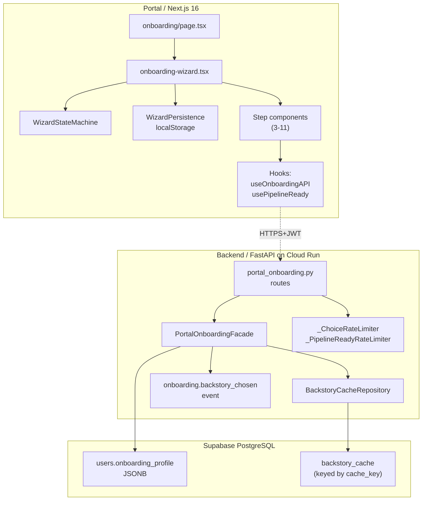

# Implementation Plan: 214-portal-onboarding-wizard

**Spec**: [spec.md](./spec.md) (1013 lines, 10 FRs + 5 NRs + 6 USs + 6 NFRs)
**Predecessor**: Spec 213 (onboarding backend foundation) — deployed `nikita-api-00250-4mm` 2026-04-15
**Status**: Ready for task decomposition
**Created**: 2026-04-15
**GATE 2**: PASS (6 iterations: 44→19→5→1→0 findings, absolute zero)

---

## 1. Overview

### Objective

Replace the existing `OnboardingCinematic` experience with an 11-step "Dossier" wizard that:
1. Collects the full profile the Spec 213 backend expects (including `name`, `age`, `occupation`, `life_stage`).
2. Previews backstory scenarios, lets the user pick one, and commits the choice to `users.onboarding_profile.chosen_option` **before** starting chat.
3. Waits for the 10-stage post-processing pipeline (`pipeline_state == "ready"`) **before** allowing conversation — gated by `PipelineGate` screen.
4. Restores landing-page aesthetic (spacious, one-thing-at-a-time, `oklch(0.75 0.15 350)` rose primary, `bg-void-ambient`).
5. Handles QR desktop→mobile handoff, voice-path fallback, and mid-wizard resume.

### Scope

**IN scope**: Portal wizard rewrite + 1 new backend endpoint (`PUT /profile/chosen-option`) + 1 additive contract extension (`PipelineReadyResponse.wizard_step`).

**OUT of scope** (per spec §Out of Scope): Spec 213 refactor, ElevenLabs agent copy changes, new DB migrations (use existing `onboarding_profile` JSONB), voice-call UI (consumes existing Spec 209 opening selector).

### Success Criteria (from spec §Success Criteria)

- SC-1: 95% wizard completion rate in staging dogfood (vs current ~40% estimate).
- SC-2: Zero broken-experience bug reports within 48h post-deploy.
- SC-3: Backstory continuity — Nikita's first chat message references the chosen scenario venue + hook (verified via E2E US-6).
- SC-4: Landing-page aesthetic parity (axe: 0 violations; manual: clamp/tracking/spacing present).

---

## 2. Architecture

### Component Topology



### Data Flow (Happy Path US-1 + US-6)

```
Step 4 (location) → PATCH /onboarding/profile {location_city}
Step 5 (scene)    → PATCH /onboarding/profile {social_scene}
Step 6 (darkness) → PATCH /onboarding/profile {drug_tolerance, life_stage}
Step 7 (identity) → PATCH /onboarding/profile {name, age, occupation, interest}
Step 8 (backstory):
  a. POST /onboarding/preview-backstory → scenarios[] + cache_key
  b. User selects card → PUT /onboarding/profile/chosen-option {chosen_option_id, cache_key}
      └─ Facade recomputes cache_key from users.onboarding_profile JSONB
      └─ Writes full BackstoryOption snapshot to onboarding_profile.chosen_option
      └─ Emits onboarding.backstory_chosen
Step 9 (phone)    → PATCH /onboarding/profile {phone, wizard_step: 10}
Step 10 (gate):
  a. POLL GET /onboarding/pipeline-ready/{user_id} every 2s
  b. Until pipeline_state == "ready" (or "degraded" after `poll_max_wait_seconds` timeout (20s per `PIPELINE_GATE_MAX_WAIT_S`, surfaced via server response))
Step 11 (handoff) → Route to Telegram chat OR voice call
```

### Key Design Decisions (inherited from spec)

| Decision | Rationale | Ref |
|----------|-----------|-----|
| New `PUT /profile/chosen-option` endpoint (Option 4) | RESTful idempotent; clean ownership of choice-commit logic; enables rate limiting separate from PATCH | FR-10.1, spec §Option evaluation |
| Cross-user ownership via `cache_key` recompute (not user_id column) | `backstory_cache` table has no user_id; recomputing from `onboarding_profile` JSONB preserves tenant isolation without schema change | FR-10.1 facade docstring |
| `wizard_step` additive on `PipelineReadyResponse` | Lets backend mid-wizard-resume resume to exact step without extra endpoint | FR-10.2 |
| Mirror Python types verbatim in TS `contracts.ts` | Single source of truth; schemas.ts owns Zod runtime validation separately | Appendix B |
| localStorage user-scoped key `nikita_wizard_{user_id}` | Multi-tenant safety on shared desktop + resume support | NR-1 |
| `prebuild: tsc --noEmit` in `portal/package.json` | Vercel CI enforces NFR-006 (strict TS) before build | PR 214-A |

---

## 3. Dependencies

### External (npm)

| Package | Purpose | Added in |
|---------|---------|----------|
| `qrcode.react` | QRHandoff desktop→mobile component | PR 214-A |
| `libphonenumber-js` | Phone country pre-flight validation (NR-3) | PR 214-A |

### Internal (consumed, not modified)

- `nikita/onboarding/contracts.py` — Spec 213 FROZEN models (additive extensions only — see PR 214-D)
- `nikita/services/portal_onboarding.py` — `PortalOnboardingFacade.process()` / `.generate_preview()` patterns
- `nikita/db/repositories/backstory_cache_repository.py` — `.get(cache_key)` lookup
- `nikita/onboarding/tuning.py` — `compute_backstory_cache_key`, poll constants
- `nikita/api/middleware/rate_limit.py` — `DatabaseRateLimiter` base class
- `nikita/api/routes/portal_onboarding.py` — existing `GET /pipeline-ready`, `PATCH /profile`, `POST /preview-backstory`
- `portal/src/lib/api/client.ts` — `apiClient` wrapper (extend with `patch<T>` method)
- `portal/src/lib/supabase/*` — JWT auth bridge
- `portal/src/components/landing/*` — aesthetic reference (system-terminal.tsx, aurora-orbs)

---

## 4. PR Decomposition (from Appendix A)

**Sequence**: D → A → (B ∥ C author-parallel after A merges)

### PR 214-D — Backend Sub-Amendment (≈200-250 LOC)
**Ordering**: First. Ships new endpoint + `wizard_step` extension so portal TypeScript contracts mirror a merged source of truth.

**Artifacts**:
- `nikita/onboarding/contracts.py` — +`BackstoryChoiceRequest`, +`PipelineReadyResponse.wizard_step`
- `nikita/onboarding/tuning.py` — +`CHOICE_RATE_LIMIT_PER_MIN`, +`PIPELINE_POLL_RATE_LIMIT_PER_MIN`
- `nikita/api/middleware/rate_limit.py` — +`_ChoiceRateLimiter`, +`_PipelineReadyRateLimiter`, +dependencies
- `nikita/api/routes/portal_onboarding.py` — +`PUT /profile/chosen-option`, extend `GET /pipeline-ready` to emit `wizard_step` + apply `pipeline_ready_rate_limit`
- `nikita/services/portal_onboarding.py` — +`PortalOnboardingFacade.set_chosen_option()`
- `tests/api/routes/test_portal_onboarding.py` — +AC-10.1..10.9, +AC-5.6 (Retry-After header)
- `tests/services/test_portal_onboarding_facade.py` — **NEW FILE** (all validation branches)

**Gate**: QA review → absolute-zero findings → merge → Cloud Run deploy → smoke new endpoint.

---

### PR 214-A — Portal Foundation (≈300-350 LOC)
**Ordering**: After D merges. No visible UI; pure plumbing.

**Artifacts**:
- `portal/src/app/onboarding/types/contracts.ts` — TS mirror of Python contracts (incl. `BackstoryChoiceRequest`, `wizard_step`)
- `portal/src/app/onboarding/types/wizard.ts` — `WizardPersistedState`, `WizardStep` enum, `WizardFormValues`
- `portal/src/app/onboarding/state/WizardStateMachine.ts` — transition guard + state enum
- `portal/src/app/onboarding/state/WizardPersistence.ts` — localStorage RWX with user-scoped key
- `portal/src/app/onboarding/hooks/use-onboarding-api.ts` — `previewBackstory`, `submitProfile`, `patchProfile`, `selectBackstory`, with `withRetry` wrapper (3-attempt exponential backoff, POST excluded)
- `portal/src/app/onboarding/hooks/use-pipeline-ready.ts` — poll with 2s interval, `poll_max_wait_seconds` timeout (20s per `PIPELINE_GATE_MAX_WAIT_S`, surfaced via server response)
- `portal/src/app/onboarding/constants/supported-phone-countries.ts`
- `portal/src/lib/api/client.ts` — add `api.patch<T>()` helper
- `portal/package.json` — +deps, +`prebuild` script
- Unit tests: `WizardStateMachine.test.ts`, `WizardPersistence.test.ts`, `usePipelineReady.test.ts`, `useOnboardingAPI.test.ts`

**Gate**: QA review → absolute-zero → merge → Vercel preview deploy.

---

### PR 214-B — Step Components + Dossier Styling (≈350-400 LOC)
**Ordering**: Parallel with 214-C after A merges.

**Artifacts**:
- `portal/src/app/onboarding/onboarding-wizard.tsx` — orchestrator (replaces `onboarding-cinematic.tsx`; DELETE legacy)
- `portal/src/app/onboarding/steps/` — 9 step components (DossierHeader, LocationStep, SceneStep, DarknessStep, IdentityStep, BackstoryReveal, PhoneStep, PipelineGate, HandoffStep)
- `portal/src/app/onboarding/components/` — QRHandoff, DossierStamp (with typewriter + stamp-rotate, `prefers-reduced-motion` guards), WizardProgress
- Unit/component tests per spec Test File Inventory
- `docs/content/wizard-copy.md` — canonical Nikita copy reference

**Gate**: QA review → absolute-zero → merge.

---

### PR 214-C — E2E + Build Chain + Vercel Deploy (≈150-200 LOC)
**Ordering**: Parallel with 214-B after A merges.

**Artifacts**:
- `portal/e2e/onboarding-wizard.spec.ts` — Happy-path E2E (US-1, US-6)
- `portal/e2e/onboarding-resume.spec.ts` — Abandonment + resume (US-3)
- `portal/e2e/onboarding-phone-country.spec.ts` — Unsupported country + voice fallback (US-4, US-5)
- `portal/src/app/onboarding/schemas.ts` — extend zod with `name`, `age`, `occupation`, `wizard_step`
- `portal/src/app/onboarding/page.tsx` — render `OnboardingWizard`; `?resume=true` detection; `supabase.auth.getUser()` (not `getSession`)
- `portal/src/lib/supabase/middleware.ts` — add `/onboarding/auth` public-route allowlist
- `portal/src/app/onboarding/loading.tsx` — Nikita-voiced copy ("ACCESSING FILE...")
- `docs/content/magic-link-email.md` — Supabase Dashboard copy
- Vercel deploy: `cd portal && npm run build && vercel --prod`

**Gate**: QA review → absolute-zero → merge → Vercel production deploy → E2E smoke on prod.

---

## 5. Tasks by User Story

Task IDs use `T{PR}.{seq}`. Estimates: S (<1hr), M (1-4hr), L (4-8hr).

### US-1 — Desktop Happy Path (P1)

| ID | Task | Est | Deps | [P] | PR |
|----|------|-----|------|-----|----|
| T-D.1 | Add `BackstoryChoiceRequest` + `wizard_step` to `contracts.py` | S | — | | D |
| T-D.2 | Add 2 tuning constants to `tuning.py` | S | — | [P] | D |
| T-D.3 | Implement `_ChoiceRateLimiter` + `_PipelineReadyRateLimiter` + deps | M | T-D.2 | | D |
| T-D.4 | Implement `PortalOnboardingFacade.set_chosen_option()` with cache_key bridge | M | T-D.1 | | D |
| T-D.5 | Implement `PUT /profile/chosen-option` handler | M | T-D.3, T-D.4 | | D |
| T-D.6 | Extend `GET /pipeline-ready` to pass `wizard_step` + apply rate limit | S | T-D.3 | [P] | D |
| T-D.7 | Unit tests: `test_portal_onboarding_facade.py` (NEW, all branches) | M | T-D.4 | [P] | D |
| T-D.8 | Route tests: AC-10.1..10.9 + AC-5.6 | M | T-D.5, T-D.6 | | D |
| T-A.1 | TS contracts mirror (`types/contracts.ts`) | S | T-D.1 merged | | A |
| T-A.2 | `WizardStateMachine` + `WizardPersistence` + tests | M | — | [P] | A |
| T-A.3 | `useOnboardingAPI` hook + `withRetry` + tests | M | T-A.1 | | A |
| T-A.4 | `usePipelineReady` hook + tests | M | T-A.1 | [P] | A |
| T-A.5 | `supported-phone-countries.ts`, `client.ts` patch helper | S | — | [P] | A |
| T-A.6 | `package.json` deps + `prebuild` script | S | — | [P] | A |
| T-B.1 | `onboarding-wizard.tsx` orchestrator; DELETE legacy cinematic | M | T-A.* merged | | B |
| T-B.2 | `DossierHeader`, `WizardProgress` + tests | S | T-B.1 | [P] | B |
| T-B.3 | `LocationStep` + tests | M | T-B.1 | [P] | B |
| T-B.4 | `SceneStep` + tests | S | T-B.1 | [P] | B |
| T-B.5 | `DarknessStep` + tests (EdginessSlider) | M | T-B.1 | [P] | B |
| T-B.6 | `IdentityStep` + tests (name/age/occupation) | M | T-B.1 | [P] | B |
| T-B.7 | `BackstoryReveal` + `BackstoryChooser` + tests | L | T-B.1 | | B |
| T-B.8 | `PhoneStep` + country validation tests | M | T-B.1, T-A.5 | [P] | B |
| T-B.9 | `PipelineGate` + `DossierStamp` (typewriter/rotate, reduced-motion) + tests | L | T-B.1 | | B |
| T-B.10 | `HandoffStep` + `QRHandoff` + tests | M | T-B.1 | | B |
| T-B.11 | `docs/content/wizard-copy.md` canonical copy | S | — | [P] | B |
| T-C.1 | E2E `onboarding-wizard.spec.ts` (US-1, US-6) | L | T-B.* merged | | C |
| T-C.2 | Update `schemas.ts` + `page.tsx` + `middleware.ts` | S | — | [P] | C |
| T-C.3 | `loading.tsx` Nikita-voiced copy | S | — | [P] | C |

### US-2 — Desktop→Mobile QR Handoff (P1)

| ID | Task | Est | Deps | [P] | PR |
|----|------|-----|------|-----|----|
| (covered by T-B.10) | QRHandoff component + mobile detection | | | | B |
| T-C.4 | E2E QR rendering assertion in wizard spec | S | T-B.10 | [P] | C |

### US-3 — Abandon & Resume (P1)

| ID | Task | Est | Deps | [P] | PR |
|----|------|-----|------|-----|----|
| (covered by T-A.2) | WizardPersistence.localStorage read on mount | | | | A |
| T-C.5 | E2E `onboarding-resume.spec.ts` | M | T-A.2, T-B.1 | | C |

### US-4 — Unsupported Phone Country (P1)

| ID | Task | Est | Deps | [P] | PR |
|----|------|-----|------|-----|----|
| (covered by T-B.8) | PhoneStep country validation branch | | | | B |
| T-C.6 | E2E `onboarding-phone-country.spec.ts` (unsupported branch) | M | T-B.8 | | C |

### US-5 — Voice Path + ElevenLabs Unavailable (P1)

| ID | Task | Est | Deps | [P] | PR |
|----|------|-----|------|-----|----|
| (covered by T-B.10) | Voice fallback UI in HandoffStep | | | | B |
| T-C.7 | E2E voice-unavailable fallback in phone-country spec | S | T-B.10 | [P] | C |

### US-6 — Backstory Continuity in First Message (P1)

| ID | Task | Est | Deps | [P] | PR |
|----|------|-----|------|-----|----|
| (covered by T-D.4, T-D.5) | `set_chosen_option` writes chosen_option to JSONB | | | | D |
| T-C.8 | E2E assertion: first Telegram message references chosen venue/hook | M | T-C.1 | | C |

---

## 6. Risks

| Risk | Likelihood | Impact | Mitigation |
|------|-----------|--------|------------|
| R1: `cache_key` recompute drift (Python vs TS) | Low | HIGH — silent 403s | Spec FR-10.1 mandates SimpleNamespace bridge; test `test_portal_onboarding_facade.py` asserts all 7 JSONB fields feed compute correctly |
| R2: localStorage corruption from legacy cinematic onboarding | Medium | MEDIUM — UX confusion | WizardPersistence includes version byte; mismatch → clear and restart |
| R3: PipelineReady polling hammers backend | Low | MEDIUM — cost + 429 | Both `_PipelineReadyRateLimiter` (30/min) AND `poll_max_wait_seconds=45` bound worst case |
| R4: QR component CSP violation on Vercel | Medium | MEDIUM — broken handoff | Pre-deploy checklist in PR 214-C: verify `vercel.json` CSP `img-src` allows `data:` + `blob:` |
| R5: Spec 213 frozen contract drift if regenerated | Low | HIGH — TS mirror desync | Additive extensions only; canonical mapping doc in Appendix B; PR 214-A CI tsc guards |
| R6: Nikita-voiced copy overrides SaaS placeholder slips in | Medium | LOW — aesthetic break | `docs/content/wizard-copy.md` as single source; spec FR-3 enforces zero SaaS copy rule |
| R7: Reduced-motion users see broken stamp animations | Low | MEDIUM — a11y violation | DossierStamp guard: `useReducedMotion()` → skip animation, show final state |
| R8: Backend rate-limit 429 response shape inconsistent with portal error handler | Low | MEDIUM — confused UX | Spec §Appendix B: handlers use flat `{detail: string}`; portal `ErrorResponse` type handles both shapes |

---

## 7. Testing Strategy

### Pyramid

- **Unit** (Jest + RTL + pytest): ≥80% line coverage on new code (NFR-005). Covers: state machine, persistence, hooks, Facade branches, route validation.
- **Component** (RTL): All 9 step components render + interact correctly with mocked hooks.
- **Integration** (pytest + FastAPI TestClient): AC-10.1..10.9 + AC-5.6 for full `PUT /profile/chosen-option` flow.
- **E2E** (Playwright): 3 spec files covering 6 user stories on real deployed preview.

### TDD Sequence (per story)

1. Write failing test → commit (RED)
2. Minimal implementation → test passes → commit (GREEN)
3. Refactor if needed → commit (optional REFACTOR)

### CI Gates

- Portal: `npm run prebuild` (`tsc --noEmit`) → `npm test` → `npm run build` → `npx playwright test` (E2E only on PR 214-C)
- Backend: `pytest tests/ -x -q --timeout 30 -m "not integration and not slow and not e2e"` → baseline 6153 pass / 0 fail

### Coverage Targets (from NFR-005)

| Area | Target |
|------|--------|
| Portal new code (hooks, state, components) | ≥80% lines |
| Backend new code (facade, routes, rate limiter) | ≥90% lines |
| E2E happy path + 5 edge cases | 100% scenario coverage |

---

## 8. Parallelization Strategy

| Phase | Parallel tracks |
|-------|----------------|
| PR 214-D implementation | T-D.2, T-D.6, T-D.7 marked [P] |
| PR 214-A implementation | T-A.2, T-A.4, T-A.5, T-A.6 marked [P] |
| PR 214-B implementation | All 9 step components [P] after T-B.1 orchestrator lands |
| After PR-A merges | **Worktree agents dispatched in parallel for PR 214-B + PR 214-C** (per state file Phase 8 directive) |

Main orchestrator manages: per-branch PR creation, QA review dispatch, merge sequencing.

---

## 9. Handoff to Phase 6 (/tasks)

**Artifacts produced**:
- [x] `specs/214-portal-onboarding-wizard/plan.md` (this file)
- [ ] `research.md` — **skipped** (spec §Appendix B already captures canonical TS↔Python mapping; no external libs need deep research beyond standard qrcode.react/libphonenumber-js docs which are linked inline)
- [ ] `data-model.md` — **skipped** (no new tables; extends existing `users.onboarding_profile` JSONB only)

**Resume command**: `/tasks 214`

**Next phase goal**: Expand the US/task matrix above into `tasks.md` with explicit RED/GREEN commits, file-level touch map, and [P] markers at the file-test-pair level for worktree dispatch.
