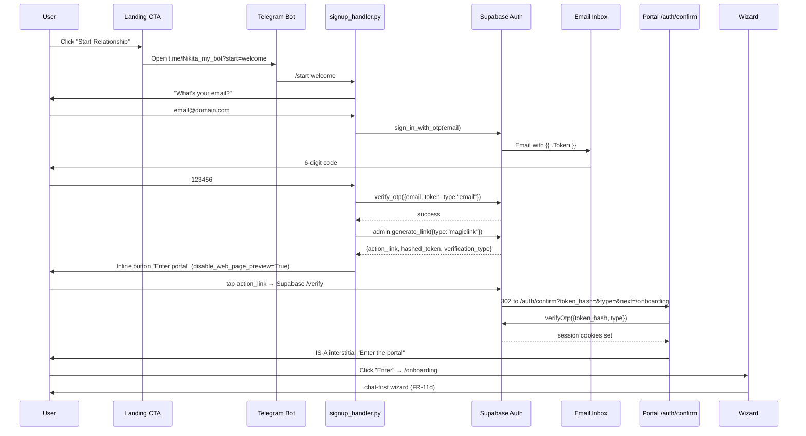

# Implementation Plan — Spec 215 Auth Flow Redesign (Telegram-First Signup)

**Spec**: `spec.md` (913 lines, 16 FRs, 77 ACs)
**Status**: Ready for `/tasks` (Phase 6)
**Date**: 2026-04-24
**Author**: Phase D executor (per Plan v17.1)
**GATE 2**: PASS (iter-2, 0 CRITICAL + 0 HIGH across 6 validators); user-approved 2026-04-24
**Branch**: `feat/215-telegram-first-signup` (created at PR-F1a kickoff)
**Feature flag**: `NEXT_PUBLIC_TELEGRAM_FIRST_SIGNUP=true` (gates PR-F1a/F1b/F2a/F2b; flipped after Phase F W1)

---

## §1 Overview

Spec 215 inverts the auth direction: anonymous landing → Telegram bot collects email → 6-digit OTP delivered to inbox → user types code in Telegram → backend mints in-chat magic-link via `admin.generate_link` → user taps → portal `/auth/confirm` calls non-PKCE `verifyOtp({token_hash, type})` → IS-A always-interstitial → wizard.

This eliminates the GH #393 PKCE 422 failure surface, removes portal-first magic-link signup (`/onboarding/auth` deleted), consolidates two legacy Telegram-first OTP handlers (`registration_handler.py` + `otp_handler.py`) into a single `signup_handler.py` FSM, and drops the legacy `auth_bridge_tokens` table.

Five PRs ship sequentially behind a feature flag. PR-F3 (legacy deletion) waits one deploy cycle after the flag flips, providing rollback safety.

## §2 Architecture (lifted from spec §7)

### §2.1 Data flow (high-level)



### §2.2 Module map

| Layer | New | Modified | Deleted |
|---|---|---|---|
| Backend FSM | `nikita/platforms/telegram/signup_handler.py` | `nikita/api/routes/telegram.py` (route email/code to signup_handler) | `nikita/platforms/telegram/{registration_handler,otp_handler}.py`; `auth.py:61-141` deprecated methods |
| Backend admin | `nikita/api/routes/portal_auth.py::generate_magiclink_for_telegram_user` (NEW endpoint) | — | — |
| Backend DB | — | `nikita/db/models/pending_registration.py` → `telegram_signup_session.py` (rename + columns) | `nikita/db/models/auth_bridge.py`; `nikita/api/routes/auth_bridge.py`; `auth_bridge_repository.py` |
| Backend agents | — | `nikita/agents/onboarding/wizard_slots.py` (add `preferred_call_window`); `nikita/agents/text/persona.py` (S2 phone-call proposal fragment) | — |
| Backend telemetry | `nikita/monitoring/events.py` 9 new Pydantic event models | — | — |
| Portal route | `portal/src/app/auth/confirm/route.ts` + `interstitial.tsx` | `portal/src/app/login/page-client.tsx` (Nikita-voiced); `portal/src/lib/supabase/middleware.ts` (exemptions) | `portal/src/app/onboarding/auth/` (entire dir) |
| Portal landing | — | 3 CTA components: `hero-section.tsx`, `cta-section.tsx`, `landing-nav.tsx` | — |
| Portal wizard | — | `portal/src/components/onboarding/ClearanceGrantedCeremony.tsx` (S3 portal-orientation copy) | `onboarding-wizard-legacy.tsx` + `steps/legacy/` + `components/legacy/` (D4: flag UNSET in Vercel) |
| Migrations | 4 new SQL migrations | — | — |

### §2.3 Migration sequence (PR-F1a → PR-F3)

1. PR-F1a: RENAME `pending_registrations` → `telegram_signup_sessions` + ADD COLUMNs + RLS
2. PR-F1a: ADD COLUMN `preferred_call_window` ON `user_profiles` (FR-12)
3. PR-F3: DROP TABLE `auth_bridge_tokens` (verified count=0; 1-deploy-cycle delay after flag flip)

## §3 Dependencies

| Dep | Type | Status | Notes |
|---|---|---|---|
| `supabase-py 2.24.0+` | external | installed | `admin.generate_link` native support confirmed (Plan §21 spike) |
| `@supabase/ssr ^0.8.0` | external | installed | Next.js 16 cookies adapter pattern |
| Telegram bot API `disable_web_page_preview` | external | available | NFR-Sec-1 hard requirement |
| Spec 213 FR-11b (307 auto-provision) | internal | shipped | reused for `public.users` row creation in FR-5 |
| Spec 214 FR-11d wizard | internal | shipped | post-auth entry; modified to add FR-12 slot |
| `portal_bridge_tokens` table | internal | shipped (PR #414, GH #413 hotfix) | unchanged; legacy `auth_bridge_tokens` is the one being dropped |
| `feedback_dogfood_gmail_mcp_mismatch.md` plus-alias | tooling | documented | Phase F walks use `youwontgetmyname777+walkN@gmail.com` |

## §4 PR breakdown (5 PRs, sequential, per Plan §18.4)

### PR-F1a — Data layer + admin endpoint contract

**Branch**: `feat/215-pr-f1a-data-layer`
**Estimate**: ~300 LOC, 6-8 hours
**TDD**: tests-first commit, then implementation commit (2-commit min per task)

**Scope**:
- Schema: rename `pending_registrations` → `telegram_signup_sessions`; add columns; RLS; CAS-update SQL helpers
- Pydantic models: `TelegramSignupSession` (model + repository); `GenerateMagiclinkRequest` + `GenerateMagiclinkResponse`
- Admin endpoint: `POST /api/v1/admin/auth/generate-magiclink-for-telegram-user` (service-role only)
- 9 telemetry event Pydantic models (`SignupStartedTelegramEvent` etc.)
- Migration: `add_preferred_call_window_to_user_profiles.sql` (FR-12 schema)
- Tests: `test_telegram_signup_session_repository.py`, `test_portal_auth_generate_magiclink.py`, `test_signup_funnel_events.py`

**ACs satisfied**: AC-3.2, AC-5.1, AC-5.2, AC-5.5 (idempotent bind), §7.6 contract, §7.2.1 CAS transitions, FR-Telemetry-1 schema

**Verification**: `uv run pytest tests/db/repositories/test_telegram_signup_session_repository.py tests/api/routes/test_portal_auth_generate_magiclink.py tests/monitoring/test_signup_funnel_events.py -v`

### PR-F1b — Backend FSM `signup_handler.py` + Telegram webhook routing

**Branch**: `feat/215-pr-f1b-signup-handler`
**Estimate**: ~400 LOC, 8-12 hours
**Dependency**: PR-F1a merged

**Scope**:
- `signup_handler.py` consolidated FSM (handle_welcome, handle_email, handle_code, handle_invalid)
- Replace `registration_handler.py` + `otp_handler.py` wiring in `nikita/api/routes/telegram.py`
- Email regex validation; rate-limit (3 invalid OTP / 1h, 60s resend cooldown, 5min TTL)
- Magic-link mint via admin endpoint (FR-5); inline-button delivery with `disable_web_page_preview=True`
- `_handle_start_welcome` Nikita-voiced greeting + state transition
- Tests: `test_signup_handler.py` (FSM), `test_signup_handler_link_preview.py` (Testing H1)
- Telemetry emission at every FSM transition

**ACs satisfied**: AC-2.1 through AC-2.3, AC-3.1 through AC-3.4, AC-4.1 through AC-4.4, AC-5.3, AC-5.4

**Verification**: `uv run pytest tests/platforms/telegram/test_signup_handler.py tests/platforms/telegram/test_signup_handler_link_preview.py -v`

### PR-F2a — Portal `/auth/confirm` route + IS-A interstitial + middleware

**Branch**: `feat/215-pr-f2a-auth-confirm`
**Estimate**: ~250 LOC, 6 hours
**Dependency**: PR-F1b merged (so live signup → magic-link mints to working URL)

**Scope**:
- `portal/src/app/auth/confirm/route.ts` (server route handler, `verifyOtp({token_hash, type})`)
- `portal/src/app/auth/confirm/interstitial.tsx` (~150 LOC IS-A always-interstitial Client Component)
- `portal/src/lib/supabase/middleware.ts` — add `/auth/confirm` exemption
- IAB UA detection regex (centralized helper for D4 GH #420)
- ARIA contract (`role="main"`, `aria-labelledby`, `aria-describedby` per FR-6a)
- Tests: `route.test.ts` (Testing H3 — T-E22/T-E23/T-E24/T-E27), `interstitial.test.tsx` (Testing H4 UA-spoof)

**ACs satisfied**: AC-6.1 through AC-6.6, AC-PKCEGone, FR-6a visual contract

**Verification**: `(cd portal && npm run test -- --run portal/tests/app/auth/confirm/) && (cd portal && npm run lint && npm run build)`

### PR-F2b — Portal UI: `/login` redesign + landing CTA flip + `/onboarding/auth` deletion

**Branch**: `feat/215-pr-f2b-portal-ui`
**Estimate**: ~350 LOC, 6 hours
**Dependency**: PR-F2a merged

**Scope**:
- `/login/page-client.tsx` Nikita-voiced redesign; `emailRedirectTo` → `/auth/confirm?next=/dashboard`
- 3 landing CTA components: anon `href` → `https://t.me/Nikita_my_bot?start=welcome`
- `landing-nav.tsx` adds visible "Sign in" + "Continue with Nikita" entries (FR-11)
- `ClearanceGrantedCeremony.tsx` adds S3 portal-orientation copy (FR-14)
- DELETE `portal/src/app/onboarding/auth/` (entire directory)
- Middleware exemption removed for deleted route
- Tests: `cta-href.test.tsx`, `page-client.test.tsx` (login Nikita voice)

**ACs satisfied**: AC-1.1 through AC-1.3, AC-10.1 through AC-10.5, AC-11.1 through AC-11.3, AC-14.1 through AC-14.3

**Verification**: portal lint+build+vitest; manual smoke of `/login` + landing CTAs in dev

### PR-F3 — Legacy code removal + `auth_bridge_tokens` drop

**Branch**: `chore/215-pr-f3-legacy-removal`
**Estimate**: ~400 LOC deletions, 4 hours
**Dependency**: PR-F2b merged + Phase F W1 dogfood passes + flag flipped + 1 deploy cycle elapsed

**Scope**:
- DELETE `nikita/platforms/telegram/{registration_handler.py, otp_handler.py}`
- DELETE `nikita/platforms/telegram/auth.py:61-141` (`register_user`, `verify_otp` deprecated)
- DELETE `nikita/db/models/auth_bridge.py` + `nikita/api/routes/auth_bridge.py` + repository
- Migration: `DROP TABLE auth_bridge_tokens` (verified count=0)
- DELETE `portal/src/components/onboarding/onboarding-wizard-legacy.tsx` + `steps/legacy/` + `components/legacy/`
- DELETE dual `generate_portal_bridge_url` in `utils.py` (collapse to `onboarding/bridge_tokens.py`; closes GH #233 finally)
- DELETE `_send_bare_portal_auth_link` (`commands.py:408-429`); DELETE `/onboard` slash-command (`commands.py:198`) + help-text (`commands.py:643`)
- Add S2 phone-call proposal fragment to `nikita/agents/text/persona.py` (FR-13) — small additive change, batches with deletions
- Update wizard slots: add `preferred_call_window` (FR-12) — coordinates with PR-F1a migration
- Tests: assertion that deleted modules are not imported anywhere; agentic-flow tests for `preferred_call_window` slot per `.claude/rules/agentic-design-patterns.md` §8.4

**ACs satisfied**: AC-LegacyDelete, AC-12.1 through AC-12.4, AC-13.1 through AC-13.2

**Verification**: full pytest + portal vitest + lint + build; `grep -r "registration_handler\|otp_handler\|auth_bridge" nikita/ portal/src/` returns empty (only test files referencing deletion)

## §5 Risks (lifted + extended from spec §10)

| Risk | Likelihood | Impact | Mitigation | Owner |
|---|---|---|---|---|
| Telegram crawler burns single-use token | Medium | High | `disable_web_page_preview=True` + Testing H1 crawler-sim test | PR-F1b |
| iOS Safari ITP / Telegram IAB session strand | Medium | High | IS-A always-interstitial unconditional | PR-F2a |
| Email template misconfigured (signup vs login) | Medium | High | §7.4 dashboard runbook + AC-CodeOnlyTemplate + AC-LinkOnlyTemplate Phase F gate | PR-F1b + Phase F |
| Migration `RENAME pending_registrations` breaks live FR-11c routing | Low | High | `chat_id` column retained verbatim; integration test on PR-F1a | PR-F1a |
| `verification_type` hardcoded literal regression | Low | High | Static-grep gate in `test_portal_auth_admin.py` (Testing H2) | PR-F1a |
| Wizard slot addition (FR-12) regresses cumulative state | Low | High | `.claude/rules/agentic-design-patterns.md` §8.4 monotonicity test | PR-F3 |
| Walk subagent fabricates DB state | Medium | High | `.claude/rules/live-testing-protocol.md` PR-blocker anti-patterns | Phase F |
| PR-F3 dropping `auth_bridge_tokens` breaks rollback | Low | Medium | Sequential to PR-F2b; 1 deploy cycle behind flipped flag | PR-F3 |
| Vercel cache of deleted `/onboarding/auth` returns stale | Low | Medium | T-E29 cache purge in Phase E checklist post-PR-F2b | Phase E |
| Supabase rate-limit collision in dogfood | Medium | Low | Plus-alias rotation per walk | Phase F |

## §6 Testing Strategy (lifted from spec §8)

- **Unit (70%)**: pytest for backend FSM + repository + admin endpoint + telemetry models; vitest for portal route + interstitial + landing components
- **Integration (20%)**: `test_signup_flow_e2e.py` (mocked Supabase admin client end-to-end); `test_auth_confirm_session.py` (cookie + middleware getUser pickup)
- **E2E (10%)**: Phase F per `.claude/rules/live-testing-protocol.md` 12-step canonical protocol (Telegram MCP + Gmail MCP + agent-browser; NO DB fabrication)
- **Mandatory agentic-flow tests** (FR-12 wizard slot addition): cumulative-state monotonicity + completion-gate triplet + mock-LLM-emits-wrong-tool recovery
- **Pre-PR grep gates** (zero-assertion shells, PII format strings, raw cache_key): all 3 must return empty before `/qa-review` dispatch
- **Live-dogfood anti-patterns**: NO `INSERT INTO auth.users`, NO `signInWithPassword`, NO `E2E_AUTH_BYPASS=true`, NO custom JWT minting

## §7 Quality Gates

| Gate | Requirement | Enforcement |
|---|---|---|
| Article III (Test-First) | ≥2 ACs per task | enforced in `tasks.md` |
| Article IV (Spec-First) | spec → plan → code | this plan + `/audit` |
| Article VI (Simplicity) | ≤2 abstraction layers | reviewed in `/audit` |
| Article VII (User-Story-Centric) | Tasks organized by FR | this plan §4 |
| Article VIII (Parallelization) | `[P]` markers in `tasks.md` | enforced in Phase 6 |
| Pre-push HARD GATE | full pytest+vitest+lint+build | per `.claude/rules/pr-workflow.md` |
| Orchestrator grep-verify | both implementor claim + reviewer finding | per `.claude/rules/pr-workflow.md` |
| QA review zero-tolerance | 0 findings ALL severities (incl. nitpicks) | per `feedback_qa_review_zero_tolerance.md` |
| Subagent dispatch caps | HARD CAP + scope + exit criterion every dispatch | per `.claude/rules/parallel-agents.md` |
| Live walk anti-fabrication | per `.claude/rules/live-testing-protocol.md` | Phase F |

## §8 Out of scope (lifted from spec §2 — explicitly NOT in plan)

- Voice onboarding (Spec 028 — separate)
- Email change flow (deferred to Spec 215 v2)
- Telegram LoginUrl / native ID (REJECTED for v1)
- SSO (Google/Apple)
- Password authentication
- Multi-device linking UI
- Multi-locale
- Daily engagement emails (NEW Spec 216 — separate spec lifecycle)

## §9 Sequencing summary

```
PR-F1a (data layer + admin endpoint)
  ↓
PR-F1b (signup_handler FSM + Telegram routing)
  ↓
PR-F2a (/auth/confirm + interstitial + middleware)
  ↓
PR-F2b (portal UI: /login + landing CTA + /onboarding/auth deletion)
  ↓
[Phase F W1 dogfood walk per live-testing-protocol.md]
  ↓ (W1 PASSES)
[Flag flips: NEXT_PUBLIC_TELEGRAM_FIRST_SIGNUP=true in Vercel prod]
  ↓ (1 deploy cycle wait for rollback safety)
PR-F3 (legacy deletion + auth_bridge_tokens drop + FR-12/13/14)
```

## §10 Handoff to Phase 6 (`/tasks`)

`tasks.md` will decompose each PR into ordered T-numbered tasks with:
- 2+ falsifiable ACs each
- TDD pair (RED commit + GREEN commit minimum)
- Estimate (S <1hr, M 1-4hr, L 4-8hr — no XL)
- Dependencies (DAG)
- `[P]` parallelization markers where independent
- Owner: `executor-implement-verify` (per CLAUDE.md SDD Enforcement #10)

After `/tasks`: `/audit` (Phase 7) returns PASS/FAIL on the full artifact set (spec.md + plan.md + tasks.md). PASS unblocks `/implement` (Phase 8). FAIL → max 3 fix iterations per SDD Enforcement #7.

---

**References**: see spec.md §11 References (lifted verbatim) for Plan v17.1, ADRs 009/010/011, project rules, Supabase docs, Telegram docs, sister specs.
